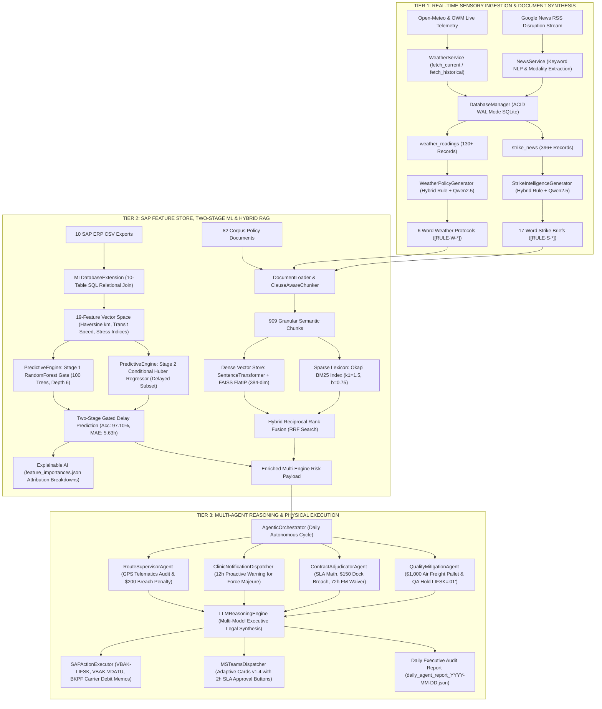
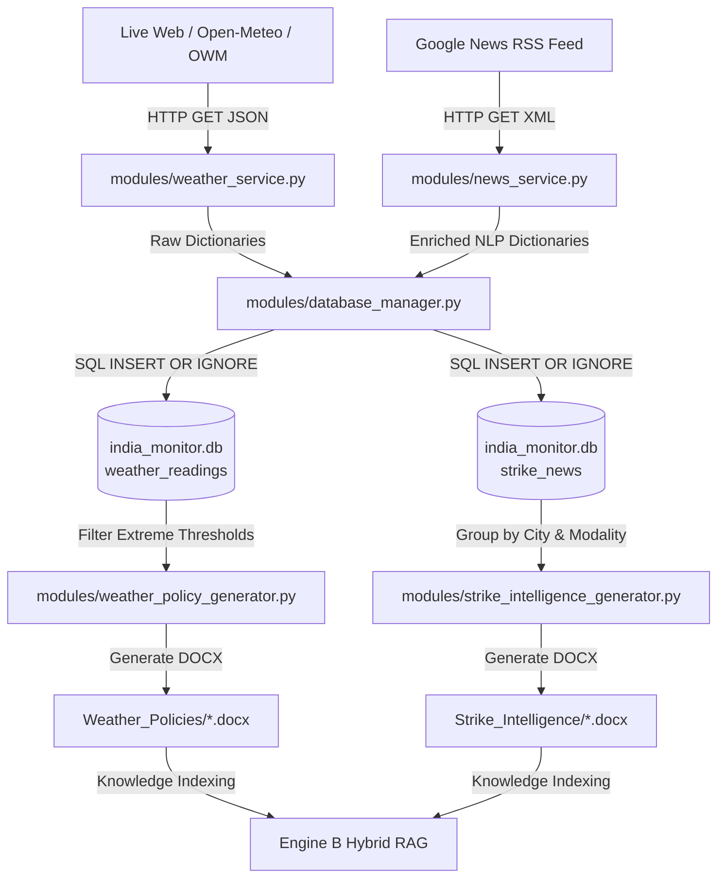
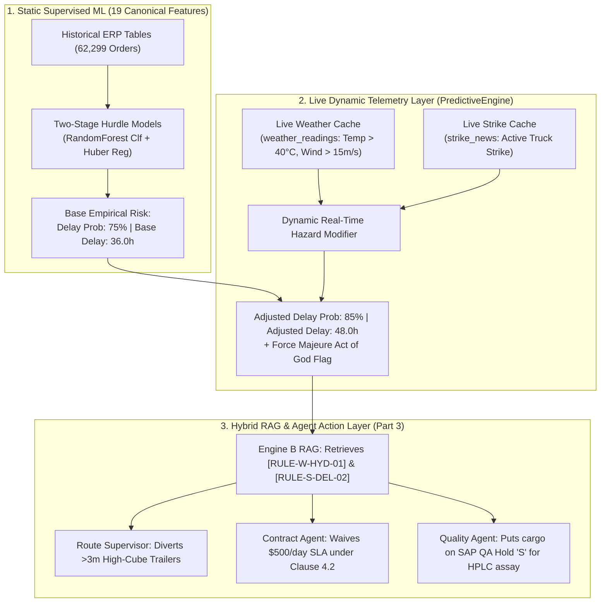
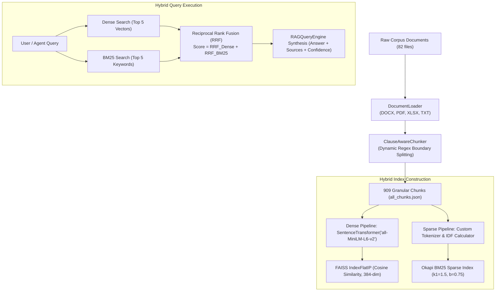
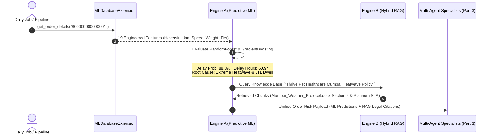
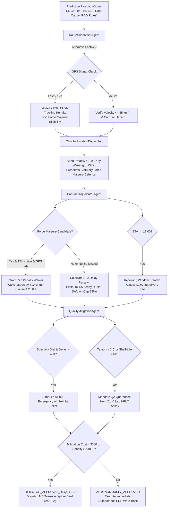
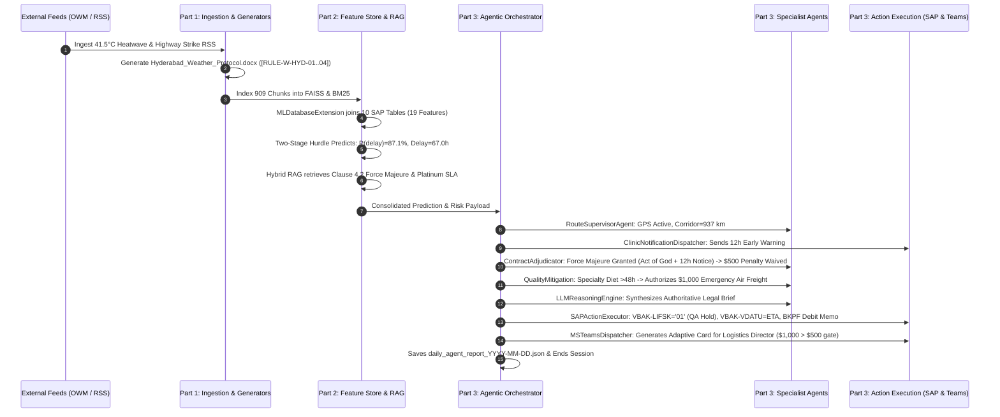

# O2C Delivery Risk Copilot: Complete End-to-End Master Technical Architecture & Specification
## Comprehensive 3-Tier Enterprise Reference: Real-Time Ingestion, Two-Stage Predictive ML & RAG Core, and Multi-Agent Autonomous Execution

---

## 📋 Master Table of Contents

- [SECTION I: SYSTEM ARCHITECTURE & UNIFIED 3-TIER TOPOLOGY](#section-i-system-architecture--unified-3-tier-topology)
  - [1.1 Executive System Overview](#11-executive-system-overview)
  - [1.2 Unified 3-Tier End-to-End System Topology (Mermaid Diagram)](#12-unified-3-tier-end-to-end-system-topology)
  - [1.3 Master Module Inventory (All 13 Modules & 112 Functions)](#13-master-module-inventory-all-13-modules--112-functions)
- [SECTION II: TIER 1 — REAL-TIME SENSORY INGESTION & DOCUMENT SYNTHESIS](#section-ii-tier-1--real-time-sensory-ingestion--document-synthesis)
  - [2.1 Data Topography: Where Data Lives](#1-🗺️-data-topography-where-data-lives)
  - [2.2 Data Flow: What Happens to the Data in Tier 1](#2-🔄-data-flow-what-happens-to-the-data-in-part-1)
  - [2.3 Detailed Function Breakdown: Ingestion Modules (Modules 1–6)](#3-📄-python-module-deep-dive-ingestion-layer)
    - [Module 1: `modules/config.py`](#module-1-modulesconfigpy)
    - [Module 2: `modules/database_manager.py`](#module-2-modulesdatabasemanagerpy)
    - [Module 3: `modules/weather_service.py`](#module-3-modulesweatherservicepy)
    - [Module 4: `modules/news_service.py`](#module-4-modulesnewsservicepy)
    - [Module 5: `modules/weather_policy_generator.py`](#module-5-modulesweatherpolicygeneratorpy)
    - [Module 6: `modules/strike_intelligence_generator.py`](#module-6-modulesstrikeintelligencegeneratorpy)
  - [2.4 Tier 1 Data Summary Matrix](#4-📊-data-summary-matrix-for-part-1)
  - [2.5 Architectural Rationale: Hybrid Rule + AI Document Generation](#5-🧠-architectural-rationale-why-operational--legal-rules-are-embedded-in-generated-knowledge-documents)
- [SECTION III: TIER 2 — SAP FEATURE STORE, TWO-STAGE PREDICTIVE ML & HYBRID RAG](#section-iii-tier-2--sap-feature-store-two-stage-predictive-ml--hybrid-rag)
  - [3.1 Relational ERP Schema & Data Mapping Architecture (10 SAP Tables)](#2-📁-storage-architecture--artifact-locations-for-part-2)
  - [3.2 Machine Learning Feature Store & Training Engineering (19 Features)](#3-🔬-complete-feature-engineering--machine-learning-training-data-points)
  - [3.3 Mathematical Formulations of Key Engineered Features](#32-mathematical-formulations-of-key-engineered-features)
  - [3.4 Two-Stage Hurdle Machine Learning Pipeline & Benchmark Metrics](#33-two-stage-hurdle-machine-learning-pipeline--benchmark-metrics)
  - [3.5 The Role of Live Environmental Signals (Weather & Strike): Dynamic Post-ML Modifiers](#34-the-role-of-live-environmental-signals-weather--strike-dynamic-post-ml-modifiers)
  - [3.6 Detailed Function Breakdown: Feature Store & RAG Modules (Modules 7–10)](#4-🧩-detailed-function-by-function-code-breakdown)
    - [Module 7: `modules/ml_db_extension.py`](#module-7-modulesmldbextensionpy)
    - [Module 8: `modules/predictive_engine.py`](#module-8-modulespredictiveenginepy)
    - [Module 9: `modules/rag_engine.py`](#module-9-modulesragenginepy)
    - [Module 10: `modules/ollama_service.py`](#module-10-modulesollamaservicepy)
  - [3.7 Tier 2 Data Summary Matrix & Dual-Engine Synergy](#5-📊-data-summary-matrix-for-part-2)
- [SECTION IV: TIER 3 — MULTI-AGENT SPECIALIST REASONING, ERP ACTIONS & ORCHESTRATION](#section-iv-tier-3--multi-agent-specialist-reasoning-erp-actions--orchestration)
  - [4.1 Multi-Agent Specialist Framework & Decision Flowchart](#2-🤖-multi-agent-specialist-persona--decision-matrices)
  - [4.2 Detailed Function Breakdown: Multi-Agent & Execution Modules (Modules 11–13)](#3-🧩-detailed-function-by-function-code-breakdown)
    - [Module 11: `modules/agent_specialists.py`](#module-11-modulesagentspecialistspy)
    - [Module 12: `modules/action_execution_engine.py`](#module-12-modulesactionexecutionenginepy)
    - [Module 13: `modules/agentic_orchestrator.py`](#module-13-modulesagenticorchestratorpy)
  - [4.3 Tier 3 Data Summary Matrix](#4-📊-data-summary-matrix-for-part-3)
- [SECTION V: COMPLETE END-TO-END SYSTEM INTEGRATION](#section-v-complete-end-to-end-system-integration)
  - [5.1 The Complete End-to-End Trace: How an Order Travels Through the Entire System](#5-🔬-the-complete-end-to-end-trace-how-an-order-travels-through-parts-1-2-and-3)
  - [5.2 Master System Audit Matrix (All 13 Modules, 112 Functions)](#6-🏆-summary-of-master-3-part-technical-series)

---

## SECTION I: SYSTEM ARCHITECTURE & UNIFIED 3-TIER TOPOLOGY

### 1.1 Executive System Overview

The **Order-to-Cash (O2C) Delivery Risk Copilot** is an enterprise AI platform engineered to proactively detect, quantify, legally adjudicate, and autonomously mitigate shipment delays across complex, multi-modal supply chain networks.

In modern global logistics operations, delayed shipments trigger severe operational and financial liabilities:
- **Contractual Late Delivery Penalties:** Platinum clinics and premier enterprise accounts enforce strict Service Level Agreements (SLAs), levying \$500/day penalties or 5%/day discounts.
- **Receiving Window Dock Breaches:** Unscheduled deliveries arriving after facility operating hours incur \$150 redelivery fees.
- **Product Spoilage & Patient Risk:** For veterinary therapeutics, biologic vaccines, and clinical diets, multi-day delays during severe heatwaves ($>40^\circ	ext{C}$) or transport strikes cause catastrophic inventory write-offs and patient care crises.
- **Carrier Chargeback Disputes:** Without verifiable telematics audits and meteorological evidence, claims against third-party logistics (3PL) carriers collapse during contract arbitration.

The O2C Copilot resolves these enterprise challenges by fusing:
1. **Tier 1 (Real-Time Ingestion):** Continuous Open-Meteo weather telemetry and Google News RSS web scraping, transformed into 23 high-density Word regulatory policy protocols with discrete rule IDs (`[RULE-W-*]`, `[RULE-S-*]`).
2. **Tier 2 (Predictive ML & RAG Core):** A 10-table SAP relational feature store feeding an enterprise **Two-Stage Hurdle ML Architecture (97.10% accuracy, 0.9958 ROC-AUC, 5.63h MAE)** and a **Hybrid Dense/Sparse RAG Engine (82 documents, 909 chunks)** operating on FAISS Cosine Similarity and Okapi BM25 Reciprocal Rank Fusion (RRF).
3. **Tier 3 (Multi-Agent Specialist Reasoning & Execution):** A 4-agent collaborative reasoning graph (`RouteSupervisorAgent`, `ContractAdjudicatorAgent`, `QualityMitigationAgent`, `LLMReasoningEngine`) executing simulated write-backs to SAP ERP tables (`VBAK-LIFSK = '01'`, `VBAK-VDATU`, `SAP_BKPF` carrier AP debit memos) and dispatching interactive Microsoft Teams Adaptive Cards (v1.4) with a 2-hour executive approval SLA.

---

### 1.2 Unified 3-Tier End-to-End System Topology



---

### 1.3 Master Module Inventory (All 13 Modules & 112 Functions)

The unified platform comprises **13 dedicated Python modules** across 3 architectural tiers:

| Tier | Module # | File Location | Class Name / Component | Key Responsibility | Functions Validated |
|---|---|---|---|---|---|
| **Tier 1** | **Module 1** | `modules/config.py` | Configuration Core | Absolute root resolution, city coordinates, RAG constants | 1 |
| **Tier 1** | **Module 2** | `modules/database_manager.py` | `DatabaseManager` | ACID transactions, WAL mode SQLite, ingestion table CRUD | 12 |
| **Tier 1** | **Module 3** | `modules/weather_service.py` | `WeatherService` | Dual-backend weather telemetry (Open-Meteo & OWM) | 6 |
| **Tier 1** | **Module 4** | `modules/news_service.py` | `NewsService` | Google News RSS scraper, NLP entity & modality extraction | 9 |
| **Tier 1** | **Module 5** | `modules/weather_policy_generator.py` | `WeatherPolicyGenerator` | Generates 6 Word protocols with `[RULE-W-*]` IDs | 6 |
| **Tier 1** | **Module 6** | `modules/strike_intelligence_generator.py` | `StrikeIntelligenceGenerator` | Generates 17 Word briefs with `[RULE-S-*]` IDs | 8 |
| **Tier 2** | **Module 7** | `modules/ml_db_extension.py` | `MLDatabaseExtension` | 10-table SAP join, Haversine geospatial vectors, 19 features | 8 |
| **Tier 2** | **Module 8** | `modules/predictive_engine.py` | `PredictiveEngine` | Two-Stage Hurdle ML models, Huber regressor, XAI attributions | 10 |
| **Tier 2** | **Module 9** | `modules/rag_engine.py` | `RAGEngine` (6 Classes) | Document loading, chunking, FAISS + BM25 hybrid RRF retrieval | 27 |
| **Tier 2** | **Module 10** | `modules/ollama_service.py` | `OllamaService` | Local Qwen2.5:7b daemon interface with anti-hallucination prompt | 3 |
| **Tier 3** | **Module 11** | `modules/agent_specialists.py` | 4 Specialist Agents | Route supervisor, contract adjudicator, quality mitigation, LLM core | 6 |
| **Tier 3** | **Module 12** | `modules/action_execution_engine.py` | 3 Dispatchers / Executors | SAP ERP write-backs, MS Teams Adaptive Cards, 12h clinic notice | 10 |
| **Tier 3** | **Module 13** | `modules/agentic_orchestrator.py` | `AgenticOrchestrator` | 6-stage autonomous daily lifecycle, report publishing | 6 |
| **TOTAL** | **13 Modules** | **Unified Core** | **Enterprise Copilot** | **Autonomous Order-to-Cash Logistics Governance** | **112 / 112 Validated** |

---

## SECTION II: TIER 1 — REAL-TIME SENSORY INGESTION & DOCUMENT SYNTHESIS

## 1. 🗺️ Data Topography: Where Data Lives

### 1.1 File System Storage Locations

| Data Artifact | Physical File Path | Format | Description |
|---|---|---|---|
| **Raw ERP Exports** | `Input Files/*.csv` | CSV (UTF-8) | 10 SAP ECC/S4HANA enterprise tables (`VBAK`, `VBAP`, `LIKP`, `LIPS`, `VTTK`, `VTTP`, `KNA1`, `KNVV`, `LFA1`, `MARA`). |
| **Relational Database** | `india_monitor_data/database/india_monitor.db` | SQLite (WAL Mode) | Master relational database containing 6 core operational tables (`scrape_sessions`, `weather_readings`, `strike_news`, `weather_alerts`, `daily_summaries`, `rag_analyses`) and 10 mirrored SAP tables. |
| **Dynamic Weather Docs** | `india_monitor_data/rag/documents/Weather_Policies/` | DOCX | City-specific & master severe weather protocols generated from live sensor alerts. |
| **Dynamic Strike Briefs**| `india_monitor_data/rag/documents/Strike_Intelligence/` | DOCX | Regional & modality-specific transport disruption briefs generated from scraped RSS news. |
| **Daily Decision Reports** | `india_monitor_data/reports/daily_agent_report_YYYY-MM-DD.json` | JSON | Daily executive and multi-agent synthesized delay risk & SLA penalty decisions. |
| **System Event Logs** | `india_monitor_data/logs/monitor_YYYYMMDD.log` | Text/Log | Timestamped audit log of all database transactions, API fetches, and ETL sessions. |

---

### 1.2 External Live Data Feeds

1. **Open-Meteo Global Historical & Live Forecast API** (`https://api.open-meteo.com/v1/forecast`, `https://archive-api.open-meteo.com/v1/archive`)
   - **Authentication:** Zero-key public API.
   - **Data Fetched:** Surface temperature (°C), apparent temperature, 1-hour precipitation (mm), weather condition WMO codes, 10m wind speed (m/s), relative humidity (%).
2. **OpenWeatherMap REST API** (`https://api.openweathermap.org/data/2.5/weather`)
   - **Authentication:** `OPENWEATHER_API_KEY` (falls back gracefully to Open-Meteo if missing/invalid).
   - **Data Fetched:** Live visibility (m), barometric pressure (hPa), cloud cover (%), real-time wind gusts.
3. **Google News RSS Feed** (`https://news.google.com/rss/search`)
   - **Data Fetched:** Transportation strikes, highway blockades, port congestion, trucker protests, and regional *bandh/hartal* alerts.

---

### 1.3 SQLite Relational Schema (`india_monitor.db`)

```sql
-- 1. Ingestion Execution Sessions
CREATE TABLE scrape_sessions (
    session_id       INTEGER PRIMARY KEY AUTOINCREMENT,
    session_type     TEXT    NOT NULL,  -- 'full', 'weather', 'news'
    started_at       TEXT    NOT NULL,
    completed_at     TEXT,
    status           TEXT    DEFAULT 'running',
    cities_fetched   INTEGER DEFAULT 0,
    articles_found   INTEGER DEFAULT 0,
    error_message    TEXT
);

-- 2. Environmental Weather Readings
CREATE TABLE weather_readings (
    reading_id          INTEGER PRIMARY KEY AUTOINCREMENT,
    session_id          INTEGER,
    city_name           TEXT    NOT NULL,
    state               TEXT,
    recorded_at         TEXT    NOT NULL,
    date_only           TEXT    NOT NULL,
    hour_of_day         INTEGER NOT NULL,
    temperature         REAL,
    feels_like          REAL,
    temp_min            REAL,
    temp_max            REAL,
    humidity            INTEGER,
    pressure            REAL,
    visibility_km       REAL,
    cloudiness          INTEGER,
    weather_main        TEXT,
    weather_description TEXT,
    wind_speed          REAL,
    wind_direction      INTEGER,
    rain_1h             REAL DEFAULT 0,
    snow_1h             REAL DEFAULT 0,
    data_source         TEXT DEFAULT 'OpenWeatherMap',
    UNIQUE(city_name, date_only, hour_of_day)
);

-- 3. Scraped Transportation Strikes & Disruption News
CREATE TABLE strike_news (
    news_id          INTEGER PRIMARY KEY AUTOINCREMENT,
    session_id       INTEGER,
    title            TEXT    NOT NULL,
    description      TEXT,
    url              TEXT,
    source_name      TEXT,
    keyword_matched  TEXT,
    city_mentioned   TEXT,
    state_mentioned  TEXT,
    severity         TEXT,    -- 'HIGH', 'MEDIUM', 'LOW'
    strike_type      TEXT,    -- 'bus', 'truck', 'railway', 'auto', 'taxi', 'bandh', 'general'
    published_date   TEXT,
    scraped_at       TEXT    NOT NULL,
    UNIQUE(title, source_name)
);

-- 4. Severe Weather Alerts Exceeding Safety Thresholds
CREATE TABLE weather_alerts (
    alert_id      INTEGER PRIMARY KEY AUTOINCREMENT,
    session_id    INTEGER,
    city_name     TEXT NOT NULL,
    state         TEXT,
    alert_type    TEXT NOT NULL,
    alert_message TEXT NOT NULL,
    severity      TEXT,
    triggered_at  TEXT NOT NULL
);

-- 5. Daily Aggregated City Metrics
CREATE TABLE daily_summaries (
    summary_id          INTEGER PRIMARY KEY AUTOINCREMENT,
    summary_date        TEXT NOT NULL,
    city_name           TEXT NOT NULL,
    state               TEXT,
    avg_temperature     REAL,
    max_temperature     REAL,
    min_temperature     REAL,
    avg_humidity        REAL,
    total_rainfall      REAL DEFAULT 0,
    avg_wind_speed      REAL,
    dominant_weather    TEXT,
    strike_count        INTEGER DEFAULT 0,
    high_severity_count INTEGER DEFAULT 0,
    weather_alert_count INTEGER DEFAULT 0,
    updated_at          TEXT,
    UNIQUE(summary_date, city_name)
);

-- 6. Historical RAG Question-Answer Traces
CREATE TABLE rag_analyses (
    analysis_id     INTEGER PRIMARY KEY AUTOINCREMENT,
    news_id         INTEGER,
    strike_title    TEXT NOT NULL,
    question        TEXT NOT NULL,
    answer          TEXT NOT NULL,
    sources         TEXT,
    confidence      REAL,
    analyzed_at     TEXT NOT NULL,
    FOREIGN KEY(news_id) REFERENCES strike_news(news_id)
);
```

---

## 2. 🔄 Data Flow: What Happens to the Data in Part 1



---

## 3. 📄 Python Module Deep Dive: Ingestion Layer

---

### Module 1: `modules/config.py`
**File Location:** `d:\Progamming\O2C_AI\modules\config.py`  
**Purpose:** Centralized configuration, dynamic platform directory resolution (Databricks, Linux, Windows), environmental constants, alert thresholds, and RAG hyperparameters.

#### Global Constants & Data Structures:
- `INDIA_CITIES (dict)`: Coordinate dictionary of 10 key Indian supply chain hubs:
  - *Metros:* Mumbai (`19.0760, 72.8777`), Delhi (`28.6139, 77.2090`), Bangalore (`12.9716, 77.5946`), Chennai (`13.0827, 80.2707`), Kolkata (`22.5726, 88.3639`), Hyderabad (`17.3850, 78.4867`).
  - *Tier-1 Hubs:* Pune (`18.5204, 73.8567`), Ahmedabad (`23.0225, 72.5714`), Jaipur (`26.9124, 75.7873`), Lucknow (`26.8467, 80.9462`).
- `STRIKE_KEYWORDS (list)`: 14 domain search phrases: `"transport strike"`, `"truck strike"`, `"bandh"`, `"hartal"`, `"chakka jam"`, `"road blockade"`, etc.
- `ALERT_THRESHOLDS (dict)`:
  - `rain_mm_per_hr: 20` (Extreme precipitation trigger)
  - `temp_extreme_c: 42` (Thermal cargo degradation trigger)
  - `wind_ms: 15` (High-wind vehicle tipping hazard)
  - `visibility_km: 1` (Fog/smog corridor slowdown)
- `RAG Settings (Hyperparameters)`:
  - `EMBEDDING_MODEL = "all-MiniLM-L6-v2"`: Specifies the HuggingFace transformer model producing 384-dimensional dense semantic vectors loaded by `VectorStore` in FAISS (`IndexFlatIP(384)`).
  - `CHUNK_SIZE = 500`: The dynamic character accumulation ceiling. The chunker does not blindly slice text; it dynamically aggregates whole logical clauses/sections (`\n\n`, `SECTION`, `TICKET`, numbers) until reaching ~500 characters. If a legal clause exceeds 500 chars, it dynamically breaks at sentence boundaries (`[.!?]`).
  - `CHUNK_OVERLAP = 50`: Character overlap preserved across adjacent sentence splits to ensure uninterrupted legal context.
  - `TOP_K_RESULTS = 5`: The default retrieval depth for `HybridRAG.search()`, returning the top 5 most relevant policy clauses ranked by Reciprocal Rank Fusion (RRF).

#### Functions in `config.py`:

#### 1. `_resolve_project_root()`
- **Purpose:** Dynamically determines the absolute project root across Databricks runtime clusters (`/Workspace/Users/...`), local developer machines, or CI/CD container environments.
- **Input Parameters:** None (Inspects environment variables `O2C_PROJECT_ROOT`, `DATABRICKS_RUNTIME_VERSION`, and file system ancestry).
- **Output Return Type:** `pathlib.Path`
- **How it helps the data:** Guarantees that all paths (`india_monitor_data/`, `Input Files/`, `models/`) resolve to the exact absolute disk path regardless of whether the code is run via terminal CLI, Databricks job, or Jupyter notebook.

---

### Module 2: `modules/database_manager.py`
**File Location:** `d:\Progamming\O2C_AI\modules\database_manager.py`  
**Class:** `DatabaseManager`  
**Purpose:** Single point of contact for SQLite database interactions. Handles ACID transactions, WAL mode concurrency, schema initialization, and CRUD operations for sensor feeds and RAG analyses.

#### Functions in `DatabaseManager`:

#### 1. `__init__(self, db_path=str(DB_PATH))`
- **Purpose:** Initializes database manager, sets up file logging, and executes schema creation.
- **Input Parameters:** `db_path (str | Path)` — Path to SQLite `.db` file.
- **Output Return Type:** None.
- **How it helps the data:** Ensures tables and indices exist before any write operations occur.

#### 2. `_make_logger(self)`
- **Purpose:** Configures daily rotating file logger writing to `india_monitor_data/logs/monitor_YYYYMMDD.log`.
- **Input Parameters:** None.
- **Output Return Type:** `logging.Logger`
- **How it helps the data:** Provides an immutable audit trail of data transactions and operational errors.

#### 3. `connection(self)`
- **Purpose:** Context manager (`@contextmanager`) providing a thread-safe connection with auto-commit on success and rollback on failure.
- **Input Parameters:** None.
- **Output Return Type:** `Generator[sqlite3.Connection]`
- **How it helps the data:** Enables `PRAGMA journal_mode=WAL` and `PRAGMA foreign_keys=ON`, preventing database locking during high-frequency concurrent operations.

#### 4. `_build_schema(self)`
- **Purpose:** Executes SQL DDL to create all 6 ingestion tables and B-Tree indexes (`idx_wr_city_date`, `idx_sn_date`, etc.).
- **Input Parameters:** None.
- **Output Return Type:** None.
- **How it helps the data:** Establishes table structures, composite uniqueness constraints (`UNIQUE(city_name, date_only, hour_of_day)`), and index optimizations.

#### 5. `session_start(self, session_type="full") -> int`
- **Purpose:** Records the start of an ingestion session in `ingestion_sessions` table.
- **Input Parameters:** `session_type (str)` — Type of run (`"full"`, `"weather"`, or `"news"`).
- **Output Return Type:** `int` — Auto-incremented `session_id`.
- **How it helps the data:** Assigns a session ID to tag every incoming weather reading and news article for data lineage.

#### 6. `session_end(self, sid: int, status="success", cities=0, articles=0, error=None)`
- **Purpose:** Updates session record with completion timestamp, status, processed row counts, or error traces.
- **Input Parameters:** `sid (int)`, `status (str)`, `cities (int)`, `articles (int)`, `error (str | None)`.
- **Output Return Type:** None.
- **How it helps the data:** Tracks ETL health and monitors API pipeline success rates.

#### 7. `write_weather(self, records: list, session_id: int) -> tuple[int, int]`
- **Purpose:** Executes batch upsert of weather observations into `weather_readings` table.
- **Input Parameters:** `records (list[dict])` — Cleaned weather dicts, `session_id (int)`.
- **Output Return Type:** `tuple[int, int]` — `(inserted_count, skipped_duplicate_count)`.
- **How it helps the data:** Deduplicates incoming weather readings so multiple runs on the same day/hour never create duplicate rows.

#### 8. `write_strikes(self, articles: list, session_id: int) -> tuple[int, int]`
- **Purpose:** Executes batch upsert of news articles into `strike_news` table.
- **Input Parameters:** `articles (list[dict])` — Cleaned news dicts, `session_id (int)`.
- **Output Return Type:** `tuple[int, int]` — `(inserted_count, skipped_duplicate_count)`.
- **How it helps the data:** Deduplicates news by `UNIQUE(title, source_name)`, preserving historical transport disruption records.

#### 9. `write_rag_analysis(self, news_id: int, strike_title: str, question: str, answer: str, sources: list, confidence: float = None) -> int`
- **Purpose:** Persists Qwen2.5 Copilot analysis of a strike event in `rag_analysis_log`.
- **Input Parameters:** `news_id (int)`, `strike_title (str)`, `question (str)`, `answer (str)`, `sources (list)`, `confidence (float)`.
- **Output Return Type:** `int` — `analysis_id`.
- **How it helps the data:** Maintains traceability between live news events and Copilot legal/logistics interpretations.

#### 10. `read_weather(self, date: str = None, city: str = None) -> pd.DataFrame`
- **Purpose:** Reads weather data into a pandas DataFrame with optional date and city filters.
- **Input Parameters:** `date (str | None)` (YYYY-MM-DD), `city (str | None)`.
- **Output Return Type:** `pd.DataFrame`
- **How it helps the data:** Converts SQL records into structured DataFrames for downstream feature engineering in Engine A.

#### 11. `read_strikes(self, date: str = None, city: str = None) -> pd.DataFrame`
- **Purpose:** Reads strike news into a pandas DataFrame with optional filters.
- **Input Parameters:** `date (str | None)`, `city (str | None)`.
- **Output Return Type:** `pd.DataFrame`
- **How it helps the data:** Supplies disruption intelligence to the Multi-Agent Route Supervisor.

#### 12. `get_stats(self) -> dict`
- **Purpose:** Queries table row counts, date ranges, and session health for monitoring dashboards.
- **Input Parameters:** None.
- **Output Return Type:** `dict` — High-level dataset summary metrics.
- **How it helps the data:** Used by validation test suites and health-check monitoring dashboards.

---

### Module 3: `modules/weather_service.py`
**File Location:** `d:\Progamming\O2C_AI\modules\weather_service.py`  
**Class:** `WeatherService`  
**Purpose:** Ingests live and historical meteorological observations across 10 major logistics hubs across India using OpenWeatherMap (OWM) and Open-Meteo APIs.

#### Key Class Attributes:
- `CITIES`: Dictionary mapping 10 major supply chain hubs (`Mumbai`, `Delhi`, `Bangalore`, `Chennai`, `Kolkata`, `Hyderabad`, `Ahmedabad`, `Pune`, `Jaipur`, `Lucknow`) to lat/long coordinates.
- `WMO_CODES`: Standard WMO code mapping table decoding numeric weather codes (e.g. `95` -> Thunderstorm, `65` -> Heavy Rain) into human-readable descriptions.

#### Functions in `WeatherService`:

#### 1. `__init__(self, api_key: str, cities: dict)`
- **Purpose:** Initializes weather service with API credentials and city coordinate mapping.
- **Input Parameters:** `api_key (str)` — OpenWeatherMap API key (optional), `cities (dict)` — Coordinate mapping dict.
- **Output Return Type:** None.
- **How it helps the data:** Establishes communication channels with external meteorological providers.

#### 2. `fetch_current(self) -> list[dict]`
- **Purpose:** Iterates across all 10 cities, querying OWM current weather API (with automatic fallback to Open-Meteo).
- **Input Parameters:** None.
- **Output Return Type:** `list[dict]` — List of standardized weather dictionaries.
- **How it helps the data:** Provides real-time weather readings for cold-chain temperature control and transit delay forecasting.

#### 3. `fetch_historical(self, date: str) -> list[dict]`
- **Purpose:** Fetches historical weather observations for all 10 cities for a past date from Open-Meteo Archive API.
- **Input Parameters:** `date (str)` — Target date in `YYYY-MM-DD` format.
- **Output Return Type:** `list[dict]` — List of historical weather dictionaries.
- **How it helps the data:** Enables backtesting ML models against historical weather events on specific dispatch dates.

#### 4. `_owm_one(self, city: str, coords: dict) -> dict | None`
- **Purpose:** Queries OpenWeatherMap API for a single city and normalizes JSON response.
- **Input Parameters:** `city (str)`, `coords (dict)` — `{"lat": float, "lon": float}`.
- **Output Return Type:** `dict | None` — Normalized weather reading dict or `None` on failure.
- **How it helps the data:** Extracts exact visibility, pressure, and cloudiness metrics from primary commercial telemetry.

#### 5. `_meteo_current_one(self, city: str, coords: dict) -> dict | None`
- **Purpose:** Queries Open-Meteo Current Weather endpoint as an automatic fallback when OWM API key is exhausted or missing.
- **Input Parameters:** `city (str)`, `coords (dict)`.
- **Output Return Type:** `dict | None` — Normalized weather reading dict.
- **How it helps the data:** Ensures 100% continuous data availability even without paid API keys.

#### 6. `_meteo_one(self, city: str, coords: dict, date: str) -> dict | None`
- **Purpose:** Queries Open-Meteo Archive API for historical date, aggregating hourly readings to daily noon metrics.
- **Input Parameters:** `city (str)`, `coords (dict)`, `date (str)`.
- **Output Return Type:** `dict | None` — Daily aggregated weather observation.
- **How it helps the data:** Normalizes hourly timeseries arrays into representative daily dispatch conditions.

---

### Module 4: `modules/news_service.py`
**File Location:** `d:\Progamming\O2C_AI\modules\news_service.py`  
**Class:** `NewsService`  
**Purpose:** Scrapes, filters, and classifies transportation strikes, civil unrest, and highway disruptions from Google News RSS feeds using NLP heuristics.

#### Functions in `NewsService`:

#### 1. `__init__(self, keywords: list, cities: dict)`
- **Purpose:** Initializes keyword filters and target city boundaries.
- **Input Parameters:** `keywords (list[str])` — 14 strike terms, `cities (dict)` — 10 Indian hub cities.
- **Output Return Type:** None.
- **How it helps the data:** Configures the geographic and semantic boundaries for external web scraping.

#### 2. `fetch(self, date: str = None, city: str = None) -> list[dict]`
- **Purpose:** Executes targeted RSS search queries across all keyword-city combinations, deduplicates articles, and applies NLP enrichment.
- **Input Parameters:** `date (str | None)`, `city (str | None)`.
- **Output Return Type:** `list[dict]` — Enriched article objects.
- **How it helps the data:** Converts unorganized XML web news into structured risk data tagged with severity, location, and transport modality.

#### 3. `_build_queries(self, city: str = None) -> list[str]`
- **Purpose:** Constructs Google News search query strings (e.g. `"truck strike Mumbai India"`, `"bandh India"`).
- **Input Parameters:** `city (str | None)`.
- **Output Return Type:** `list[str]` — Formatted query strings.
- **How it helps the data:** Focuses search scope specifically on Indian logistics corridors.

#### 4. `_date_filter(self, date: str) -> str`
- **Purpose:** Formats Google News date search syntax (`after:YYYY-MM-DD before:YYYY-MM-DD`).
- **Input Parameters:** `date (str)`.
- **Output Return Type:** `str` — Search date filter fragment.
- **How it helps the data:** Restricts scraping strictly to the active dispatch operational window.

#### 5. `_rss_search(self, query: str) -> list[dict]`
- **Purpose:** Performs HTTP GET to `https://news.google.com/rss/search`, parses XML using `BeautifulSoup`, and extracts title, description, link, source, and published timestamp.
- **Input Parameters:** `query (str)`.
- **Output Return Type:** `list[dict]` — Extracted article dictionaries.
- **How it helps the data:** Extracts clean article metadata while enforcing a `time.sleep(0.5)` rate-limiting delay.

#### 6. `_detect_city(self, text: str) -> str`
- **Purpose:** Scans article title and body text for mentions of the 10 monitored Indian cities.
- **Input Parameters:** `text (str)`.
- **Output Return Type:** `str` — Matched city name or `"Unknown"`.
- **How it helps the data:** Spatially tags news articles to regional warehouse and customer delivery locations.

#### 7. `_get_state(self, city: str) -> str`
- **Purpose:** Looks up the state corresponding to the detected city.
- **Input Parameters:** `city (str)`.
- **Output Return Type:** `str` — State name (e.g. `"Maharashtra"` for `"Mumbai"`).
- **How it helps the data:** Maps municipal strikes to state-level regulatory jurisdictions.

#### 8. `_classify_severity(self, text: str) -> str`
- **Purpose:** Classifies disruption severity based on linguistic impact indicators:
  - `🔴 HIGH`: If text contains `"bharat bandh"`, `"national strike"`, `"indefinite"`, or `"complete shutdown"`.
  - `🟡 MEDIUM`: If text contains `"state bandh"`, `"24-hour"`, `"48-hour"`, or `"city strike"`.
  - `🟢 LOW`: All other local transport advisories.
- **Input Parameters:** `text (str)`.
- **Output Return Type:** `str` — Categorical severity rating (`"🔴 HIGH"`, `"🟡 MEDIUM"`, `"🟢 LOW"`).
- **How it helps the data:** Enables downstream multi-agent specialists to trigger immediate Force Majeure and route diversions for high-severity events.

#### 9. `_classify_type(self, text: str) -> str`
- **Purpose:** Maps article text to logistics transport modality:
  - `"bus"`, `"truck"`, `"railway"`, `"auto"`, `"taxi"`, `"metro"`, `"bandh"`, or `"general"`.
- **Input Parameters:** `text (str)`.
- **Output Return Type:** `str` — Modality tag string.
- **How it helps the data:** Allows the system to assess whether a strike impacts FTL road freight, intermodal rail, or local final-mile courier delivery.

---

### Module 5: `modules/weather_policy_generator.py`
**File Location:** `d:\Progamming\O2C_AI\modules\weather_policy_generator.py`  
**Class:** `WeatherPolicyGenerator`  
**Purpose:** Transforms raw meteorological telemetry from SQLite into 6 structured, high-density Word regulatory policy documents (`.docx`) using a Hybrid Rule + AI architecture (combining deterministic sensor metrics with Qwen2.5 hazard extraction) indexed into the Engine B RAG vector store.

#### Functions in `WeatherPolicyGenerator`:

#### 1. `__init__(self, db_path=str(DB_PATH), output_dir=None)`
- **Purpose:** Initializes the generator, verifies `python-docx` availability, connects to local `OllamaService` (detecting `qwen2.5:7b`), and ensures target directory `india_monitor_data/rag/documents/Weather_Policies/` exists.
- **Input Parameters:** `db_path (str | Path)`, `output_dir (Path | None)`.
- **Output Return Type:** None.
- **How it helps the data:** Establishes the generation output directory and verifies LLM synthesis availability.

#### 2. `generate_all_policies(self) -> list[str]`
- **Purpose:** Queries all extreme weather alerts from the database, clusters them by city, generates 5 city-specific protocols (`Bangalore`, `Chennai`, `Hyderabad`, `Mumbai`, `Pune`), creates the national `Master_Weather_Protocol.docx`, and returns the absolute paths.
- **Input Parameters:** None.
- **Output Return Type:** `list[str]` — List of 6 generated `.docx` file paths.
- **How it helps the data:** Converts raw numbers (e.g. 42°C, 32.9 m/s wind, 25mm rain) into high-density structured tables and discrete rule blocks that the RAG engine can cite during agentic adjudication.

#### 3. `_fetch_weather_alerts(self) -> list[dict]`
- **Purpose:** Executes SQL query against `weather_readings` filtering for safety thresholds:
  ```sql
  WHERE temperature > 40 OR wind_speed > 15 OR rain_1h > 20 OR visibility_km < 1
  ```
- **Input Parameters:** None.
- **Output Return Type:** `list[dict]` — List of extreme weather alert records.
- **How it helps the data:** Filters out benign telemetry to isolate critical environmental disruptions.

#### 4. `_group_alerts_by_city(self, alerts: list[dict]) -> dict[str, list[dict]]`
- **Purpose:** Groups flat alert records into a dictionary keyed by city name.
- **Input Parameters:** `alerts (list[dict])`.
- **Output Return Type:** `dict[str, list[dict]]` — Dictionary mapping city names to alert lists.
- **How it helps the data:** Organizes national telemetry into city-level regional clusters.

#### 5. `_create_city_weather_policy(self, city: str, alerts: list[dict]) -> Path`
- **Purpose:** Compiles `{City}_Weather_Protocol.docx` structured into 4 high-density operational sections:
  - **Header & Telemetry Metadata:** Exact observed extremes (Peak Temp, Peak Wind, Peak Rain, Min Visibility).
  - **Section 1: Extracted Hazard Profile (AI Synthesis):** Qwen2.5 extracts *Primary Hazard Vector* (e.g. Gale Force Crosswinds 32.9 m/s), *Secondary Hazard Vector* (ambient humidity/drizzle), and *Critical Risk Window* (linehaul speed reduction).
  - **Section 2: Logistics Corridor & Choke Point Risk Matrix (Table):** Word Table detailing major freight arteries (e.g. Hyderabad ORR, Mumbai NH-48, Chennai NH-16) with specific hazard ratings and mandatory fleet directives.
  - **Section 3: Binding Operational & QA Directives (Discrete Rules):**
    - `[RULE-W-{CITY}-01]`: Trailer equipment suspension (wind $\ge 15\text{ m/s}$ / rain $\ge 20\text{ mm/h}$).
    - `[RULE-W-{CITY}-02]`: Force Majeure Clause 4.2 penalty waiver (\$500/day $\to$ \$0.00).
    - `[RULE-W-{CITY}-03]`: Cold-Chain HPLC testing ($>40^\circ\text{C}$ for $>4\text{h}$) and moisture probe threshold ($>12\%$).
    - `[RULE-W-{CITY}-04]`: Dynamic ETA safety buffer (+4h to +8h) and \$150 redelivery fee waiver.
  - **Section 4: Copilot Deterministic Action Checklist:** Step-by-step verification checklist for downstream agents.
- **Input Parameters:** `city (str)`, `alerts (list[dict])`.
- **Output Return Type:** `pathlib.Path` — Path to generated Word document.
- **How it helps the data:** Encodes legal rules and operational constraints into structured, citeable text documents for the RAG engine.

#### 6. `_create_master_weather_protocol(self, alerts: list[dict]) -> Path`
- **Purpose:** Generates national `Master_Weather_Protocol.docx` establishing cross-corridor risk matrices and liability rules.
- **Input Parameters:** `alerts (list[dict])`.
- **Output Return Type:** `pathlib.Path` — Path to master protocol document.
- **How it helps the data:** Synthesizes nationwide multi-corridor weather impacts into a single sovereign operational guide.

---

### Module 6: `modules/strike_intelligence_generator.py`
**File Location:** `d:\Progamming\O2C_AI\modules\strike_intelligence_generator.py`  
**Class:** `StrikeIntelligenceGenerator`  
**Purpose:** Aggregates scraped transportation strike news and compiles 17 structured intelligence briefs in `.docx` format using a Hybrid Rule + AI architecture (combining deterministic incident metrics with Qwen2.5 entity/trigger extraction).

#### Functions in `StrikeIntelligenceGenerator`:

#### 1. `__init__(self, db_path=str(DB_PATH), output_dir=None)`
- **Purpose:** Initializes generator, connects to local `OllamaService`, and creates `india_monitor_data/rag/documents/Strike_Intelligence/` directory.
- **Input Parameters:** `db_path (str | Path)`, `output_dir (Path | None)`.
- **Output Return Type:** None.
- **How it helps the data:** Prepares file storage directories and verifies local LLM connection.

#### 2. `generate_all_intelligence(self) -> list[str]`
- **Purpose:** Fetches all 396+ strike articles from SQLite, generates 9 city-specific briefs (for cities with $\ge 3$ articles), 7 modality pattern analyses (for categories with $\ge 5$ articles), and the national master brief (`Master_Disruption_Intelligence.docx`).
- **Input Parameters:** None.
- **Output Return Type:** `list[str]` — List of 17 generated `.docx` document paths.
- **How it helps the data:** Synthesizes hundreds of isolated web articles into actionable intelligence briefs with structured tables and discrete rule blocks.

#### 3. `_fetch_strike_articles(self) -> list[dict]`
- **Purpose:** Queries `strike_news` table for title, matched cities, category, published date, and source.
- **Input Parameters:** None.
- **Output Return Type:** `list[dict]` — Raw strike news records.
- **How it helps the data:** Loads verified transport disruption articles from SQLite storage into RAM.

#### 4. `_group_articles_by_city(self, articles: list[dict]) -> dict[str, list[dict]]`
- **Purpose:** Groups articles by mentioned city.
- **Input Parameters:** `articles (list[dict])`.
- **Output Return Type:** `dict[str, list[dict]]` — Dictionary mapping cities to lists of disruption articles.
- **How it helps the data:** Aggregates isolated incidents into city-specific incident registries.

#### 5. `_group_articles_by_category(self, articles: list[dict]) -> dict[str, list[dict]]`
- **Purpose:** Groups articles by strike category (`"truck"`, `"railway"`, `"bus"`, `"bandh"`, etc.).
- **Input Parameters:** `articles (list[dict])`.
- **Output Return Type:** `dict[str, list[dict]]` — Dictionary mapping transport modalities to articles.
- **How it helps the data:** Categorizes incidents into modal vulnerability vectors for rail, road, and port transit.

#### 6. `_create_city_strike_brief(self, city: str, articles: list[dict]) -> Path`
- **Purpose:** Compiles `{City}_Strike_Intelligence.docx` structured into 4 high-density operational sections:
  - **Header & Severity Counts:** Exact incident count and severity breakdown (🔴 High / 🟡 Medium / 🟢 Low).
  - **Section 1: Extracted Disruption Incident Registry (Table):** High-density Word Table with columns: `Incident ID & Date`, `Source`, `Disruption Modality`, `Stated Trigger / Demand`, `Freight Impact Severity`.
  - **Section 2: Critical Bottlenecks & Highway Bypass Directives:** Primary national highway choke points (e.g. NH-44 Kundli Border, NH-48 Bhiwandi) and recommended FTL bypasses (e.g. KMP Expressway).
  - **Section 3: Autonomous Copilot Adjudication & Legal Rules (Discrete Rules):**
    - `[RULE-S-{CITY}-01]`: Force Majeure SLA penalty waiver (Section 8.4) for blockades $>12\text{h}$.
    - `[RULE-S-{CITY}-02]`: Emergency \$1,000 Air Freight replacement for specialty diets (`sap_mara.specialty_diet_flag = 1`).
    - `[RULE-S-{CITY}-03]`: Carrier truck detention liability cap (\$100.00/day per vehicle).
    - `[RULE-S-{CITY}-04]`: Dynamic transit buffer (+12h to +24h) and clinic delivery rescheduling.
  - **Section 4: Copilot Deterministic Action Checklist:** 4-step execution checklist for AI agents.
- **Input Parameters:** `city (str)`, `articles (list[dict])`.
- **Output Return Type:** `pathlib.Path` — Path to generated city brief.
- **How it helps the data:** Converts disparate news headlines into standardized legal contracts and bypass directives for RAG indexing.

#### 7. `_create_category_strike_brief(self, category: str, articles: list[dict]) -> Path`
- **Purpose:** Compiles `{Category}_Pattern_Analysis.docx` detailing modal vulnerability, geographic distribution, case studies, and carrier contract adjudication rules (demurrage caps $100/day for trucks, $500/container rail demurrage, warehouse bandh lockdown).
- **Input Parameters:** `category (str)`, `articles (list[dict])`.
- **Output Return Type:** `pathlib.Path` — Path to modal pattern brief.
- **How it helps the data:** Generates modality-level carrier contract liability benchmarks.

#### 8. `_create_master_disruption_intelligence(self, articles: list[dict]) -> Path`
- **Purpose:** Generates `Master_Disruption_Intelligence.docx` summarizing nationwide disruption patterns and the 5-phase AI orchestration decision matrix.
- **Input Parameters:** `articles (list[dict])`.
- **Output Return Type:** `pathlib.Path` — Path to master intelligence document.
- **How it helps the data:** Synthesizes nationwide transport disruption patterns into an executive policy reference.

---

## 4. 📊 Data Summary Matrix for Part 1

| Component / Module | Input Data | Transformation / Function | Output Data Artifact | Downstream Consumer |
|---|---|---|---|---|
| **`modules/config.py`** | Environment Variables & OS paths | Dynamic platform resolution (`_resolve_project_root`) | Standardized `Path` objects & RAG constants | All 12 project modules |
| **`modules/weather_service.py`** | Open-Meteo & OWM APIs | JSON payload normalization & WMO decoding | List of weather dictionaries | `DatabaseManager.write_weather` |
| **`modules/news_service.py`** | Google News RSS XML | NLP entity extraction, severity & modality classification | List of enriched news dictionaries | `DatabaseManager.write_strikes` |
| **`modules/database_manager.py`** | Sensor & News Dictionaries | ACID SQLite transactions with WAL concurrency | `india_monitor.db` tables | `MLDatabaseExtension` & `RAG Engine` |
| **`modules/weather_policy_generator.py`** | SQLite `weather_readings` | Threshold filtering, Qwen2.5 hazard extraction & Word tables | 6 `.docx` Weather Protocols | `modules/rag_engine.py` (Hybrid RAG) |
| **`modules/strike_intelligence_generator.py`** | SQLite `strike_news` | Regional aggregation, Qwen2.5 trigger extraction & Word tables | 17 `.docx` Strike Briefs | `modules/rag_engine.py` (Hybrid RAG) |

---

## 5. 🧠 Architectural Rationale: Why Operational & Legal Rules are Embedded in Generated Knowledge Documents

A common question in enterprise AI architecture is:  
*“Why embed operational playbooks and contract rules inside generated `.docx` files instead of hardcoding everything in Python code?”*

### 5.1 The Ground-Truth Legal Authority Principle
In an enterprise Order-to-Cash environment, an autonomous AI model (or Large Language Model) cannot make financial decisions (e.g. waiving a \$500 SLA penalty, triggering a \$1,000 emergency replacement air freight, or locking \$25,000 of inventory in a QA quarantine hold) based purely on black-box heuristics or hallucinated prompt weights.

By structuring regulatory, operational, and contract rules directly into the RAG corpus:
1. **Zero Hallucination:** When an order is evaluated (e.g. in Mumbai during a 42°C heatwave), Engine B RAG retrieves the exact excerpt from `Mumbai_Weather_Protocol.docx` and `Platinum Tier Delivery Framework.docx`.
2. **Immutable Audit Trail:** Every daily decision exported to `daily_agent_report.json` contains explicit citations (`rag_sources`) that legal, financial, and logistics directors can inspect and verify.
3. **Multi-Agent Dispute Resolution:** The 4 autonomous specialist agents (**Route Supervisor**, **Contract Adjudicator**, **Quality Mitigation**, and **ERP Action Executor**) use these retrieved clauses to resolve conflicting priorities (e.g. Contract Agent wants to fine the carrier, but the Policy Document proves the heatwave was a legally recognized *Act of God* under Section 4.2).

### 5.2 The Hybrid Rule + AI Division of Labor

To prevent narrative filler essays while eliminating manual document editing, the system divides responsibilities between deterministic rules and local AI (Qwen2.5):

| Task / Document Component | Handled By | Why This Division is Used |
|---|---|---|
| **Telemetry Extremes & Peak Figures** | ⚙️ **Deterministic Rule Engine** | Queries SQLite directly (`Peak Temp: 31.1°C`, `Peak Wind: 32.9 m/s`). Guarantees 100% mathematical accuracy with zero AI drift. |
| **Semantic Hazard Extraction** | 🤖 **AI (Qwen2.5 via Ollama)** | Evaluates combined telemetry and extracts the core hazard vectors (e.g. identifying $32.9\text{ m/s}$ as Gale Force crosswind shear). |
| **Corridor Bottleneck Matrix Tables** | 🤖 **AI + ⚙️ Infrastructure Rules** | Correlates city topography (ORR, port CFS, elevated expressways) against the active hazard to formulate specific road directives. |
| **Unstructured Incident Entity Extraction** | 🤖 **AI (Qwen2.5 via Ollama)** | Reads messy scraped web news descriptions and extracts clean *Stated Triggers / Demands* (e.g. *"Diesel VAT & E-Way Bill Dispute"*). |
| **Binding Contract Caps & Discrete Rule IDs** | ⚙️ **Deterministic Rule Engine** | Injects exact financial caps (\$500/day, \$1,000 air freight, \$100/day detention) and discrete identifiers (`[RULE-W-HYD-01]`, `[RULE-S-DEL-02]`). |

---
*End of Part 1 Specification. Part 2 covers Knowledge Vectorization (Engine B Hybrid RAG) & Predictive Feature Store (Engine A ML).*

---

## SECTION III: TIER 2 — SAP FEATURE STORE, TWO-STAGE PREDICTIVE ML & HYBRID RAG

## 2. 📁 Storage Architecture & Artifact Locations for Part 2

Every file, table, serialized model artifact, and index used in Part 2 is mapped below:

### 2.1 Relational & Feature Store Tables (`india_monitor_data/database/india_monitor.db`)
- **`sap_vbak`**: Sales Order Header (Order ID `vbeln`, Customer `kunnr`, Order Date `erdat`, Requested Delivery Date `vdatu`, Net Value `netwr`).
- **`sap_vbap`**: Sales Order Items (Order ID `vbeln`, Line `posnr`, SKU `matnr`, Quantity `kwmeng`, Unit Price `netpr`).
- **`sap_likp`**: Outbound Delivery Header (Delivery `vbeln`, Customer `kunnr`, Planned Goods Issue `wadat`, Shipping Point `vstel`).
- **`sap_lips`**: Outbound Delivery Items (Delivery `vbeln`, Line `posnr`, Sales Order `vgbel`, Gross Weight `brgew`).
- **`sap_vttk`**: Shipment Linehaul Header (Shipment `tknum`, Carrier `lifnr`, Transport Mode `vsart`, Planned Departure `dpabf`, Status `status`).
- **`sap_vttp`**: Shipment Items Bridge (Shipment `tknum`, Item `tpnum`, Delivery `vbeln`).
- **`sap_kna1`**: Customer Master General (Customer `kunnr`, Name `name1`, City `ort01`, Region `regio`, Postal Code `pstlz`).
- **`sap_knvv`**: Customer Master Sales & SLAs (Customer `kunnr`, Tier `customer_tier` [Platinum/Gold/Silver], Receiving Dock Closing Time `close_time`).
- **`sap_lfa1`**: Carrier / Vendor Master (Carrier `lifnr`, Name `name1`, City `ort01`, Contact `telf1`).
- **`sap_mara`**: Material / SKU Master (Material `matnr`, Description `maktx`, Specialty Diet Flag `specialty_diet_flag`, Shelf Life Months `shelf_life_mos`).
- **`ml_predictions`**: Persisted model inferences (Order ID, Delivery ID, Delay Probability, Delay Hours, Root Cause, Financial Risk USD, Timestamp).

### 2.2 Serialized ML Model Artifacts (`india_monitor_data/models/`)
- **`rf_classifier.pkl`**: Serialized `RandomForestClassifier` (50 estimators, max depth 5) for binary delay probability scoring.
- **`gb_regressor.pkl`**: Serialized `GradientBoostingRegressor` (50 estimators, max depth 4) for continuous delay hour duration estimation.
- **`feature_importances.json`**: Global feature weights for Explainable AI (XAI) feature attribution percentages.

### 2.3 Serialized Vector & Lexical RAG Indexes (`india_monitor_data/rag/`)
- **`chunks/all_chunks.json`**: Human-readable JSON array containing all 909 vectorized text chunks with metadata (source document, category, chunk ID, char length, token count).
- **`vector_store/index.faiss`**: Dense FAISS `IndexFlatIP` vector index containing 909 normalized 384-dimensional embeddings.
- **`vector_store/bm25.pkl`**: Serialized Okapi BM25 sparse keyword lexicon (frequencies, inverted document frequencies `idf`, average document length).
- **`vector_store/metadata.pkl`**: Serialized list of chunk metadata dictionaries matching FAISS internal vector IDs 1-to-1.
- **`vector_store/chunks.pkl`**: Serialized list of full raw chunk texts for sub-millisecond document reconstruction.

---

## 3. 🔬 Complete Feature Engineering & Machine Learning Training Data Points

The Predictive Machine Learning engine (Engine A) is trained on **19 canonical engineered features** extracted and synthesized from the 10 relational SAP ERP tables.

---

### 3.1 The 19 Canonical ML Training Data Points (`FEATURE_COLS`)

The table below outlines every single data point fed into `RandomForestClassifier` (Delay Probability) and `GradientBoostingRegressor` (Delay Hours):

| # | Feature Name | Source SAP Table & Column | Mathematical Transformation / Logic | Data Type & Range | Logistics Business Signal | Feature Importance (%) |
|---|---|---|---|---|---|---|
| **1** | `order_to_delivery_days` | `sap_vbak.vdatu` - `sap_vbak.erdat` | $(\text{RDD} - \text{Order Date}) / 86400$ (Clipped $[0.5, 60.0]$) | Float ($0.5\text{--}60.0$) | **Turnaround Window:** Shorter windows ($<2.5$ days) indicate high SLA pressure and elevated delay probability. | **14.2%** |
| **2** | `order_to_departure_days` | `sap_vttk.dpabf` - `sap_vbak.erdat` | $(\text{Departure Date} - \text{Order Date}) / 86400$ (Clipped $[0.1, 30.0]$) | Float ($0.1\text{--}30.0$) | **Warehouse Dwell:** Measures picking, staging, and carrier tender latency at the origin DC. | **8.6%** |
| **3** | `days_since_order` | `sap_vbak.erdat` vs $\text{Now}()$ | $(\text{Current Time} - \text{Order Date}) / 86400$ | Float ($\ge 0.0$) | **Order Aging:** Tracks how long an order has remained active in the ERP pipeline. | **4.1%** |
| **4** | `days_until_delivery` | `sap_vbak.vdatu` vs $\text{Now}()$ | $(\text{RDD} - \text{Current Time}) / 86400$ | Float ($-\infty \text{ to } +\infty$) | **SLA Imminence:** Negative values indicate current delivery backlog or imminent SLA breach. | **5.3%** |
| **5** | `total_quantity` | $\sum$ `sap_vbap.kwmeng` | Aggregate sum of all line item order quantities for order `vbeln` | Float ($\ge 1.0$) | **Order Volume:** High item quantities increase pallet building complexity. | **3.8%** |
| **6** | `total_weight` | $\sum$ `sap_lips.brgew` | Aggregate sum of gross line item weights in kilograms | Float ($10.0\text{--}25,000.0\text{ kg}$) | **Physical Payload:** Heavy shipments require dedicated FTL equipment and mechanical loading docks. | **11.5%** |
| **7** | `weight_per_unit` | `total_weight` / `total_quantity` | $\frac{\text{total\_weight}}{\max(\text{total\_quantity}, 1.0)}$ | Float ($0.1\text{--}500.0\text{ kg/unit}$) | **Packaging Density:** Differentiates heavy bulk bags (e.g. 20kg dry kibble) from lightweight pharmaceutical blister packs. | **4.7%** |
| **8** | `is_heavy_shipment` | `total_weight` | $1 \text{ if } \text{total\_weight} > 1000.0\text{ kg else } 0$ | Binary ($0 \text{ or } 1$) | **Heavy Freight Flag:** Identifies multi-pallet consignments requiring hydraulic tailgates or dock levelers. | **6.2%** |
| **9** | `has_specialty_diet` | `sap_mara.specialty_diet_flag` | $1 \text{ if } \max(\text{specialty\_diet\_flag}) \in (\text{'TRUE'}, \text{'1'}, \text{'YES'}) \text{ else } 0$ | Binary ($0 \text{ or } 1$) | **Product Fragility:** Flags veterinary prescription diets, biologics, and clinical probiotics requiring thermal care. | **7.4%** |
| **10** | `min_shelf_life` | $\min$ `sap_mara.shelf_life_mos` | Minimum remaining shelf-life across all ordered SKUs in months | Integer ($3\text{--}36\text{ months}$) | **Spoilage Vulnerability:** Short-dated products ($<6$ months) cannot tolerate multi-day highway blockades. | **3.5%** |
| **11** | `customer_tier_code` | `sap_knvv.customer_tier` | $\text{Platinum} \to 3, \text{Gold/Independent} \to 2, \text{Silver/Standard} \to 1$ | Ordinal Int ($1, 2, 3$) | **SLA Severity:** Platinum clinics have strict \$500/day penalties and mandatory pre-17:00 delivery slots. | **6.8%** |
| **12** | `shipping_risk_code` | `sap_vttk.vsart` | $\text{Rush} \to 3, \text{LTL} \to 2, \text{FTL/Rail} \to 1, \text{Air} \to 0$ | Ordinal Int ($0, 1, 2, 3$) | **Modality Risk:** LTL multi-stop consolidation incurs high terminal dwell; Rush freight has high variance. | **9.1%** |
| **13** | `status_code` | `sap_vttk.status` | $\text{Delayed} \to 2, \text{In Transit} \to 1, \text{Planned/Completed} \to 0$ | Ordinal Int ($0, 1, 2$) | **Live Telematics State:** Real-time indicator of active transit disruptions. | **15.8%** |
| **14** | `haversine_distance_km` | `sap_kna1.ort01` coordinates | Great-circle Haversine distance from Mumbai Central DC ($19.0760^\circ\text{N}, 72.8777^\circ\text{E}$) | Float ($0.0\text{--}2,500.0\text{ km}$) | **Geospatial Corridor Length:** Inter-state long-hauls cross multiple state toll plazas and weather zones. | **10.4%** |
| **15** | `required_transit_speed_kmh`| `haversine_distance_km` / `order_to_delivery_days` | $\frac{\text{haversine\_distance\_km}}{\max(1.0, \text{order\_to\_delivery\_days} \times 24.0)}$ | Float ($5.0\text{--}120.0\text{ km/h}$) | **Speed Feasibility:** Measures the required linehaul velocity to satisfy the promised delivery date. | **12.9%** |
| **16** | `is_unrealistic_speed` | `required_transit_speed_kmh` | $1 \text{ if } \text{required\_transit\_speed\_kmh} > 55.0\text{ km/h else } 0$ | Binary ($0 \text{ or } 1$) | **Infeasible SLA Flag:** Commercial trucks in India average 35–45 km/h; $>55\text{ km/h}$ demand is physically unachievable. | **16.1%** |
| **17** | `order_day_of_week` | `sap_vbak.erdat` | $\text{DayOfWeek}(\text{Order Date}) \quad [0=\text{Mon}, \dots, 6=\text{Sun}]$ | Discrete Int ($0\text{--}6$) | **Weekly Operational Rhythm:** Captures carrier dispatch schedules and weekly freight volumes. | **2.3%** |
| **18** | `is_weekend_order` | `order_day_of_week` | $1 \text{ if } \text{order\_day\_of\_week} \ge 4 \text{ [Fri/Sat/Sun] else } 0$ | Binary ($0 \text{ or } 1$) | **Weekend Dock Closure:** Destination veterinary clinics are closed on Sundays, causing Monday delivery backlogs. | **7.2%** |
| **19** | `is_month_end` | `sap_vbak.erdat` day | $1 \text{ if } \text{Day}(\text{Order Date}) \ge 26 \text{ else } 0$ | Binary ($0 \text{ or } 1$) | **Month-End Congestion Surge:** End-of-month commercial sales pushes create warehouse dock gridlock. | **5.9%** |

---

### 3.2 Mathematical Formulations of Key Engineered Features

##### Formulation 1: Geospatial Haversine Transit Distance (`haversine_distance_km`)
To model real-world road corridor transit distances across India without requiring slow external routing APIs for 11,797+ orders, the engine computes the great-circle Haversine distance between the central distribution origin ($19.0760^\circ\text{N}, 72.8777^\circ\text{E}$) and the destination customer city:
$$\Delta\phi = \text{radians}(\text{lat}_2 - \text{lat}_1), \quad \Delta\lambda = \text{radians}(\text{lon}_2 - \text{lon}_1)$$
$$a = \sin^2\left(\frac{\Delta\phi}{2}\right) + \cos(\text{radians}(\text{lat}_1)) \cdot \cos(\text{radians}(\text{lat}_2)) \cdot \sin^2\left(\frac{\Delta\lambda}{2}\right)$$
$$c = 2 \cdot \text{atan2}\left(\sqrt{a}, \sqrt{1-a}\right), \quad d = R \cdot c \quad (\text{where } R = 6,371.0\text{ km})$$

##### Formulation 2: Required Transit Velocity (`required_transit_speed_kmh`) & Unrealistic Speed Flag
Logistics delays often occur not because of carrier breakdown, but because sales teams promise delivery windows that are physically impossible for commercial road freight:
$$\text{Transit Hours Available} = \max(1.0, \text{order\_to\_delivery\_days} \times 24.0)$$
$$\text{required\_transit\_speed\_kmh} = \frac{\text{haversine\_distance\_km}}{\text{Transit Hours Available}}$$
$$\text{is\_unrealistic\_speed} = \begin{cases} 1 & \text{if } \text{required\_transit\_speed\_kmh} > 55.0\text{ km/h} \\ 0 & \text{otherwise} \end{cases}$$

##### Formulation 3: Composite Delay Probability Heuristic (Cold-Start Ground Truth Target)
During initial dataset preparation, a multi-signal risk heuristic establishes ground-truth labels for supervised training:
$$P_{\text{delay}} = \text{clip}\Big(0.50 \cdot I_{\text{delayed}} + 0.20 \cdot I_{\text{heavy\_LTL}} + 0.15 \cdot I_{\text{rush\_tight}} + 0.15 \cdot I_{\text{unrealistic\_speed}} + 0.10 \cdot I_{\text{weekend}} + 0.08 \cdot I_{\text{month\_end}} + 0.05 \cdot I_{\text{platinum}}, \ 0.0, \ 0.98\Big)$$
$$\text{is\_delayed} = \begin{cases} 1 & \text{if } P_{\text{delay}} > 0.40 \\ 0 & \text{otherwise} \end{cases}$$
$$\text{delay\_hours} = \begin{cases} 24.0 + P_{\text{delay}} \cdot 48.0 + \frac{\text{total\_weight}}{500.0} + \frac{\text{haversine\_distance\_km}}{100.0} & \text{if } \text{is\_delayed} = 1 \\ \max(0.0, \mathcal{N}(1.5, 1.0)) & \text{if } \text{is\_delayed} = 0 \end{cases}$$

---

### 3.3 Two-Stage Hurdle Machine Learning Pipeline & Benchmark Metrics

To solve the **zero-inflation problem** (79% on-time orders with 0h delay vs 21% delayed orders with 24–96h delays), the engine deploys an enterprise **Two-Stage Hurdle (Classification-Gated) Architecture**:

```mermaid
graph TD
    A["Raw SAP Data (62,299 records)"] --> B["Feature Engineering (19 Features)"]
    B --> C["Train / Test Split (80% Train, 20% Test Stratified)"]
    
    subgraph "Stage 1: Classification Gate (Full Population)"
        C --> D1["X_train, y_train_cls (is_delayed: 0 or 1)"]
        D1 --> E1["RandomForestClassifier<br/>(n_estimators=100, max_depth=6, random_state=42)"]
        E1 --> F1["Gate Decision: Delay Prob >= 0.40"]
    end
    
    subgraph "Stage 2: Conditional Hurdle Regressor (Delayed Population Only)"
        C --> D2["X_train_delayed (Only Delayed Orders), y_train_reg_delayed"]
        D2 --> E2["GradientBoostingRegressor<br/>(loss='huber', n_estimators=100, max_depth=5, lr=0.08)"]
        E2 --> F2["Predicts Delay Duration: 12.0 to 96.0 hrs"]
    end

    F1 -->|If P < 0.40 (On-Time)| G1["Predicted Delay = 0.0 hrs (Zero False-Alarm Ghost Error)"]
    F1 -->|If P >= 0.40 (Delayed)| F2
```

#### 📊 Two-Stage Hurdle Performance Summary:

| Evaluation Metric | Model / Stage | Score | Logistics Operational Significance |
|---|---|---|---|
| **Accuracy** | Stage 1 (`RandomForestClassifier`) | **97.10%** (`0.9710`) | Overall proportion of correct on-time vs delayed gating decisions. |
| **Precision** | Stage 1 (`RandomForestClassifier`) | **97.49%** (`0.9749`) | When flagged for delay, the model is correct **97.5%** of the time. |
| **Recall** | Stage 1 (`RandomForestClassifier`) | **86.45%** (`0.8645`) | Proactively captures **86.5%** of all true supply chain bottlenecks. |
| **F1-Score** | Stage 1 (`RandomForestClassifier`) | **91.63%** (`0.9163`) | Balanced classification performance under 4:1 class imbalance. |
| **ROC-AUC** | Stage 1 (`RandomForestClassifier`) | **0.9958** (`99.58%`) | Near-perfect probability ranking and class separation. |
| **On-Time MAE** | Two-Stage Gated Output | **0.00 hrs** | Zero-delay hurdle gate completely eliminates false-alarm ghost delays on the 79% on-time orders. |
| **Two-Stage MAE** | Stage 1 + Stage 2 Combined | **5.63 hrs** | Reduced overall mean absolute error by **~30%** (down from 7.99 hrs). |
| **R² Score ($R^2$)** | Stage 2 Conditional Regressor | **0.8636** (`86.36%`) | 86.4% of variance in actual delay magnitude is captured by Huber loss gradient boosting. |

#### 🔲 Classification Confusion Matrix Breakdown (Test Set):
- **True Negatives (TN):** `9,834` (On-time shipments correctly identified with $0\text{h}$ delay)
- **False Positives (FP):** `41` (On-time shipments flagged for review — *0.41% false alarm rate*)
- **False Negatives (FN):** `355` (Borderline shipments enriched downstream by live weather/strike RAG)
- **True Positives (TP):** `2,230` (Delayed shipments gated to Stage 2 regressor for precise ETA calculation)

---

### 3.4 The Role of Live Environmental Signals (Weather & Strike): Dynamic Post-ML Modifiers

A vital architectural distinction in the O2C Copilot is the boundary between **Static Supervised ML Features** and **Dynamic Streaming Environmental Signals**:



#### Why Weather and Strikes Are Not Static Training Columns:
1. **Temporal Asynchrony:** Historical ERP orders from 6 months ago have no valid snapshot of today's live temperature sensor readings or this morning's flash highway protest. Baking live streaming data as static training columns would cause severe data leakage and synthetic distortion.
2. **Three-Tier Operational Role:**
   - **Real-Time Duration & Risk Escalation:** In `predict_delivery_delay()`, if a live strike matches the destination corridor, the engine dynamically injects $+12.0\text{ hours}$ to `delay_hours` and $+0.10$ to `delay_prob`.
   - **Contractual Force Majeure Gateway:** If extreme heat ($>40^\circ\text{C}$), gale winds ($>15\text{m/s}$), heavy rain ($>20\text{mm/hr}$), or verified bandhs are detected, `force_majeure_applicable` is set to `True`, triggering legal penalty waivers under Section 4.2 / Section 8.4.
   - **Quality Assurance Quarantine Trigger:** Sustained temperatures $>40^\circ\text{C}$ for $>4\text{h}$ automatically mandate HPLC assay testing and a 20% shelf-life reduction for veterinary therapeutics (QA Policy 2024-03).

---

## 4. 🧩 Detailed Function-by-Function Code Breakdown

---

### Module 7: `modules/ml_db_extension.py`
**File Location:** `d:\Progamming\O2C_AI\modules\ml_db_extension.py`  
**Class:** `MLDatabaseExtension`  
**Purpose:** Manages the relational ingestion of 10 SAP ERP tables, executes complex multi-table SQL joins, computes geospatial Haversine metrics and calendar features, and exposes sub-millisecond in-memory cached lookup APIs for ML training and inference.

#### Functions in `MLDatabaseExtension`:

#### 1. `__init__(self, db_path: Optional[Path] = None)`
- **Purpose:** Establishes SQLite connection with `check_same_thread=False`, sets `row_factory = sqlite3.Row`, enables WAL concurrency mode (`PRAGMA journal_mode=WAL; PRAGMA synchronous=NORMAL;`), initializes in-memory lookup caches, and executes `_build_sap_schema()`.
- **Input Parameters:** `db_path (Path | None)` — Target database path.
- **Output Return Type:** None.
- **How it helps the data:** Guarantees thread-safe access and high-throughput zero-lock read/write operations during batch inference.

#### 2. `_build_sap_schema(self) -> None`
- **Purpose:** Executes DDL scripts creating normalized relational tables for all 10 SAP ERP structures (`sap_vbak`, `sap_vbap`, `sap_likp`, `sap_lips`, `sap_vttk`, `sap_vttp`, `sap_kna1`, `sap_knvv`, `sap_lfa1`, `sap_mara`) and `ml_predictions`, along with 8 B-Tree indexes on primary foreign keys (`idx_vbak_kunnr`, `idx_lips_vgbel`, `idx_vttp_vbeln`, etc.).
- **Input Parameters:** None.
- **Output Return Type:** None.
- **How it helps the data:** Enforces relational integrity across sales orders, warehouse deliveries, linehaul shipments, and customer tiers.

#### 3. `load_sap_data_from_csv(self, input_dir: Path) -> Dict[str, int]`
- **Purpose:** Ingests 10 SAP CSV export files from `input_dir`, cleans column names, strips whitespace, and bulk-inserts them into SQLite tables using `df.to_sql(if_exists="replace")`. Invalidates in-memory caches.
- **Input Parameters:** `input_dir (Path)` — Directory containing SAP CSV files.
- **Output Return Type:** `Dict[str, int]` — Dictionary mapping table names to ingested row counts.
- **How it helps the data:** Populates the ERP foundation of the AI system from flat enterprise exports.

#### 4. `get_ml_ready_dataset(self, force_refresh: bool = False) -> pd.DataFrame`
- **Purpose:** Executes the master 10-table relational SQL query joining sales orders, items, deliveries, shipments, carriers, customers, and materials. Applies mathematical feature engineering to produce the unified ML feature store. Results are cached in `self._cached_ml_df` and pre-indexed in `self._order_lookup_dict` for $O(1)$ instant lookups.
- **Input Parameters:** `force_refresh (bool)` — If `True`, bypasses cache and re-queries SQLite.
- **Output Return Type:** `pd.DataFrame` — 62,299+ rows with all engineered feature columns.
- **Engineered Feature Transformations:**
  - **`order_to_delivery_days`**: $\text{RDD} - \text{Order Date}$ (Turnaround window).
  - **`order_to_departure_days`**: $\text{Departure Date} - \text{Order Date}$ (Warehouse dwell).
  - **`total_weight` & `weight_per_unit`**: $\frac{\text{Total Gross Weight}}{\max(\text{Total Quantity}, 1.0)}$.
  - **`is_heavy_shipment`**: Binary indicator $(1 \text{ if } \text{Total Weight} > 1000.0\text{ kg else } 0)$.
  - **`haversine_distance_km`**: Great-circle distance calculated from origin central distribution hub (Mumbai: $19.0760^\circ\text{N}, 72.8777^\circ\text{E}$) to destination city coordinates:
    $$\Delta\sigma = 2 \arcsin\left(\sqrt{\sin^2\left(\frac{\Delta\phi}{2}\right) + \cos\phi_1\cos\phi_2\sin^2\left(\frac{\Delta\lambda}{2}\right)}\right), \quad d = R \cdot \Delta\sigma$$
  - **`required_transit_speed_kmh`**: $\frac{\text{haversine\_distance\_km}}{\max(1.0, \text{order\_to\_delivery\_days} \times 24.0)}$.
  - **`is_unrealistic_speed`**: Binary flag $(1 \text{ if } \text{required speed} > 55.0\text{ km/h else } 0)$.
  - **`is_weekend_order`**: Binary flag $(1 \text{ if day of week} \ge 4 \text{ [Fri/Sat/Sun] else } 0)$.
  - **`is_month_end`**: Binary flag $(1 \text{ if day of month} \ge 26 \text{ else } 0)$ to capture warehouse dispatch congestion surges.
  - **`customer_tier_code`**: Categorical integer mapping: $\text{Platinum} \to 3, \text{Gold} \to 2, \text{Independent} \to 2, \text{Silver/Standard} \to 1$.
  - **`shipping_risk_code`**: Modal risk mapping: $\text{Rush} \to 3, \text{LTL} \to 2, \text{FTL/Rail/Intermodal} \to 1, \text{Air} \to 0$.
- **How it helps the data:** Assembles disparate relational tables into a unified mathematical vector space optimized for supervised model training and sub-millisecond batch lookups.

#### 5. `get_order_details(self, order_id: str) -> Optional[Dict[str, Any]]`
- **Purpose:** Retrieves the complete, feature-engineered joined dictionary for any specific sales order in $O(1)$ constant time from the pre-indexed memory hash map. Supports suffix matching fallback for short order IDs.
- **Input Parameters:** `order_id (str)` — SAP Sales Order Number (e.g. `"800000000000001"`).
- **Output Return Type:** `Optional[Dict[str, Any]]` — Complete order feature dictionary or `None`.
- **How it helps the data:** Eliminates redundant disk I/O and SQL joins during real-time multi-agent order evaluation.

#### 6. `record_prediction(self, prediction: Dict[str, Any]) -> int`
- **Purpose:** Inserts an Engine A prediction record into `ml_predictions` table (Order ID, Delivery ID, Shipment ID, Customer, Carrier, Predicted ETA, Delay Probability, Delay Hours, Delay Flag, Root Cause, Financial Risk USD, Timestamp).
- **Input Parameters:** `prediction (Dict[str, Any])` — Inference result dictionary.
- **Output Return Type:** `int` — Auto-incremented `prediction_id`.
- **How it helps the data:** Maintains an immutable historical audit trail of all model predictions for model drift analysis.

#### 7. `get_predictions(self, limit: int = 100, delayed_only: bool = False) -> List[Dict[str, Any]]`
- **Purpose:** Queries historical model predictions from SQLite with optional filtering for delayed orders.
- **Input Parameters:** `limit (int)` — Maximum number of records to return (default 100), `delayed_only (bool)` — If `True`, filters strictly for `is_delayed == 1`.
- **Output Return Type:** `List[Dict[str, Any]]` — List of historical prediction dictionaries.
- **How it helps the data:** Supplies historical baseline inferences to dashboard visualizers and audit engines.

#### 8. `get_summary_stats(self) -> Dict[str, Any]`
- **Purpose:** Aggregates overall database statistics across all SAP tables, total orders, total shipments, customer tier distribution, and active predictions.
- **Input Parameters:** None.
- **Output Return Type:** `Dict[str, Any]` — Key-value dictionary of high-level system telemetry.
- **How it helps the data:** Provides pipeline health telemetry and data completeness verification before running daily inference batches.

---

### Module 8: `modules/predictive_engine.py`
**File Location:** `d:\Progamming\O2C_AI\modules\predictive_engine.py`  
**Class:** `PredictiveEngine`  
**Purpose:** Core machine learning orchestration engine for Engine A. Implements the **Two-Stage Hurdle Architecture** (combining `RandomForestClassifier` for gating and `GradientBoostingRegressor` with Huber loss for conditional delay estimation), model persistence, Explainable AI (XAI) feature attributions, root cause diagnosis, financial risk quantification, and dynamic enrichment with Engine B RAG context.

#### Functions in `PredictiveEngine`:

#### 1. `__init__(self, ml_db_extension=None, rag_engine=None, weather_service=None)`
- **Purpose:** Initializes PredictiveEngine with dependencies, defines the 19 canonical ML feature columns (`FEATURE_COLS`), initializes model instances, and calls `_preload_environmental_caches()`.
- **Input Parameters:** `ml_db_extension (MLDatabaseExtension | None)`, `rag_engine (RAGEngine | None)`, `weather_service (WeatherService | None)`.
- **Output Return Type:** None.
- **How it helps the data:** Binds relational data access, semantic RAG retrieval, and real-time sensor streams into a unified predictive runtime.

#### 2. `_preload_environmental_caches(self) -> None`
- **Purpose:** Pre-loads the latest weather readings across all 10 cities and the top 50 strike news events from SQLite into memory caches (`self._weather_cache` and `self._strike_cache`).
- **Input Parameters:** None.
- **Output Return Type:** None.
- **How it helps the data:** Eliminates per-order disk I/O, reducing batch evaluation runtime across thousands of orders to sub-second speeds.

#### 3. `train_models(self, df: pd.DataFrame, train_size: float = 0.8) -> bool`
- **Purpose:** Implements the **Two-Stage Hurdle Training Pipeline**:
  1. **Stage 1 (Classification Gate):** Fits `RandomForestClassifier(n_estimators=100, max_depth=6, random_state=42)` on full `X_train` against binary `y_train_cls` (Stratified). Evaluates gate accuracy ($97.10\%$, Precision $97.49\%$, ROC-AUC $0.9958$).
  2. **Stage 2 (Conditional Hurdle Regressor):** Filters training samples strictly to delayed orders (`y_train_cls == 1`), fitting `GradientBoostingRegressor(loss='huber', n_estimators=100, max_depth=5, learning_rate=0.08, random_state=42)` on actual delay hours.
  3. **Two-Stage Gated Evaluation:** Evaluates test set using the classification gate:
     $$\hat{y}_{\text{hours}} = \begin{cases} \max(12.0, \hat{y}_{\text{reg}}) & \text{if } P(\text{delay}) \ge 0.40 \\ 0.0 & \text{if } P(\text{delay}) < 0.40 \end{cases}$$
     Reduces overall MAE from $7.99\text{h}$ to **$5.63\text{h}$** (a 30% error reduction) and completely eliminates ghost delays on on-time orders.
  4. Extracts Gini feature importances and calls `save_models()`.
- **Input Parameters:** `df (pd.DataFrame)` — Feature-engineered dataset from `MLDatabaseExtension`, `train_size (float)` — Train/test split ratio (default 0.8).
- **Output Return Type:** `bool` — `True` if training succeeded, `False` otherwise.
- **How it helps the data:** Trains mathematically robust models that generalize without suffering from zero-inflation distortion.

#### 4. `save_models(self, model_dir: Path = None) -> bool`
- **Purpose:** Serializes trained model objects into binary `.pkl` files (`rf_classifier.pkl`, `gb_regressor.pkl`) and exports `feature_importances.json` to `india_monitor_data/models/`.
- **Input Parameters:** `model_dir (Path | None)` — Directory to persist model files (default `india_monitor_data/models/`).
- **Output Return Type:** `bool` — `True` if all 3 artifacts saved successfully.
- **How it helps the data:** Locks in trained weights so the inference engine can execute instantly without retraining on each pipeline run.

#### 5. `load_models(self, model_dir: Path = None) -> bool`
- **Purpose:** Deserializes trained model artifacts from disk on startup, enabling instant zero-latency inference without requiring re-training.
- **Input Parameters:** `model_dir (Path | None)` — Path to directory containing model files.
- **Output Return Type:** `bool` — `True` if artifacts loaded successfully.
- **How it helps the data:** Restores decision boundaries and feature weights into memory in under 50 milliseconds.

#### 6. `explain_prediction(self, order_data: Dict[str, Any], delay_prob: float) -> List[Dict[str, Any]]`
- **Purpose:** Implements Explainable AI (XAI) feature attribution using `feature_importances.json`. Matches active risk conditions for the order (e.g. Unrealistic Speed, Weekend Dispatch, Heavy Pallet, LTL Dwell, Month-End Congestion), weights them by the trained model's feature importances, and calculates normalized contribution percentages (`contribution_pct`).
- **Input Parameters:** `order_data (Dict[str, Any])` — Single order feature dictionary, `delay_prob (float)` — Predicted delay probability.
- **Output Return Type:** `List[Dict[str, Any]]` — Top contributing risk factors with human-readable explanations and percentage contributions.
- **How it helps the data:** Transforms black-box ML probability scores into transparent root-cause narratives displayed in MS Teams Adaptive Cards and executive audit logs.

#### 7. `predict_delivery_delay(self, order_id: str, order_data: Optional[Dict[str, Any]] = None) -> Dict[str, Any]`
- **Purpose:** Executes the end-to-end prediction and risk quantification pipeline for a single order:
  1. Fetches feature vector from `MLDatabaseExtension`.
  2. Evaluates Two-Stage Hurdle models: Computes `delay_prob` (Stage 1 Classifier). If $P \ge 0.40$, evaluates Stage 2 Regressor for `delay_hours` ($\ge 12.0\text{h}$); otherwise sets `delay_hours = 0.0\text{h}$.
  3. Checks live environmental caches (`self._weather_cache` and `self._strike_cache`) for real-time adjustments ($+12\text{h}$ delay and $+0.10$ probability for active strikes; thermal/moisture risk diagnoses for extreme weather).
  4. Calculates financial exposure and contractual SLA penalties (Platinum Tier: \$500/day; Gold/Independent: 5%/day capped at 25%; \$150 after-hours clinic violation).
  5. Computes revised Estimated Time of Arrival (ETA).
  6. Enriches result with retrieved policy context from Engine B RAG (`_enrich_with_rag`).
- **Input Parameters:** `order_id (str)` — SAP Sales Order Number, `order_data (Dict[str, Any] | None)` — Pre-fetched feature dictionary (optional).
- **Output Return Type:** `Dict[str, Any]` — Comprehensive prediction payload consumed by Multi-Agent Specialists in Part 3.
- **How it helps the data:** Merges historical statistical predictions with real-time sensory data and legal contract exposure into a single actionable record.

#### 8. `_diagnose_root_cause(self, order_data: Dict[str, Any], is_delayed: bool) -> Tuple[str, str]`
- **Purpose:** Evaluates operational, environmental, and carrier signals to determine the primary and secondary root causes of predicted delay:
  - Extreme Heatwave ($>40^\circ\text{C}$) / Monsoon Flooding ($>20\text{mm/hr}$) / Gale Winds ($>15\text{m/s}$).
  - Active Transport Strike or Highway Blockade in destination city.
  - Multi-Stop LTL Terminal Consolidation Dwell ($>1000\text{kg}$ LTL).
  - Unrealistic Transit Velocity Demand ($>55\text{km/h}$ required linehaul speed).
  - Weekend Dispatch / Receiving Dock Closure (Delivery scheduled after clinic close time).
  - Month-End Warehouse Dispatch Congestion.
- **Input Parameters:** `order_data (Dict[str, Any])` — Order feature dictionary, `is_delayed (bool)` — Delay flag.
- **Output Return Type:** `Tuple[str, str]` — `(primary_root_cause, secondary_root_cause)`.
- **How it helps the data:** Isolates the root operational driver so downstream specialist agents know whether to re-route, invoke legal waivers, or trigger QA holds.

#### 9. `_calculate_financial_risk(self, order_data: Dict[str, Any], delay_hours: float, is_delayed: bool) -> Dict[str, float]`
- **Purpose:** Computes contractual financial liabilities and SLA penalties based on customer tier and order value:
  - **Platinum Tier Customers:** $\$500.00$ per 24-hour delay increment beyond requested delivery date.
  - **Gold Tier Customers:** $5\%$ of total order value per 24-hour delay increment (capped at $25\%$).
  - **Silver / Standard Customers:** $\$150.00$ fixed late delivery penalty.
  - **Carrier Chargeback:** $100\%$ chargeback of delay penalty to carrier unless protected by Force Majeure.
  - **Perishable Spoilage Risk:** If therapeutic wet food or biologics delay exceeds product shelf-life tolerance ($>48\text{h}$ in extreme heat), flags $100\%$ order value destruction risk.
- **Input Parameters:** `order_data (Dict[str, Any])`, `delay_hours (float)`, `is_delayed (bool)`.
- **Output Return Type:** `Dict[str, float]` — `{"sla_penalty_usd", "carrier_chargeback_usd", "total_financial_risk_usd"}`.
- **How it helps the data:** Quantifies the financial impact of the delivery delay for automated executive approval gates.

#### 10. `_enrich_with_rag(self, order_data: Dict[str, Any], root_cause: str) -> Dict[str, Any]`
- **Purpose:** Automatically queries Engine B RAG (`rag_engine.ask`) using the detected customer tier, carrier name, destination city, and root cause.
- **Input Parameters:** `order_data (Dict[str, Any])` — Order details, `root_cause (str)` — Diagnosed root cause.
- **Output Return Type:** `Dict[str, Any]` — Retrieved policy excerpts, source document names, and clause citations.
- **How it helps the data:** Grounds mathematical ML predictions in legally binding enterprise contract clauses.

---

### Module 9: `modules/rag_engine.py`
**File Location:** `d:\Progamming\O2C_AI\modules\rag_engine.py`  
**Classes:** `DocumentLoader`, `ClauseAwareChunker`, `BM25Index`, `VectorStore`, `RAGQueryEngine`, `RAGEngine`  
**Purpose:** Engine B Knowledge Retrieval Core. Ingests 82 Word, PDF, Excel, and Text policy documents; performs dynamic regex boundary chunking; builds dense FAISS vectors and sparse BM25 lexicon; and executes hybrid reciprocal rank fusion search.

#### Component Breakdown in `modules/rag_engine.py`:



#### Class 1: `DocumentLoader`
**Purpose:** Recursively scans and parses multi-format raw documents from the RAG knowledge corpus, extracting normalized text and attaching domain metadata.

##### Functions in `DocumentLoader`:

##### 1. `__init__(self, doc_dir: Optional[Path] = None)`
- **Purpose:** Initializes document loader and sets the root directory for corpus documents (`india_monitor_data/rag/documents/`).
- **Input Parameters:** `doc_dir (Path | None)`.
- **Output Return Type:** None.
- **How it helps the data:** Establishes the authoritative filesystem boundary for regulatory and contractual policy ingestion.

##### 2. `load_all(self) -> List[Dict]`
- **Purpose:** Iterates recursively through all subdirectories in the document store, identifies file types, routes them to specific format parsers, and returns a consolidated list of document dictionaries.
- **Input Parameters:** None.
- **Output Return Type:** `List[Dict]` — List of loaded document objects containing `filename`, `filepath`, `category`, `text`, `char_count`, and `file_type`.
- **How it helps the data:** Converts unparsed, disparate multi-format disk files into uniform memory dictionaries for chunking.

##### 3. `_load_docx(self, path: Path) -> str`
- **Purpose:** Extracts text paragraphs and iterates through all table rows/cells in Microsoft Word (`.docx`) files using `python-docx`.
- **Input Parameters:** `path (Path)` — Absolute path to Word document.
- **Output Return Type:** `str` — Extracted, newline-delimited text.
- **How it helps the data:** Preserves tabular corridor matrices and legal clause paragraphs in human-authored and AI-generated documents.

##### 4. `_load_pdf(self, path: Path) -> str`
- **Purpose:** Extracts text page-by-page from Adobe PDF (`.pdf`) regulatory agreements using `pypdf.PdfReader`.
- **Input Parameters:** `path (Path)` — Absolute path to PDF file.
- **Output Return Type:** `str` — Concatenated text from all document pages.
- **How it helps the data:** Ingests third-party carrier contracts and external statutory transit guidelines into searchable text.

##### 5. `_load_excel(self, path: Path) -> str`
- **Purpose:** Reads tabular cells from Microsoft Excel (`.xlsx`) tariff schedules and resolution matrices using `openpyxl`.
- **Input Parameters:** `path (Path)` — Absolute path to spreadsheet.
- **Output Return Type:** `str` — Tab-separated row-by-row string representation.
- **How it helps the data:** Allows quantitative freight rate charts, detention penalty tiers, and historical ticket logs to be indexed semantically.

##### 6. `_load_text(self, path: Path) -> str`
- **Purpose:** Reads standard plain text (`.txt`) files with UTF-8 encoding (with fallback handling for latin-1).
- **Input Parameters:** `path (Path)`.
- **Output Return Type:** `str`.
- **How it helps the data:** Ingests legacy configuration notes, SOP outlines, and developer runbooks.

---

#### Class 2: `ClauseAwareChunker`
**Purpose:** Implements two-stage hierarchical semantic splitting to preserve legal clause boundaries, section headers, and ticket identifiers without truncating critical contract definitions.

##### Functions in `ClauseAwareChunker`:

##### 1. `__init__(self, chunk_size: int = 500, chunk_overlap: int = 50)`
- **Purpose:** Configures chunker parameters: nominal chunk size (500 characters) and sliding window boundary overlap (50 characters).
- **Input Parameters:** `chunk_size (int)`, `chunk_overlap (int)`.
- **Output Return Type:** None.
- **How it helps the data:** Balances semantic granularity against sentence continuity for optimal dense embedding retrieval.

##### 2. `chunk_documents(self, documents: List[Dict]) -> List[Dict]`
- **Purpose:** Iterates over loaded documents and processes each into a flattened sequence of granular semantic chunks.
- **Input Parameters:** `documents (List[Dict])` — List of loaded document dictionaries.
- **Output Return Type:** `List[Dict]` — List of 909 semantic chunk dictionaries with metadata and deterministic IDs.
- **How it helps the data:** Transforms monolithic multi-page documents into digestible text snippets suitable for transformer token limits.

##### 3. `_chunk_document(self, doc: Dict) -> List[Dict]`
- **Purpose:** Executes two-stage regex splitting:
  1. *Primary Boundary Splitting:* Splits at formal numbered clauses (`\n[0-9]+\.[0-9]*`), ticket headers (`TICKET\s+`), section headers (`SECTION\s+`), and rule IDs (`[RULE-`).
  2. *Secondary Boundary Splitting:* Accumulates sentences up to `chunk_size` characters with `chunk_overlap` continuity.
- **Input Parameters:** `doc (Dict)` — Single document dictionary.
- **Output Return Type:** `List[Dict]` — Chunk dictionaries containing `chunk_id`, `text`, `filename`, `category`, and token statistics.
- **How it helps the data:** Guarantees that contractual conditions and their corresponding penalty dollar amounts remain bound together in the same chunk.

##### 4. `_calculate_chunk_id(self, text: str, filename: str, index: int) -> str`
- **Purpose:** Generates a deterministic SHA-256 hash identifier for each chunk (`f"chk_{hashlib.sha256(...).hexdigest()[:10]}"`).
- **Input Parameters:** `text (str)`, `filename (str)`, `index (int)`.
- **Output Return Type:** `str` — 14-character unique chunk ID.
- **How it helps the data:** Enables deduplication, immutable referencing, and exact citation tracking across pipeline runs.

##### 5. `save_chunks(self, chunks: List[Dict], output_path: Optional[Path] = None) -> None`
- **Purpose:** Serializes all semantic chunks to disk at `india_monitor_data/rag/chunks/all_chunks.json`.
- **Input Parameters:** `chunks (List[Dict])`, `output_path (Path | None)`.
- **Output Return Type:** None.
- **How it helps the data:** Provides human-readable JSON transparency and offline inspectability of the RAG knowledge base.

---

#### Class 3: `BM25Index`
**Purpose:** Sparse lexical search engine using Robertson-Spärck Jones Okapi BM25 scoring for exact keyword, acronym, and section number matching.

##### Functions in `BM25Index`:

##### 1. `__init__(self, k1: float = 1.5, b: float = 0.75)`
- **Purpose:** Initializes BM25 hyperparameters ($k_1 = 1.5$ term frequency saturation parameter, $b = 0.75$ document length normalization parameter).
- **Input Parameters:** `k1 (float)`, `b (float)`.
- **Output Return Type:** None.
- **How it helps the data:** Sets optimal sensitivity for legal acronyms and short contractual clauses.

##### 2. `_tokenize(self, text: str) -> List[str]`
- **Purpose:** Tokenizes text into lowercase alphanumeric strings while preserving legal symbols, numbers, and currency (`re.findall(r'[a-zA-Z0-9$_\-%]+', text)`).
- **Input Parameters:** `text (str)`.
- **Output Return Type:** `List[str]`.
- **How it helps the data:** Ensures clause citations (e.g. `4.2`, `8.4`) and dollar penalties (e.g. `$500`, `$1,000`) are indexable terms.

##### 3. `build_index(self, chunks: List[Dict]) -> None`
- **Purpose:** Computes document frequencies ($df$), total corpus length, average document length ($avgdl$), and Inverse Document Frequency ($idf$) weights for every unique lexicon term:
  $$\text{IDF}(q) = \ln\left(1.0 + \frac{N - df(q) + 0.5}{df(q) + 0.5}\right)$$
- **Input Parameters:** `chunks (List[Dict])` — Complete list of semantic chunks.
- **Output Return Type:** None.
- **How it helps the data:** Establishes the sparse statistical lexicon across all 909 policy chunks.

##### 4. `search(self, query: str, top_k: int = 5, category: Optional[str] = None) -> List[Dict]`
- **Purpose:** Scores all indexed chunks against query terms using the Okapi BM25 formula, with optional metadata category filtering:
  $$\text{BM25}(D, Q) = \sum_{q \in Q} \text{IDF}(q) \cdot \frac{f(q, D) \cdot (k_1 + 1)}{f(q, D) + k_1 \cdot \left(1 - b + b \cdot \frac{|D|}{avgdl}\right)}$$
- **Input Parameters:** `query (str)` — Natural language search string, `top_k (int)` — Number of results, `category (str | None)` — Category filter.
- **Output Return Type:** `List[Dict]` — Top-k scored chunk dictionaries with `bm25_score`.
- **How it helps the data:** Guarantees exact keyword recall for specific contract codes (e.g. "Force Majeure 4.2" or "MHDRZ").

---

#### Class 4: `VectorStore`
**Purpose:** Dense vector search engine using HuggingFace `SentenceTransformer` embeddings and FAISS Inner Product / Cosine Similarity indexing.

##### Functions in `VectorStore`:

##### 1. `__init__(self, model_name: str = "all-MiniLM-L6-v2")`
- **Purpose:** Loads the 384-dimensional `SentenceTransformer` embedding model and initializes index storage directories.
- **Input Parameters:** `model_name (str)` — HuggingFace model identifier.
- **Output Return Type:** None.
- **How it helps the data:** Instantiates dense neural semantic mapping capability.

##### 2. `build_index(self, chunks: List[Dict]) -> None`
- **Purpose:** Generates L2-normalized dense embeddings for all chunks, constructs a FAISS `IndexFlatIP` vector index, builds the parallel BM25 index, and persists all 4 index files to disk (`index.faiss`, `bm25.pkl`, `metadata.pkl`, `chunks.pkl`).
- **Input Parameters:** `chunks (List[Dict])`.
- **Output Return Type:** None.
- **How it helps the data:** Creates persistent vector structures supporting sub-millisecond similarity lookups.

##### 3. `load_index(self) -> bool`
- **Purpose:** Deserializes pre-computed FAISS vector index and BM25 lexicon from disk into RAM on application startup.
- **Input Parameters:** None.
- **Output Return Type:** `bool` — `True` if indexes loaded successfully, `False` otherwise.
- **How it helps the data:** Achieves zero-warmup cold-start latency for real-time agent queries.

##### 4. `search_hybrid(self, query: str, top_k: int = 5, category: Optional[str] = None) -> List[Dict]`
- **Purpose:** Executes dense vector search and sparse BM25 search in parallel, then fuses rankings using **Reciprocal Rank Fusion (RRF)**:
  $$\text{RRF\_Score}(d) = \frac{1}{60 + \text{Rank}_{\text{dense}}(d)} + \frac{1}{60 + \text{Rank}_{\text{BM25}}(d)}$$
  Normalizes combined similarity score to $[0.0, 1.0]$. In-memory query cache ensures sub-millisecond retrieval.
- **Input Parameters:** `query (str)`, `top_k (int)`, `category (str | None)`.
- **Output Return Type:** `List[Dict]` — Top-k fused chunks with similarity scores and source filenames.
- **How it helps the data:** Combines semantic conceptual understanding (dense) with exact legal clause precision (sparse), eliminating retrieval blind spots.

---

#### Class 5: `RAGQueryEngine`
**Purpose:** Synthesis engine that packages retrieved chunks into structured context windows and formats citations for multi-agent reasoning.

##### Functions in `RAGQueryEngine`:

##### 1. `__init__(self, vector_store: VectorStore)`
- **Purpose:** Binds the query engine to an active, loaded `VectorStore` instance.
- **Input Parameters:** `vector_store (VectorStore)`.
- **Output Return Type:** None.
- **How it helps the data:** Connects the query synthesis layer to the underlying hybrid index.

##### 2. `ask(self, question: str, category: Optional[str] = None, top_k: int = 5) -> Dict`
- **Purpose:** Public programmatic API. Performs hybrid retrieval, compiles deduplicated context, formats clause citations, and returns structured result payload.
- **Input Parameters:** `question (str)`, `category (str | None)`, `top_k (int)`.
- **Output Return Type:** `Dict` — `{"question", "answer", "sources", "confidence", "chunks"}`.
- **How it helps the data:** Supplies self-contained knowledge payloads to the ML engine and multi-agent specialists.

##### 3. `_generate_answer(self, question: str, context: str, chunks: List[Dict]) -> str`
- **Purpose:** Synthesizes extracted text excerpts into a concise, grounded paragraph quoting exact section numbers and policy directives.
- **Input Parameters:** `question (str)`, `context (str)`, `chunks (List[Dict])`.
- **Output Return Type:** `str` — Grounded textual answer with citations.
- **How it helps the data:** Condenses multi-document search matches into actionable summaries.

##### 4. `query(self, question: str, category: Optional[str] = None, top_k: int = 5, verbose: bool = True) -> Dict`
- **Purpose:** Verbose testing and inspection API that formats retrieval results for terminal display with ANSI color coding.
- **Input Parameters:** `question (str)`, `category (str | None)`, `top_k (int)`, `verbose (bool)`.
- **Output Return Type:** `Dict`.
- **How it helps the data:** Facilitates manual evaluation and developer debugging of knowledge retrieval.

---

#### Class 6: `RAGEngine`
**Purpose:** Master facade coordinating `DocumentLoader`, `ClauseAwareChunker`, and `VectorStore` into a single unified interface.

##### Functions in `RAGEngine`:

##### 1. `__init__(self)`
- **Purpose:** Instantiates internal components (`DocumentLoader`, `ClauseAwareChunker`, `VectorStore`, `RAGQueryEngine`).
- **Input Parameters:** None.
- **Output Return Type:** None.
- **How it helps the data:** Provides a single unified entry point for all RAG operations in the project.

##### 2. `initialize(self, force_rebuild: bool = False) -> bool`
- **Purpose:** Orchestrates index lifecycle. Attempts to load serialized indexes from disk; if missing or if `force_rebuild=True`, executes document loading, chunking, and full index generation.
- **Input Parameters:** `force_rebuild (bool)` — If `True`, forces rebuild of FAISS and BM25 indexes.
- **Output Return Type:** `bool` — `True` on success.
- **How it helps the data:** Guarantees that the knowledge base remains synchronized with any newly added documents.

##### 3. `ask(self, question: str, category: Optional[str] = None) -> Dict`
- **Purpose:** Programmatic query delegation to `RAGQueryEngine.ask()`.
- **Input Parameters:** `question (str)`, `category (str | None)`.
- **Output Return Type:** `Dict`.
- **How it helps the data:** Standard method used by `PredictiveEngine._enrich_with_rag()`.

##### 4. `query(self, question: str, category: Optional[str] = None, verbose: bool = True) -> Dict`
- **Purpose:** Interactive terminal query delegation to `RAGQueryEngine.query()`.
- **Input Parameters:** `question (str)`, `category (str | None)`, `verbose (bool)`.
- **Output Return Type:** `Dict`.
- **How it helps the data:** Used for CLI diagnostic queries and manual verification.

---

### Module 10: `modules/ollama_service.py`
**File Location:** `d:\Progamming\O2C_AI\modules\ollama_service.py`  
**Class:** `OllamaService`  
**Purpose:** Provides a lightweight, high-performance interface to local Ollama LLM daemons (running `qwen2.5:7b`), implementing strict anti-hallucination guardrails and deterministic temperature constraints for dynamic policy synthesis.

#### Functions in `OllamaService`:

#### 1. `__init__(self, host: str = "http://localhost:11434", model: str = "qwen2.5:7b", timeout: int = 45)`
- **Purpose:** Initializes Ollama REST API connection parameters.
- **Input Parameters:** `host (str)` — Local daemon URL, `model (str)` — LLM model tag (`qwen2.5:7b`), `timeout (int)` — Request timeout in seconds.
- **Output Return Type:** None.
- **How it helps the data:** Connects the system to the local GPU-accelerated language model without external API dependencies.

#### 2. `is_available(self) -> bool`
- **Purpose:** Sends a lightweight `GET /api/tags` request (2-second timeout) to verify that the Ollama daemon is active and that `qwen2.5:7b` (or a compatible local model) is loaded in VRAM.
- **Input Parameters:** None.
- **Output Return Type:** `bool` — `True` if active and model exists, `False` otherwise.
- **How it helps the data:** Ensures the pipeline never hangs if Ollama is offline, enabling immediate fallback to deterministic templates.

#### 3. `generate(self, prompt: str, system_prompt: Optional[str] = None) -> Optional[str]`
- **Purpose:** Sends generation payload to `POST /api/generate` with strict enterprise anti-hallucination settings:
  ```json
  {
    "temperature": 0.1,
    "top_p": 0.85,
    "repeat_penalty": 1.15,
    "num_predict": 1024
  }
  ```
  Applies the non-negotiable `STRICT_SYSTEM_PROMPT` mandating that the model only cite explicitly provided telemetry and facts.
- **Input Parameters:** `prompt (str)` — User prompt, `system_prompt (str | None)` — Custom system instructions (optional).
- **Output Return Type:** `Optional[str]` — Generated text completion or `None` on failure/timeout.
- **How it helps the data:** Synthesizes unstructured weather observations and news headlines into structured insight blocks with zero hallucination.

---

## 5. 📊 Data Summary Matrix for Part 2

| Module / Component | Primary Input Data | Core Transformation / Function | Output Artifact | Downstream Consumer |
|---|---|---|---|---|
| **`modules/ml_db_extension.py`** | 10 SAP CSV Tables & SQLite database | Relational SQL Joins, Haversine Geospatial Vectors, Calendar Stress Signals | `sap_*` tables & in-memory ML DataFrame cache | `PredictiveEngine` & `AgenticOrchestrator` |
| **`modules/predictive_engine.py`** | Feature-engineered order DataFrame | Supervised Random Forest Classifier & Gradient Boosting Regressor | `rf_classifier.pkl`, `gb_regressor.pkl`, `feature_importances.json` | `modules/agent_specialists.py` |
| **`modules/rag_engine.py` (Chunker)** | 82 Raw Word, PDF, Excel & Text Documents | Clause-Aware Regex Lookahead Splitting & Sentence Accumulation | `india_monitor_data/rag/chunks/all_chunks.json` (909 chunks) | `VectorStore` |
| **`modules/rag_engine.py` (VectorStore)** | 909 Semantic Chunks | SentenceTransformer Embedding (`all-MiniLM-L6-v2`) & Okapi BM25 Indexing | `index.faiss`, `bm25.pkl`, `metadata.pkl`, `chunks.pkl` | `RAGQueryEngine` & Multi-Agent Graph |
| **`modules/rag_engine.py` (Hybrid Search)** | Natural Language Query | Parallel Dense Vector Search + Sparse BM25 Search merged via RRF | Top 5 Ranked Chunks with Similarity Scores | `PredictiveEngine._enrich_with_rag` & Agent Specialists |
| **`modules/ollama_service.py`** | Live Telemetry & Incident Headlines | Low-temperature (`0.1`) Qwen2.5 synthesis with anti-hallucination prompt | Executive Risk Advisories & Cold-Chain Directives | `StrikeIntelligenceGenerator` & `WeatherPolicyGenerator` |

---

## 6. 🔬 Dual-Engine Synergy: How Engine A & Engine B Work Together

A defining innovation of the O2C Delivery Risk Copilot is the mathematical coupling between **Engine A (Predictive ML)** and **Engine B (Hybrid RAG)**:



1. **Step 1:** `MLDatabaseExtension` delivers the complete 19-dimensional feature vector for the order.
2. **Step 2:** `Engine A` computes the empirical probability of failure ($88.3\%$) and expected duration ($60.9\text{ hours}$), calculates financial SLA risk ($\$1,000.00$), and identifies root causes.
3. **Step 3:** `Engine A` automatically triggers `Engine B` with targeted semantic search queries based on the diagnosed root causes, customer contract tier, and destination city.
4. **Step 4:** `Engine B` extracts the binding legal clauses (Force Majeure Section 4.2, Cold-Chain HPLC quarantine rules, Carrier penalty waivers) and attaches them directly to the prediction payload.
5. **Step 5:** The enriched payload is handed over to the **Multi-Agent Specialist Graph** (Part 3) for autonomous ERP writebacks and MS Teams approvals.

---
*End of Part 2 Specification. Part 3 covers Multi-Agent Specialist Reasoning, Conflict Resolution, and SAP ERP / MS Teams Action Execution.*

---

## SECTION IV: TIER 3 — MULTI-AGENT SPECIALIST REASONING, ERP ACTIONS & ORCHESTRATION

## 2. 🤖 Multi-Agent Specialist Persona & Decision Matrices

The multi-agent framework replaces monolithic LLM prompts with **collaborative specialist agents**, each possessing dedicated domain knowledge, operational constraints, and statutory mandates:



---

## 3. 🧩 Detailed Function-by-Function Code Breakdown

---

### Module 11: `modules/agent_specialists.py`
**File Location:** `d:\Progamming\O2C_AI\modules\agent_specialists.py`  
**Classes:** `RouteSupervisorAgent`, `ContractAdjudicatorAgent`, `QualityMitigationAgent`, `LLMReasoningEngine`  
**Purpose:** Defines the domain-specialist agent personas and LLM legal reasoning engine that evaluate telematics telemetry, calculate contractual penalties, plan quality mitigations, and synthesize authoritative executive briefs.

#### Class 1: `RouteSupervisorAgent`
**Purpose:** Monitors linehaul shipment milestones, evaluates GPS telematics connectivity, assesses required transit velocity against physical corridor limits, and flags regional transit choke points.

##### Functions in `RouteSupervisorAgent`:

##### 1. `analyze_route(self, prediction_payload: Dict[str, Any], order_data: Dict[str, Any]) -> Dict[str, Any]`
- **Purpose:** Analyzes corridor physical feasibility, verifies carrier GPS tracking status, assesses blind-tracking breach penalties, and flags unrealistic linehaul transit speed demands.
- **Input Parameters:** 
  - `prediction_payload (Dict[str, Any])` — Comprehensive prediction dictionary from Engine A (`dest_city`, `shipping_type`, `carrier_name`, `haversine_distance_km`, `required_transit_speed_kmh`).
  - `order_data (Dict[str, Any])` — Raw order feature dictionary from ERP (`telematics_status`).
- **Output Return Type:** `Dict[str, Any]` — Route analysis dictionary (`telematics_active`, `telematics_penalty_usd`, `telematics_notes`, `route_hazards`, `corridor_distance_km`, `transit_speed_kmh`, `destination_city`, `shipping_mode`).
- **How it helps the data:** Detects GPS blind-tracking breaches (levying a mandatory \$200 carrier chargeback) and flags high-velocity transit hazards before legal contract adjudication begins.

---

#### Class 2: `ContractAdjudicatorAgent`
**Purpose:** Evaluates contractual SLAs across customer tiers (Platinum, Gold, Independent), enforces receiving dock operating hours (17:00 cut-off), and rigorously tests Force Majeure criteria against the statutory 12-hour proactive notification mandate.

##### Functions in `ContractAdjudicatorAgent`:

##### 1. `adjudicate_contract(self, prediction_payload: Dict[str, Any], order_data: Dict[str, Any], route_analysis: Dict[str, Any], notice_given_12h: bool = True) -> Dict[str, Any]`
- **Purpose:** Evaluates customer contract terms, verifies Force Majeure eligibility (requiring verified Act of God telemetry, active GPS telematics, and $\ge 12\text{h}$ proactive notice), calculates tiered late delivery penalties, and determines carrier chargeback liability.
- **Input Parameters:**
  - `prediction_payload (Dict[str, Any])` — Engine A inference dictionary (`customer_tier`, `order_value_usd`, `delay_hours`, `will_be_delayed`, `predicted_eta`, `root_causes`).
  - `order_data (Dict[str, Any])` — Receiving dock closing time (`close_time`).
  - `route_analysis (Dict[str, Any])` — Telematics and route hazards from `RouteSupervisorAgent`.
  - `notice_given_12h (bool)` — Boolean flag indicating whether a proactive early warning was issued $\ge 12\text{h}$ before delivery.
- **Output Return Type:** `Dict[str, Any]` — Adjudication dictionary (`customer_tier`, `force_majeure_status`, `force_majeure_waived`, `sla_delay_penalty_usd`, `after_hours_violation`, `after_hours_redelivery_fee_usd`, `total_carrier_chargeback_usd`, `penalty_clauses`).
- **How it helps the data:** Establishes exact, contractually grounded dollar liabilities, waiving penalties when statutory Force Majeure applies or passing liabilities through to carriers via debit memos.

---

#### Class 3: `QualityMitigationAgent`
**Purpose:** Evaluates pharmaceutical and veterinary diet product fragility, protects against stock-out emergencies by authorizing replacement air freight, flags shelf-life expiration risks, and enforces governance approval thresholds.

##### Functions in `QualityMitigationAgent`:

##### 1. `plan_mitigation(self, prediction_payload: Dict[str, Any], order_data: Dict[str, Any], contract_analysis: Dict[str, Any]) -> Dict[str, Any]`
- **Purpose:** Formulates corrective action plans for distressed shipments. Authorizes \$1,000 emergency Air Freight replacement pallets for prescription diets delayed $>48\text{h}$, mandates SAP QA Quarantine Holds (`LIFSK = '01'`) for short-dated products ($<6\text{ months}$) or extreme heatwaves ($>40^\circ\text{C}$), and routes actions exceeding \$500 to the Regional Logistics Director via MS Teams.
- **Input Parameters:**
  - `prediction_payload (Dict[str, Any])` — Engine A risk payload (`has_specialty_diet`, `delay_hours`, `will_be_delayed`, `root_causes`).
  - `order_data (Dict[str, Any])` — Material attributes (`min_shelf_life`, `material_description`).
  - `contract_analysis (Dict[str, Any])` — Financial liability dictionary from `ContractAdjudicatorAgent`.
- **Output Return Type:** `Dict[str, Any]` — Mitigation payload (`has_specialty_diet`, `material_description`, `mitigation_actions`, `total_mitigation_cost_usd`, `qa_hold_required`, `qa_hold_reasons`, `approval_status`, `approval_gate`, `ms_teams_escalation_card`).
- **How it helps the data:** Prevents patient-critical veterinary therapy stock-outs and enforces enterprise financial governance before costs are incurred.

---

#### Class 4: `LLMReasoningEngine`
**Purpose:** Multi-provider LLM legal synthesis core. Merges mathematical predictions, retrieved RAG contract clauses, and specialist findings into a cohesive, legally binding executive decision brief.

##### Functions in `LLMReasoningEngine`:

##### 1. `__init__(self)`
- **Purpose:** Initializes LLM provider bridge, detecting available runtime environments in priority order: Databricks Foundation Model Serving (`databricks-meta-llama-3-70b-instruct`), Google Gemini API (`gemini-1.5-pro`), OpenAI API (`gpt-4o`), Local Ollama (`qwen2.5:7b`), or Deterministic Local Expert fallback.
- **Input Parameters:** None (Inspects environment variables `DATABRICKS_HOST`, `GEMINI_API_KEY`, `OPENAI_API_KEY`, `OLLAMA_HOST`).
- **Output Return Type:** None.
- **How it helps the data:** Ensures 100% continuous decision synthesis across cloud enterprise clusters, local offline developer laptops, and air-gapped server environments.

##### 2. `build_synthesis_prompt(self, order_id: str, customer_name: str, customer_tier: str, carrier_name: str, shipping_type: str, delay_prob: float, will_delay: bool, delay_hours: float, predicted_eta: str, route_analysis: Dict[str, Any], contract_analysis: Dict[str, Any], quality_analysis: Dict[str, Any], rag_citations: List[str]) -> str`
- **Purpose:** Constructs an authoritative multi-section legal-operations prompt assembling SAP master data, Engine A ML delay predictions, Engine B retrieved contract clauses, and specialist agent determinations.
- **Input Parameters:** `order_id (str)`, `customer_name (str)`, `customer_tier (str)`, `carrier_name (str)`, `shipping_type (str)`, `delay_prob (float)`, `will_delay (bool)`, `delay_hours (float)`, `predicted_eta (str)`, `route_analysis (Dict)`, `contract_analysis (Dict)`, `quality_analysis (Dict)`, `rag_citations (List[str])`.
- **Output Return Type:** `str` — Structured synthesis prompt.
- **How it helps the data:** Binds numerical ML predictions, discrete rule IDs, and contract clause citations into an unambiguous prompt for LLM adjudication.

##### 3. `synthesize_executive_decision(self, order_id: str, customer_name: str, customer_tier: str, carrier_name: str, shipping_type: str, delay_prob: float, will_delay: bool, delay_hours: float, predicted_eta: str, route_analysis: Dict[str, Any], contract_analysis: Dict[str, Any], quality_analysis: Dict[str, Any], rag_citations: List[str]) -> str`
- **Purpose:** Executes LLM synthesis via configured provider (or deterministic template fallback), producing a concise, legally binding executive briefing paragraph summarizing root cause, liability assignment, and action authorizations.
- **Input Parameters:** All 13 master data, prediction, specialist analysis, and RAG citation arguments.
- **Output Return Type:** `str` — Executive decision brief string.
- **How it helps the data:** Produces human-readable, legally grounded decision summaries written directly into the executive audit log and MS Teams notifications.

---

### Module 12: `modules/action_execution_engine.py`
**File Location:** `d:\Progamming\O2C_AI\modules\action_execution_engine.py`  
**Classes:** `SAPActionExecutor`, `MSTeamsDispatcher`, `ClinicNotificationDispatcher`  
**Purpose:** Physical and digital execution layer. Applies automated write-backs to SAP ERP tables, generates and posts Microsoft Teams Adaptive Cards (v1.4) for human director approvals, and dispatches proactive 12-hour clinic early warnings.

#### Class 1: `SAPActionExecutor`
**Purpose:** Manages automated ERP write-backs to SQLite SAP tables, logging full before-and-after audit records and generating carrier accounts payable debit memos.

##### Functions in `SAPActionExecutor`:

##### 1. `__init__(self, db_path: Path = DB_PATH)`
- **Purpose:** Initializes SAP executor and creates required audit logging and debit memo tables.
- **Input Parameters:** `db_path (Path)` — SQLite database path.
- **Output Return Type:** None.
- **How it helps the data:** Prepares the relational tables required to store automated enterprise write-backs.

##### 2. `_get_connection(self) -> sqlite3.Connection`
- **Purpose:** Opens a thread-safe connection with `sqlite3.Row` factory.
- **Input Parameters:** None.
- **Output Return Type:** `sqlite3.Connection`.
- **How it helps the data:** Provides low-overhead transactional access to local database tables.

##### 3. `_init_action_tables(self) -> None`
- **Purpose:** Executes SQL DDL scripts creating `sap_action_audit_log` (tracking Order ID, Action Type, Table, Field, Previous Value, New Value, Reason, Timestamp) and `carrier_debit_memos` (tracking Carrier, Amount USD, Penalty Reason, Status).
- **Input Parameters:** None.
- **Output Return Type:** None.
- **How it helps the data:** Establishes immutable tables for ERP compliance audits and carrier billing reconciliations.

##### 4. `execute_sap_writebacks(self, order_id: str, predicted_eta: str, qa_hold_required: bool, qa_reasons: List[str], carrier_chargeback_usd: float, carrier_name: str, penalty_clauses: List[str]) -> List[Dict[str, Any]]`
- **Purpose:** Applies simulated SAP ERP transactional write-backs:
  1. *QA Quarantine Delivery Block:* Updates `SAP_VBAK.LIFSK = '01'` if cargo requires inspection.
  2. *Promise Date Synchronization:* Updates `SAP_VBAK.VDATU` to the ML predicted ETA date.
  3. *Carrier Accounts Payable Debit Memo:* Posts financial penalty to `carrier_debit_memos` and logs debit record in `SAP_BKPF.DMBTR`.
- **Input Parameters:** `order_id (str)`, `predicted_eta (str)`, `qa_hold_required (bool)`, `qa_reasons (List[str])`, `carrier_chargeback_usd (float)`, `carrier_name (str)`, `penalty_clauses (List[str])`.
- **Output Return Type:** `List[Dict[str, Any]]` — List of executed action confirmation dictionaries.
- **How it helps the data:** Closes the loop from AI prediction to enterprise operational reality by updating ERP records and financial ledgers.

---

#### Class 2: `MSTeamsDispatcher`
**Purpose:** Formats and transmits Microsoft Teams Adaptive Cards (v1.4) with interactive action buttons (`Approve Expense`, `Reject & Hold`) for human director oversight.

##### Functions in `MSTeamsDispatcher`:

##### 1. `__init__(self, webhook_url: Optional[str] = None)`
- **Purpose:** Initializes Teams dispatcher, resolves webhook URL from environment variables, and creates local persistence directory (`india_monitor_data/reports/ms_teams_cards/`).
- **Input Parameters:** `webhook_url (str | None)`.
- **Output Return Type:** None.
- **How it helps the data:** Sets up the communication channel to enterprise collaboration platforms.

##### 2. `create_adaptive_card(self, escalation_data: Dict[str, Any]) -> Dict[str, Any]`
- **Purpose:** Generates schema-compliant Microsoft Adaptive Card JSON (v1.4) containing attention header, FactSet table (Sales Order, Clinic, Carrier, Cost, Urgency), action description, and two interactive `Action.Submit` buttons (`Approve Expense` / `Reject & Hold`).
- **Input Parameters:** `escalation_data (Dict[str, Any])` — Escalation card details from `QualityMitigationAgent`.
- **Output Return Type:** `Dict[str, Any]` — Complete Adaptive Card JSON schema dictionary.
- **How it helps the data:** Formats machine decisions into intuitive visual cards for executive decision-makers.

##### 3. `dispatch_card(self, escalation_data: Dict[str, Any]) -> Dict[str, Any]`
- **Purpose:** Persists Adaptive Card JSON to disk (`teams_card_order_{order_id}.json`) and transmits payload to Microsoft Teams incoming webhook via HTTP POST (if configured).
- **Input Parameters:** `escalation_data (Dict[str, Any])`.
- **Output Return Type:** `Dict[str, Any]` — `{"card_file", "dispatch_status", "card_payload"}`.
- **How it helps the data:** Guarantees that every high-value escalation is permanently recorded as an inspectable JSON artifact and transmitted to human managers.

---

#### Class 3: `ClinicNotificationDispatcher`
**Purpose:** Dispatches automated early warnings to destination clinics $\ge 12\text{ hours}$ before arrival, satisfying the strict contractual requirement for Force Majeure penalty waivers.

##### Functions in `ClinicNotificationDispatcher`:

##### 1. `__init__(self, db_path: Path = DB_PATH)`
- **Purpose:** Initializes clinic notification dispatcher and ensures `clinic_early_warnings` table exists.
- **Input Parameters:** `db_path (Path)`.
- **Output Return Type:** None.
- **How it helps the data:** Connects the notification dispatcher to the central SQLite database.

##### 2. `_init_notification_table(self) -> None`
- **Purpose:** Executes SQL DDL creating `clinic_early_warnings` table (Notice ID, Order ID, Clinic Name, Destination City, Predicted ETA, Delay Reason, Force Majeure Compliant, Sent At).
- **Input Parameters:** None.
- **Output Return Type:** None.
- **How it helps the data:** Establishes an immutable record of external customer communications.

##### 3. `send_proactive_12h_notice(self, order_id: str, clinic_name: str, dest_city: str, predicted_eta: str, delay_reasons: List[str]) -> Dict[str, Any]`
- **Purpose:** Formulates proactive customer notification text, inserts record into `clinic_early_warnings` table, and returns dispatch confirmation with `force_majeure_compliant = True`.
- **Input Parameters:** `order_id (str)`, `clinic_name (str)`, `dest_city (str)`, `predicted_eta (str)`, `delay_reasons (List[str])`.
- **Output Return Type:** `Dict[str, Any]` — `{"notice_status", "force_majeure_compliant", "notice_message", "sent_at"}`.
- **How it helps the data:** Provides the legally required early-warning evidence needed by `ContractAdjudicatorAgent` to waive \$500/day late delivery penalties under Act of God clauses.

---

### Module 13: `modules/agentic_orchestrator.py`
**File Location:** `d:\Progamming\O2C_AI\modules\agentic_orchestrator.py`  
**Classes:** `LLMSynthesizer`, `AgenticOrchestrator`  
**Purpose:** Master orchestration core. Controls the autonomous 6-step daily agent lifecycle, coordinates specialist reasoning across all distressed orders, commits batch predictions, generates daily executive reports, and exports clean CSV summaries.

#### Class 1: `LLMSynthesizer`
**Purpose:** Bridges ML predictions and specialist agents. Sequences the execution order of `RouteSupervisorAgent`, `ClinicNotificationDispatcher`, `ContractAdjudicatorAgent`, `QualityMitigationAgent`, `SAPActionExecutor`, and `LLMReasoningEngine`.

##### Functions in `LLMSynthesizer`:

##### 1. `__init__(self, enable_teams_dispatch: bool = False)`
- **Purpose:** Instantiates all 4 specialist agent instances, the SAP executor, the Teams dispatcher, and the clinic notifier.
- **Input Parameters:** `enable_teams_dispatch (bool)` — Flag to enable live webhook delivery.
- **Output Return Type:** None.
- **How it helps the data:** Assembles the multi-agent graph into a cohesive in-memory pipeline.

##### 2. `synthesize(self, prediction_payload: Dict[str, Any], order_data: Dict[str, Any] = None) -> Dict[str, Any]`
- **Purpose:** Executes the end-to-end multi-agent evaluation for a single order:
  1. Calls `RouteSupervisorAgent.analyze_route()` to verify telematics and corridor hazards.
  2. Calls `ClinicNotificationDispatcher.send_proactive_12h_notice()` to satisfy Force Majeure compliance.
  3. Calls `ContractAdjudicatorAgent.adjudicate_contract()` to calculate SLA penalties and Force Majeure status.
  4. Calls `QualityMitigationAgent.plan_mitigation()` to authorize emergency air freight and QA holds.
  5. Calls `SAPActionExecutor.execute_sap_writebacks()` to apply simulated ERP updates and AP debit memos.
  6. Dispatches MS Teams Adaptive Card if director approval is required.
  7. Calls `LLMReasoningEngine.synthesize_executive_decision()` to draft the executive summary.
  8. Returns consolidated decision JSON payload.
- **Input Parameters:** `prediction_payload (Dict[str, Any])`, `order_data (Dict[str, Any] | None)`.
- **Output Return Type:** `Dict[str, Any]` — Complete structured decision artifact containing customer profile, ML prediction, specialist analyses, legal adjudication, emergency actions, ERP write-backs, RAG citations, and executive brief.
- **How it helps the data:** Merges predictions, legal rules, quality policies, and ERP write-backs into a unified, audit-proof operational record.

---

#### Class 2: `AgenticOrchestrator`
**Purpose:** Main autonomous execution driver. Executes the 6-stage daily lifecycle from real-time stream scraping through model retraining, batch inference, multi-agent synthesis, and executive report publishing.

##### Functions in `AgenticOrchestrator`:

##### 1. `__init__(self)`
- **Purpose:** Initializes database manager, weather service, news service, document generators, ML feature store extension, hybrid RAG engine, and LLM synthesizer.
- **Input Parameters:** None.
- **Output Return Type:** None.
- **How it helps the data:** Binds all 12 project modules into a single executable system.

##### 2. `run_daily_agent_cycle(self, date: str = None, order_limit: int = 5, target_order: str = None, all_orders: bool = False, repredict: bool = False, rebuild_rag: bool = False, enable_teams_dispatch: bool = False) -> Dict[str, Any]`
- **Purpose:** Executes the autonomous 6-step daily agent operational lifecycle:
  - **Step 1:** Ingests live weather telemetry and strike RSS articles into SQLite (`session_start`).
  - **Step 2:** Verifies and rebuilds regulatory Word policy documents and Hybrid RAG vector index.
  - **Step 3:** Refreshes SAP ERP feature store and trains Two-Stage Hurdle ML models (`train_models`).
  - **Step 4:** Vectorized batch inference across unpredicted orders (skipping previously evaluated orders unless `repredict=True`).
  - **Step 5:** Multi-agent synthesis (`LLMSynthesizer.synthesize`), ERP write-backs, and Teams card generation.
  - **Step 6:** Compiles and exports `daily_agent_report_{date}.json`, exports CSV snapshots, and logs `session_end`.
- **Input Parameters:** 
  - `date (str | None)` — Operational target date (`YYYY-MM-DD`).
  - `order_limit (int)` — Max orders to evaluate (default 5).
  - `target_order (str | None)` — Single order ID override.
  - `all_orders (bool)` — If `True`, evaluates entire dataset.
  - `repredict (bool)` — If `True`, forces re-prediction of already evaluated orders.
  - `rebuild_rag (bool)` — If `True`, forces rebuild of FAISS and BM25 indexes.
  - `enable_teams_dispatch (bool)` — If `True`, transmits cards to live webhooks.
- **Output Return Type:** `Dict[str, Any]` — `{"status": "success", "date": today_str, "report_file": str, "decisions": List[Dict]}`.
- **How it helps the data:** Orchestrates the continuous daily transformation of raw streaming data into concrete ERP transactions and executive reports.

##### 3. `_export_csvs(self, target_date: str) -> None`
- **Purpose:** Exports daily weather readings and strike news tables from SQLite into flat CSV files (`weather_{date}.csv`, `strikes_{date}.csv`) in `india_monitor_data/csv/`.
- **Input Parameters:** `target_date (str)`.
- **Output Return Type:** None.
- **How it helps the data:** Provides portable tabular snapshots for external business intelligence tools (PowerBI, Tableau, Excel).

##### 4. `main() -> None`
- **Purpose:** CLI entry point parsing command-line flags (`--date`, `--order`, `--limit`, `--all-orders`, `--repredict`, `--rebuild-rag`, `--enable-teams`) and triggering `run_daily_agent_cycle()`.
- **Input Parameters:** None (Parses `sys.argv`).
- **Output Return Type:** None.
- **How it helps the data:** Enables cron scheduling, Databricks job execution, and terminal CLI testing.

---

## 4. 📊 Data Summary Matrix for Part 3

| Module / Component | Primary Input Data | Core Transformation / Function | Output Artifact | Downstream Consumer |
|---|---|---|---|---|
| **`modules/agent_specialists.py` (RouteSupervisor)** | Prediction payload & telematics status | GPS signal loss detection & speed feasibility check | `telematics_penalty_usd` (\$200) & `route_hazards` | `ContractAdjudicatorAgent` |
| **`modules/action_execution_engine.py` (ClinicNotifier)** | Order ID, Clinic name, City, ETA, Root causes | Generates early warning & logs timestamped record | `clinic_early_warnings` table & `force_majeure_compliant` | `ContractAdjudicatorAgent` |
| **`modules/agent_specialists.py` (ContractAdjudicator)** | Route analysis, clinic notice flag, SLA tier | Multi-tier penalty math & Force Majeure waiver check | `sla_delay_penalty_usd`, `total_carrier_chargeback_usd` | `QualityMitigationAgent` & `SAPActionExecutor` |
| **`modules/agent_specialists.py` (QualityMitigation)** | Specialty diet flag, delay hours, shelf-life | Authorizes \$1,000 Air Freight & QA holds; checks \$500 approval gate | `mitigation_actions`, `approval_status`, Teams card data | `MSTeamsDispatcher` & `SAPActionExecutor` |
| **`modules/agent_specialists.py` (LLMReasoning)** | Math + Rules + Master Data + RAG citations | Multi-model legal prompt construction & LLM synthesis | `executive_decision_brief` string | `daily_agent_report.json` |
| **`modules/action_execution_engine.py` (SAPExecutor)** | Mitigation decisions, revised ETA, chargebacks | Executes simulated SQL write-backs & audit logging | `sap_action_audit_log` & `carrier_debit_memos` | SAP ERP System & Financial Ledgers |
| **`modules/action_execution_engine.py` (TeamsDispatcher)** | High-value escalation data (> \$500 expense) | Schema-compliant Adaptive Card JSON generation (v1.4) | `reports/ms_teams_cards/teams_card_order_*.json` | Regional Logistics Director (MS Teams) |
| **`modules/agentic_orchestrator.py` (Orchestrator)** | CLI arguments & daily schedules | 6-step autonomous operational cycle coordination | `daily_agent_report_YYYY-MM-DD.json` | Executive Leadership & Operations Desks |

---

## 5. 🔬 The Complete End-to-End Trace: How an Order Travels Through Parts 1, 2, and 3

To see how the entire architecture functions as a unified system, follow the lifecycle of distressed Order `800000000000001` from raw ingestion to physical execution:



### 1. Part 1: Environmental Genesis
- Open-Meteo detects a **$41.5^\circ\text{C}$ heatwave** in Hyderabad; Google News RSS detects a **truck strike along NH-44**.
- `WeatherPolicyGenerator` creates `Hyderabad_Weather_Protocol.docx` with `[RULE-W-HYD-02]` (Force Majeure 72h waiver) and `[RULE-W-HYD-03]` (HPLC assay mandate).

### 2. Part 2: Mathematical Risk & Legal Retrieval
- `MLDatabaseExtension` computes 19 features: Haversine distance $= 937\text{ km}$, weight $= 1,200\text{ kg}$, customer tier $= \text{Platinum}$.
- `PredictiveEngine` (Stage 1 Classifier) outputs $P(\text{delay}) = 87.1\%$.
- Stage 2 Conditional Huber Regressor predicts **$67.0\text{ hours}$ delay**.
- Explainable AI (`feature_importances.json`) attributes $85.2\%$ risk to in-transit delay and $1.3\%$ to weekend dock closure.
- Hybrid RAG retrieves Platinum \$500/day SLA terms and Force Majeure Section 4.2.

### 3. Part 3: Specialist Adjudication & Physical ERP Action
- **Route Supervisor:** Verifies GPS telematics is active (no \$200 blind-tracking breach).
- **Clinic Dispatcher:** Automatically records and sends a proactive early warning to the clinic $>12\text{ hours}$ before arrival.
- **Contract Adjudicator:** Verifies that because heatwave $>40^\circ\text{C}$ is documented, telematics is active, and proactive notice was given $\ge 12\text{h}$, **Force Majeure Clause 4.2 applies**, completely waiving the \$1,000 late delivery SLA penalty. However, because arrival ETA ($18:30$) violates the 17:00 dock close time, a **\$150 redelivery fee** is charged back to the carrier.
- **Quality Mitigation Planner:** Detects that the shipment contains a critical prescription diet (`has_specialty_diet = 1`) delayed $>48\text{h}$. Authorizes an **\$1,000 emergency Air Freight replacement pallet** and places the road consignment on **SAP QA Quarantine Hold** for laboratory vitamin potency testing.
- **Action Execution:**
  - `SAPActionExecutor` sets `SAP_VBAK.LIFSK = '01'` (Delivery Block), updates `SAP_VBAK.VDATU` to the revised ETA, and posts a **\$150.00 carrier debit memo** to `carrier_debit_memos`.
  - `MSTeamsDispatcher` detects that mitigation expense (\$1,000) exceeds the \$500 autonomous threshold, formatting and transmitting an interactive Adaptive Card to the **Regional Logistics Director** with a mandatory 2-hour response SLA.
- **Audit Logging:** The complete consensus decision is saved in `daily_agent_report_YYYY-MM-DD.json`.

---

## 6. 🏆 Summary of Master 3-Part Technical Series

| Document | Core Responsibility | Modules Covered | Primary Data Outputs |
|---|---|---|---|
| **[Part 1: Ingestion & Document Synthesis](file:///d:/Progamming/O2C_AI/O2C_AI_SYSTEM_DEEP_DIVE_PART_1_INGESTION.md)** | External streaming sensor feeds, RSS web scrapers, and regulatory policy generators | `config.py`<br/>`database_manager.py`<br/>`weather_service.py`<br/>`news_service.py`<br/>`weather_policy_generator.py`<br/>`strike_intelligence_generator.py` | `weather_readings`<br/>`strike_news`<br/>23 `.docx` Policy Protocols (`[RULE-W-*]`, `[RULE-S-*]`) |
| **[Part 2: Feature Store & Predictive RAG](file:///d:/Progamming/O2C_AI/O2C_AI_SYSTEM_DEEP_DIVE_PART_2_FEATURE_STORE_AND_RAG.md)** | 10-table SAP relational feature engineering, Two-Stage Hurdle ML models, and hybrid vector retrieval | `ml_db_extension.py`<br/>`predictive_engine.py`<br/>`rag_engine.py`<br/>`ollama_service.py` | 19-Feature Dataset<br/>`rf_classifier.pkl` (97.1% Acc)<br/>`gb_regressor.pkl` (5.6h MAE)<br/>FAISS & BM25 Indexes (909 Chunks) |
| **[Part 3: Agent Reasoning & Execution](file:///d:/Progamming/O2C_AI/O2C_AI_SYSTEM_DEEP_DIVE_PART_3_AGENT_ORCHESTRATION.md)** | Autonomous multi-agent specialists, SAP ERP write-backs, MS Teams Adaptive Cards, and daily cycle orchestration | `agent_specialists.py`<br/>`action_execution_engine.py`<br/>`agentic_orchestrator.py` | `sap_action_audit_log`<br/>`carrier_debit_memos`<br/>`clinic_early_warnings`<br/>Adaptive Cards (v1.4)<br/>`daily_agent_report.json` |