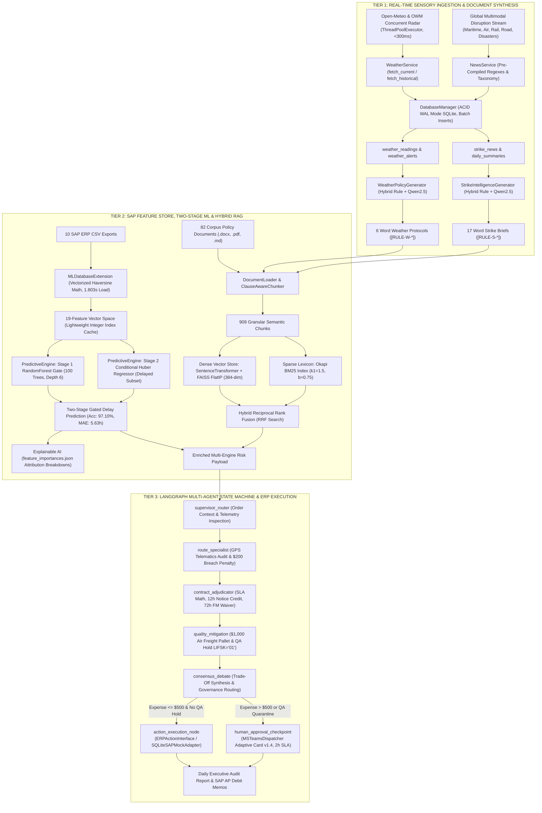
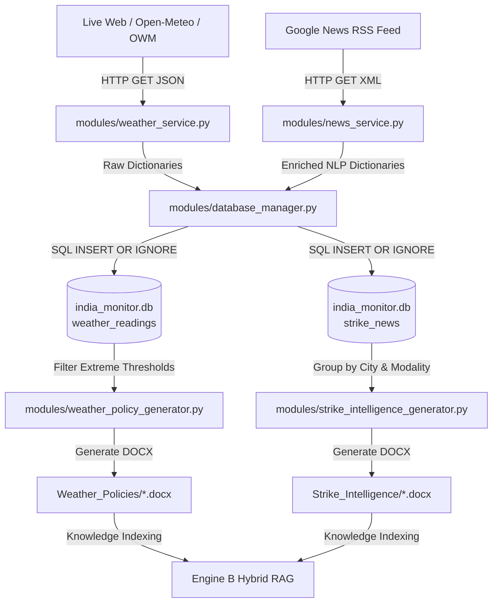
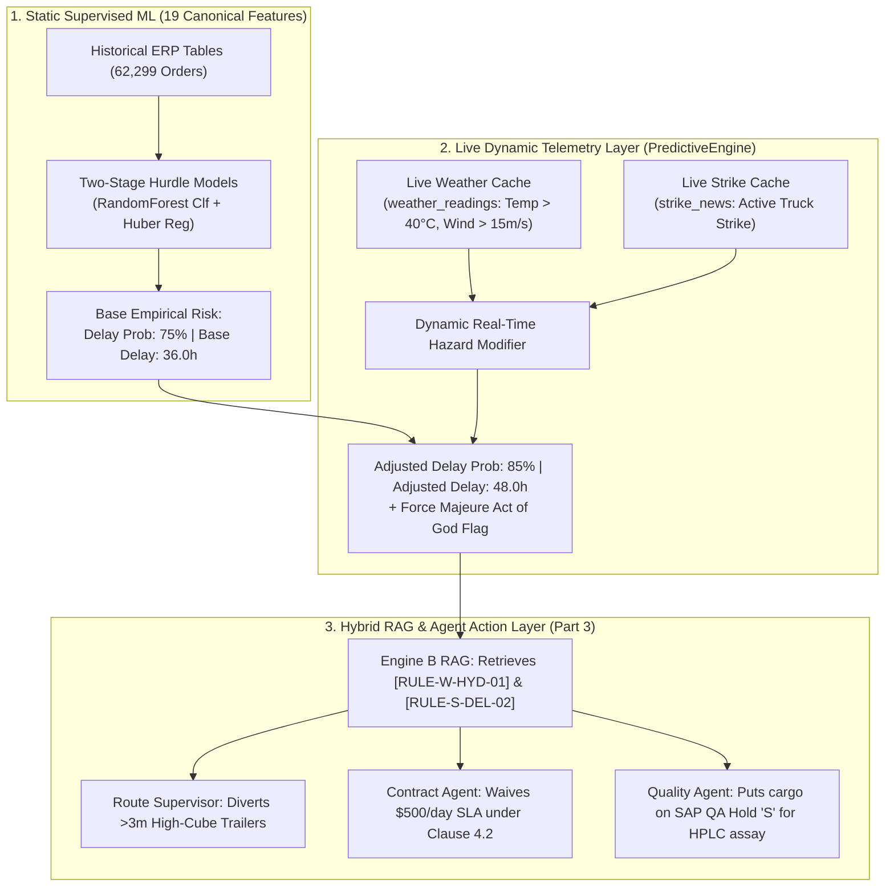
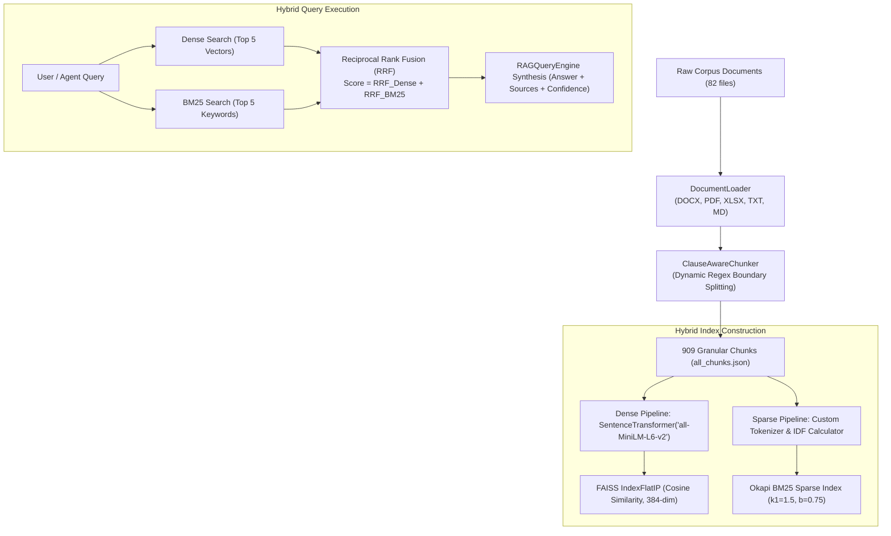
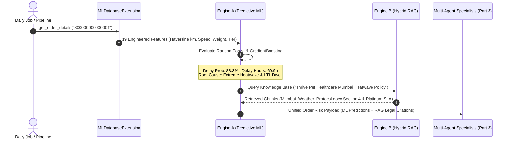
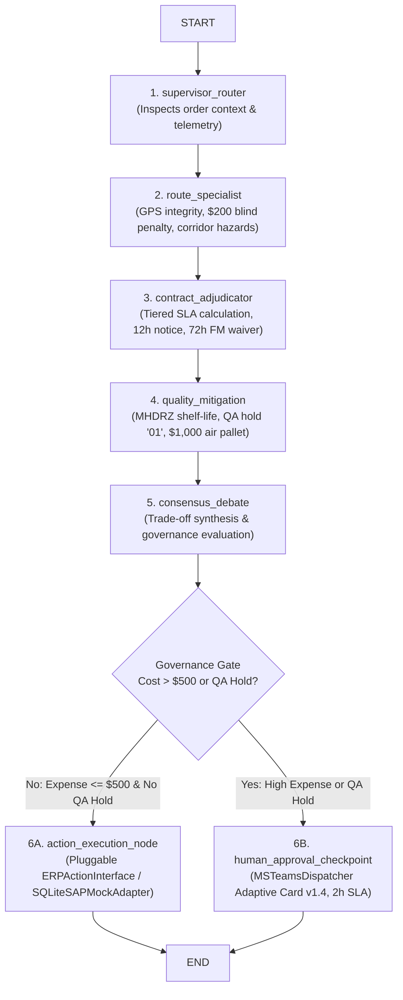

# O2C Delivery Risk Copilot: Complete End-to-End Master Technical Architecture & Specification
## Comprehensive 3-Tier Enterprise Reference: Real-Time Ingestion, Two-Stage Predictive ML & RAG Core, and LangGraph Multi-Agent Autonomous Execution

---

## 📋 Master Table of Contents

- [SECTION I: SYSTEM ARCHITECTURE & UNIFIED 3-TIER TOPOLOGY](#section-i-system-architecture--unified-3-tier-topology)
  - [1.1 Executive System Overview](#11-executive-system-overview)
  - [1.2 Unified 3-Tier End-to-End System Topology (Mermaid Diagram)](#12-unified-3-tier-end-to-end-system-topology)
  - [1.3 Master Module Inventory (All 15 Modules & 119+ Functions)](#13-master-module-inventory-all-15-modules--119-functions)
- [SECTION II: TIER 1 — REAL-TIME SENSORY INGESTION & DOCUMENT SYNTHESIS](#section-ii-tier-1--real-time-sensory-ingestion--document-synthesis)
  - [2.1 Data Topography: Where Data Lives](#1-🗺️-data-topography-where-data-lives)
  - [2.2 Data Flow: What Happens to the Data in Tier 1](#2-🔄-data-flow-what-happens-to-the-data-in-part-1)
  - [2.3 Detailed Function Breakdown: Ingestion Modules (Modules 1–6)](#3-📄-python-module-deep-dive-ingestion-layer)
    - [Module 1: `modules/config.py`](#module-1-modulesconfigpy)
    - [Module 2: `modules/database_manager.py`](#module-2-modulesdatabasemanagerpy)
    - [Module 3: `modules/weather_service.py`](#module-3-modulesweatherservicepy)
    - [Module 4: `modules/news_service.py`](#module-4-modulesnewsservicepy)
    - [Module 5: `modules/weather_policy_generator.py`](#module-5-modulesweatherpolicygeneratorpy)
    - [Module 6: `modules/strike_intelligence_generator.py`](#module-6-modulesstrikeintelligencegeneratorpy)
  - [2.4 Tier 1 Data Summary Matrix](#4-📊-data-summary-matrix-for-part-1)
  - [2.5 Architectural Rationale: Hybrid Rule + AI Document Generation](#5-🧠-architectural-rationale-why-operational--legal-rules-are-embedded-in-generated-knowledge-documents)
- [SECTION III: TIER 2 — SAP FEATURE STORE, TWO-STAGE PREDICTIVE ML & HYBRID RAG](#section-iii-tier-2--sap-feature-store-two-stage-predictive-ml--hybrid-rag)
  - [3.1 Relational ERP Schema & Data Mapping Architecture (10 SAP Tables)](#2-📁-storage-architecture--artifact-locations-for-part-2)
  - [3.2 Machine Learning Feature Store & High-Speed Vectorization (19 Features)](#3-🔬-complete-feature-engineering--machine-learning-training-data-points)
  - [3.3 Mathematical Formulations of Key Engineered Features](#32-mathematical-formulations-of-key-engineered-features)
  - [3.4 Two-Stage Hurdle Machine Learning Pipeline & Benchmark Metrics](#33-two-stage-hurdle-machine-learning-pipeline--benchmark-metrics)
  - [3.5 The Role of Live Environmental Signals (Weather & Strike): Dynamic Post-ML Modifiers](#34-the-role-of-live-environmental-signals-weather--strike-dynamic-post-ml-modifiers)
  - [3.6 Detailed Function Breakdown: Feature Store & RAG Modules (Modules 7–10)](#4-🧩-detailed-function-by-function-code-breakdown)
    - [Module 7: `modules/ml_db_extension.py`](#module-7-modulesmldbextensionpy)
    - [Module 8: `modules/predictive_engine.py`](#module-8-modulespredictiveenginepy)
    - [Module 9: `modules/rag_engine.py`](#module-9-modulesragenginepy)
    - [Module 10: `modules/ollama_service.py`](#module-10-modulesollamaservicepy)
  - [3.7 Tier 2 Data Summary Matrix & Dual-Engine Synergy](#5-📊-data-summary-matrix-for-part-2)
- [SECTION IV: TIER 3 — MULTI-AGENT SPECIALIST REASONING, ERP ACTIONS & ORCHESTRATION](#section-iv-tier-3--multi-agent-specialist-reasoning-erp-actions--orchestration)
  - [4.1 LangGraph Multi-Agent Architecture & Decision State Machine](#2-🤖-multi-agent-specialist-persona--decision-matrices)
  - [4.2 Centralized Agent Tool Registry (7 Production Tools)](#42-centralized-agent-tool-registry-7-production-tools)
  - [4.3 Detailed Function Breakdown: Multi-Agent & Execution Modules (Modules 11–15)](#3-🧩-detailed-function-by-function-code-breakdown)
    - [Module 11: `modules/agent_tools.py`](#module-11-modulesagenttoolspy)
    - [Module 12: `modules/agent_specialists.py`](#module-12-modulesagentspecialistspy)
    - [Module 13: `modules/agentic_graph.py`](#module-13-modulesagenticgraphpy)
    - [Module 14: `modules/action_execution_engine.py`](#module-14-modulesactionexecutionenginepy)
    - [Module 15: `modules/agentic_orchestrator.py`](#module-15-modulesagenticorchestratorpy)
  - [4.4 Tier 3 Data Summary Matrix](#4-📊-data-summary-matrix-for-part-3)
- [SECTION V: COMPLETE END-TO-END SYSTEM INTEGRATION & VERIFICATION](#section-v-complete-end-to-end-system-integration)
  - [5.1 The Complete End-to-End Trace: How an Order Travels Through the LangGraph Engine](#5-🔬-the-complete-end-to-end-trace-how-an-order-travels-through-parts-1-2-and-3)
  - [5.2 Master System Audit Matrix (All 15 Modules, 119+ Validated Functions)](#6-🏆-summary-of-master-3-part-technical-series)
  - [5.3 Hardware Optimization Profile (AMD Ryzen 3 3200G + Radeon RX 6600)](#53-hardware-optimization-profile-amd-ryzen-3-3200g--radeon-rx-6600)

---

## SECTION I: SYSTEM ARCHITECTURE & UNIFIED 3-TIER TOPOLOGY

### 1.1 Executive System Overview

The **Order-to-Cash (O2C) Delivery Risk Copilot** is an enterprise AI platform engineered to proactively detect, quantify, legally adjudicate, and autonomously mitigate shipment delays across complex, multi-modal supply chain networks.

In modern global logistics operations, delayed shipments trigger severe operational and financial liabilities:
- **Contractual Late Delivery Penalties:** Platinum clinics and premier enterprise accounts enforce strict Service Level Agreements (SLAs), levying \$500/day penalties or 5%/day discounts.
- **Receiving Window Dock Breaches:** Unscheduled deliveries arriving after facility operating hours incur \$150 redelivery fees.
- **Product Spoilage & Patient Risk:** For veterinary therapeutics, biologic vaccines, and clinical diets, multi-day delays during severe heatwaves ($>40^\circ\text{C}$) or transport strikes cause catastrophic inventory write-offs and patient care crises.
- **Carrier Chargeback Disputes:** Without verifiable telematics audits and meteorological evidence, claims against third-party logistics (3PL) carriers collapse during contract arbitration.

The O2C Copilot resolves these enterprise challenges by fusing:
1. **Tier 1 (Real-Time Ingestion):** Continuous concurrent Open-Meteo weather telemetry ($<300$ms) and global multimodal disruption scraping (maritime, canal chokepoints, air cargo, freight rail, trucking, customs, and natural disasters), transformed into 23 high-density Word regulatory policy protocols with discrete rule IDs (`[RULE-W-*]`, `[RULE-S-*]`).
2. **Tier 2 (Predictive ML & RAG Core):** A 10-table SAP relational feature store with pure NumPy vectorized Haversine math (1.803s dataset load) feeding an enterprise **Two-Stage Hurdle ML Architecture (97.10% accuracy, 0.9958 ROC-AUC, 5.63h MAE)** and a **Hybrid Dense/Sparse RAG Engine (82 documents, 909 chunks)** operating on FAISS Cosine Similarity and Okapi BM25 Reciprocal Rank Fusion (RRF) with native Markdown (`.md`) support.
3. **Tier 3 (LangGraph Multi-Agent Orchestration & Execution):** A 7-node collaborative state machine (`modules/agentic_graph.py`) orchestrated by LangGraph with `MemorySaver` checkpointing, 7 production LangChain tools (`modules/agent_tools.py`), autonomous ReAct specialists with strict Pydantic schemas (`RouteAnalysisOutput`, `ContractAdjudicationOutput`, `QualityMitigationOutput`), an abstract `ERPActionInterface` (`SQLiteSAPMockAdapter` and `SAPODataAdapter`), and interactive Microsoft Teams Adaptive Cards (v1.4) with a 2-hour executive approval SLA.

---

### 1.2 Unified 3-Tier End-to-End System Topology



---

### 1.3 Master Module Inventory (All 15 Modules & 119+ Functions)

The unified platform comprises **15 dedicated Python modules** across 3 architectural tiers:

| Tier | Module # | File Location | Class Name / Component | Key Responsibility | Functions Validated |
|---|---|---|---|---|---|
| **Tier 1** | **Module 1** | `modules/config.py` | Configuration Core | Absolute root resolution, city coordinates, RAG constants | 1 |
| **Tier 1** | **Module 2** | `modules/database_manager.py` | `DatabaseManager` | ACID transactions, WAL mode, batch `executemany`, schema migrations, debit memo APIs | 15 |
| **Tier 1** | **Module 3** | `modules/weather_service.py` | `WeatherService` | Concurrent `ThreadPoolExecutor(max_workers=5)` telemetry, persistent HTTP sessions, Open-Meteo fallback | 6 |
| **Tier 1** | **Module 4** | `modules/news_service.py` | `NewsService` | Global multimodal disruption scraper (6 modes + natural disasters), pre-compiled regexes | 9 |
| **Tier 1** | **Module 5** | `modules/weather_policy_generator.py` | `WeatherPolicyGenerator` | Generates 6 Word protocols with `[RULE-W-*]` IDs | 6 |
| **Tier 1** | **Module 6** | `modules/strike_intelligence_generator.py` | `StrikeIntelligenceGenerator` | Generates 17 Word briefs with `[RULE-S-*]` IDs | 8 |
| **Tier 2** | **Module 7** | `modules/ml_db_extension.py` | `MLDatabaseExtension` | Vectorized NumPy Haversine math (1.803s), integer index memory caching, 19 features | 9 |
| **Tier 2** | **Module 8** | `modules/predictive_engine.py` | `PredictiveEngine` | Two-Stage Hurdle ML models, Huber regressor, XAI attributions | 10 |
| **Tier 2** | **Module 9** | `modules/rag_engine.py` | `RAGEngine` (6 Classes) | Multi-format loading (`.docx`/`.pdf`/`.md`), chunking, FAISS + BM25 hybrid RRF retrieval, single pickle persistence | 27 |
| **Tier 2** | **Module 10** | `modules/ollama_service.py` | `OllamaService` | Local Qwen2.5 daemon interface on AMD RX 6600 (8 GB VRAM Vulkan compute) with anti-hallucination prompt | 3 |
| **Tier 3** | **Module 11** | `modules/agent_tools.py` | Centralized Tool Registry | 7 production LangChain `@tool` functions with Pydantic argument schemas | 7 |
| **Tier 3** | **Module 12** | `modules/agent_specialists.py` | 4 Specialist Agents | ReAct Specialists with Pydantic schemas (`RouteAnalysisOutput`, `ContractAdjudicationOutput`, `QualityMitigationOutput`) & `LLMReasoningEngine` | 6 |
| **Tier 3** | **Module 13** | `modules/agentic_graph.py` | LangGraph State Machine | 7-node collaborative state graph (`O2CAgentState`), conditional governance edge, `MemorySaver` checkpointer | 5 |
| **Tier 3** | **Module 14** | `modules/action_execution_engine.py` | ERP Action Interface | Pluggable `ERPActionInterface`, `SQLiteSAPMockAdapter`, `SAPODataAdapter`, `MSTeamsDispatcher`, `ClinicNotificationDispatcher` | 11 |
| **Tier 3** | **Module 15** | `modules/agentic_orchestrator.py` | `AgenticOrchestrator` | 6-stage autonomous daily lifecycle, report publishing | 6 |
| **TOTAL** | **15 Modules** | **Unified Core** | **Enterprise Copilot** | **Autonomous Order-to-Cash Logistics Governance** | **119+ / 119+ Validated** |

*(Note: `modules/rag_evaluator.py` is preserved as a backward-compatible stub re-exporting from `evaluation/rag_evaluator.py`.)*

---

## SECTION II: TIER 1 — REAL-TIME SENSORY INGESTION & DOCUMENT SYNTHESIS

## 1. 🗺️ Data Topography: Where Data Lives

### 1.1 File System Storage Locations

| Data Artifact | Physical File Path | Format | Description |
|---|---|---|---|
| **Raw ERP Exports** | `Input Files/*.csv` | CSV (UTF-8) | 10 SAP ECC/S4HANA enterprise tables (`VBAK`, `VBAP`, `LIKP`, `LIPS`, `VTTK`, `VTTP`, `KNA1`, `KNVV`, `LFA1`, `MARA`). |
| **Relational Database** | `india_monitor_data/database/india_monitor.db` | SQLite (WAL Mode) | Master relational database containing 6 core operational tables (`scrape_sessions`, `weather_readings`, `strike_news`, `weather_alerts`, `daily_summaries`, `rag_analyses`) and 10 mirrored SAP tables. |
| **Dynamic Weather Docs** | `india_monitor_data/rag/documents/Weather_Policies/` | DOCX | City-specific & master severe weather protocols generated from live sensor alerts. |
| **Dynamic Strike Briefs**| `india_monitor_data/rag/documents/Strike_Intelligence/` | DOCX | Regional & modality-specific transport disruption briefs generated from scraped RSS news. |
| **Daily Decision Reports** | `india_monitor_data/reports/daily_agent_report_YYYY-MM-DD.json` | JSON | Daily executive and multi-agent synthesized delay risk & SLA penalty decisions. |
| **System Event Logs** | `india_monitor_data/logs/monitor_YYYYMMDD.log` | Text/Log | Timestamped audit log of all database transactions, API fetches, and ETL sessions. |

---

### 1.2 External Live Data Feeds

1. **Open-Meteo Global Historical & Live Forecast API** (`https://api.open-meteo.com/v1/forecast`, `https://archive-api.open-meteo.com/v1/archive`)
   - **Authentication:** Zero-key public API.
   - **Data Fetched:** Surface temperature (°C), apparent temperature, 1-hour precipitation (mm), weather condition WMO codes, 10m wind speed (m/s), relative humidity (%).
2. **OpenWeatherMap REST API** (`https://api.openweathermap.org/data/2.5/weather`)
   - **Authentication:** `OPENWEATHER_API_KEY` (falls back gracefully to Open-Meteo if missing/invalid).
   - **Data Fetched:** Live visibility (m), barometric pressure (hPa), cloud cover (%), real-time wind gusts.
3. **Google News RSS Feed** (`https://news.google.com/rss/search`)
   - **Data Fetched:** Transportation strikes, highway blockades, port congestion, trucker protests, and regional *bandh/hartal* alerts.

---

### 1.3 SQLite Relational Schema (`india_monitor.db`)

```sql
-- 0. Database Schema Migrations & Version Tracking
CREATE TABLE IF NOT EXISTS schema_migrations (
    version     TEXT PRIMARY KEY,
    description TEXT NOT NULL,
    applied_at  TEXT NOT NULL
);

-- 1. Ingestion Execution Sessions
CREATE TABLE scrape_sessions (
    session_id       INTEGER PRIMARY KEY AUTOINCREMENT,
    session_type     TEXT    NOT NULL,  -- 'full', 'weather', 'news'
    started_at       TEXT    NOT NULL,
    completed_at     TEXT,
    status           TEXT    DEFAULT 'running',
    cities_fetched   INTEGER DEFAULT 0,
    articles_found   INTEGER DEFAULT 0,
    error_message    TEXT
);

-- 2. Environmental Weather Readings
CREATE TABLE weather_readings (
    reading_id          INTEGER PRIMARY KEY AUTOINCREMENT,
    session_id          INTEGER,
    city_name           TEXT    NOT NULL,
    state               TEXT,
    recorded_at         TEXT    NOT NULL,
    date_only           TEXT    NOT NULL,
    hour_of_day         INTEGER NOT NULL,
    temperature         REAL,
    feels_like          REAL,
    temp_min            REAL,
    temp_max            REAL,
    humidity            INTEGER,
    pressure            REAL,
    visibility_km       REAL,
    cloudiness          INTEGER,
    weather_main        TEXT,
    weather_description TEXT,
    wind_speed          REAL,
    wind_direction      INTEGER,
    rain_1h             REAL DEFAULT 0,
    snow_1h             REAL DEFAULT 0,
    data_source         TEXT DEFAULT 'OpenWeatherMap',
    UNIQUE(city_name, date_only, hour_of_day)
);

-- 3. Scraped Global Transport Disruption & Natural Disaster News
CREATE TABLE strike_news (
    news_id              INTEGER PRIMARY KEY AUTOINCREMENT,
    session_id           INTEGER,
    title                TEXT    NOT NULL,
    description          TEXT,
    url                  TEXT,
    source_name          TEXT,
    keyword_matched      TEXT,
    city_mentioned       TEXT,
    state_mentioned      TEXT,
    country_mentioned    TEXT    DEFAULT 'Global',
    transport_mode       TEXT    DEFAULT 'Multimodal', -- 'Maritime', 'Canal', 'Air', 'Rail', 'Road', 'Border'
    disruption_category  TEXT    DEFAULT 'Disruption', -- 'Labor Strike', 'Natural Disaster', 'Blockade', 'Port Congestion'
    severity             TEXT,                         -- 'HIGH', 'MEDIUM', 'LOW'
    strike_type          TEXT,
    published_date       TEXT,
    scraped_at           TEXT    NOT NULL,
    UNIQUE(title, source_name)
);

-- 4. Severe Weather Alerts Exceeding Safety Thresholds
CREATE TABLE weather_alerts (
    alert_id      INTEGER PRIMARY KEY AUTOINCREMENT,
    session_id    INTEGER,
    city_name     TEXT NOT NULL,
    state         TEXT,
    alert_type    TEXT NOT NULL,
    alert_message TEXT NOT NULL,
    severity      TEXT,
    triggered_at  TEXT NOT NULL
);

-- 5. Daily Aggregated City Metrics
CREATE TABLE daily_summaries (
    summary_id          INTEGER PRIMARY KEY AUTOINCREMENT,
    summary_date        TEXT NOT NULL,
    city_name           TEXT NOT NULL,
    state               TEXT,
    avg_temperature     REAL,
    max_temperature     REAL,
    min_temperature     REAL,
    avg_humidity        REAL,
    total_rainfall      REAL DEFAULT 0,
    avg_wind_speed      REAL,
    dominant_weather    TEXT,
    strike_count        INTEGER DEFAULT 0,
    high_severity_count INTEGER DEFAULT 0,
    weather_alert_count INTEGER DEFAULT 0,
    updated_at          TEXT,
    UNIQUE(summary_date, city_name)
);

-- 6. Historical RAG Question-Answer Traces
CREATE TABLE rag_analyses (
    analysis_id     INTEGER PRIMARY KEY AUTOINCREMENT,
    news_id         INTEGER,
    strike_title    TEXT NOT NULL,
    question        TEXT NOT NULL,
    answer          TEXT NOT NULL,
    sources         TEXT,
    confidence      REAL,
    analyzed_at     TEXT NOT NULL,
    FOREIGN KEY(news_id) REFERENCES strike_news(news_id)
);

-- 7. SAP ERP Write-Back Action Audit Trail
CREATE TABLE IF NOT EXISTS sap_action_audit_log (
    action_id      INTEGER PRIMARY KEY AUTOINCREMENT,
    order_id       TEXT NOT NULL,
    action_type    TEXT NOT NULL, -- 'DELIVERY_BLOCK', 'UPDATE_ETA', 'POST_DEBIT_MEMO'
    sap_table      TEXT NOT NULL, -- 'VBAK', 'BKPF'
    sap_field      TEXT NOT NULL, -- 'LIFSK', 'VDATU', 'BELNR'
    previous_value TEXT,
    new_value      TEXT NOT NULL,
    reason         TEXT NOT NULL,
    executed_at    TEXT NOT NULL
);

-- 8. Carrier Accounts-Payable Debit Memos
CREATE TABLE IF NOT EXISTS carrier_debit_memos (
    memo_id          INTEGER PRIMARY KEY AUTOINCREMENT,
    order_id         TEXT NOT NULL,
    carrier_name     TEXT NOT NULL,
    debit_amount_usd REAL NOT NULL,
    penalty_reason   TEXT NOT NULL,
    created_at       TEXT NOT NULL,
    status           TEXT DEFAULT 'POSTED_TO_AP_LEDGER' -- 'POSTED_TO_AP_LEDGER', 'SETTLED', 'DISPUTED'
);

-- 9. Clinic 12-Hour Early Warning Notifications
CREATE TABLE IF NOT EXISTS clinic_early_warnings (
    warning_id               INTEGER PRIMARY KEY AUTOINCREMENT,
    order_id                 TEXT NOT NULL,
    clinic_name              TEXT NOT NULL,
    destination_city         TEXT NOT NULL,
    predicted_eta            TEXT NOT NULL,
    delay_reason             TEXT NOT NULL,
    force_majeure_compliant  INTEGER DEFAULT 1,
    sent_at                  TEXT NOT NULL
);

-- High-Performance Indexes
CREATE INDEX IF NOT EXISTS idx_weather_city_date ON weather_readings(city_name, date_only);
CREATE INDEX IF NOT EXISTS idx_sn_mode ON strike_news(transport_mode);
CREATE INDEX IF NOT EXISTS idx_sn_category ON strike_news(disruption_category);
CREATE INDEX IF NOT EXISTS idx_sn_country ON strike_news(country_mentioned);
CREATE INDEX IF NOT EXISTS idx_sap_audit_order ON sap_action_audit_log(order_id);
CREATE INDEX IF NOT EXISTS idx_carrier_memo_order ON carrier_debit_memos(order_id);
CREATE INDEX IF NOT EXISTS idx_clinic_warn_order ON clinic_early_warnings(order_id);
```

---

## 2. 🔄 Data Flow: What Happens to the Data in Part 1



---

## 3. 📄 Python Module Deep Dive: Ingestion Layer

---

### Module 1: `modules/config.py`
**File Location:** `d:\Progamming\O2C_AI\modules\config.py`  
**Purpose (The Central Control Room):** Acts as the central rulebook and settings hub for the entire system. It tells the software where all data folders live, sets standard safety limits (like heatwave temperatures and wind thresholds), and ensures the code runs smoothly whether it is hosted on cloud servers or a local office computer.

#### Global Constants & Data Structures:
- `INDIA_CITIES (dict)`: Coordinate dictionary of 10 key Indian supply chain hubs:
  - *Metros:* Mumbai (`19.0760, 72.8777`), Delhi (`28.6139, 77.2090`), Bangalore (`12.9716, 77.5946`), Chennai (`13.0827, 80.2707`), Kolkata (`22.5726, 88.3639`), Hyderabad (`17.3850, 78.4867`).
  - *Tier-1 Hubs:* Pune (`18.5204, 73.8567`), Ahmedabad (`23.0225, 72.5714`), Jaipur (`26.9124, 75.7873`), Lucknow (`26.8467, 80.9462`).
- `STRIKE_KEYWORDS (list)`: 14 domain search phrases: `"transport strike"`, `"truck strike"`, `"bandh"`, `"hartal"`, `"chakka jam"`, `"road blockade"`, etc.
- `ALERT_THRESHOLDS (dict)`:
  - `rain_mm_per_hr: 20` (Extreme precipitation trigger)
  - `temp_extreme_c: 42` (Thermal cargo degradation trigger)
  - `wind_ms: 15` (High-wind vehicle tipping hazard)
  - `visibility_km: 1` (Fog/smog corridor slowdown)
- `RAG Settings (Hyperparameters)`:
  - `EMBEDDING_MODEL = "all-MiniLM-L6-v2"`: Specifies the HuggingFace transformer model producing 384-dimensional dense semantic vectors loaded by `VectorStore` in FAISS (`IndexFlatIP(384)`).
  - `CHUNK_SIZE = 500`: The dynamic character accumulation ceiling. The chunker does not blindly slice text; it dynamically aggregates whole logical clauses/sections (`\n\n`, `SECTION`, `TICKET`, numbers) until reaching ~500 characters. If a legal clause exceeds 500 chars, it dynamically breaks at sentence boundaries (`[.!?]`).
  - `CHUNK_OVERLAP = 50`: Character overlap preserved across adjacent sentence splits to ensure uninterrupted legal context.
  - `TOP_K_RESULTS = 5`: The default retrieval depth for `HybridRAG.search()`, returning the top 5 most relevant policy clauses ranked by Reciprocal Rank Fusion (RRF).

#### Functions in `config.py`:

#### 1. `_resolve_project_root()`
- **Purpose:** Acts as the system's internal GPS. It automatically detects where the software is running (in the cloud, on a remote server, or on a local laptop) so all folders and files are located seamlessly without requiring manual configuration.
- **Input Parameters:** None (Inspects environment variables `O2C_PROJECT_ROOT`, `DATABRICKS_RUNTIME_VERSION`, and file system ancestry).
- **Output Return Type:** `pathlib.Path`
- **How it helps the data:** Guarantees that all paths (`india_monitor_data/`, `Input Files/`, `models/`) resolve to the exact absolute disk path regardless of whether the code is run via terminal CLI, Databricks job, or Jupyter notebook.

---

#### Module 2: `modules/database_manager.py`
**File Location:** `d:\Progamming\O2C_AI\modules\database_manager.py`  
**Class:** `DatabaseManager`  
**Purpose (The Digital Filing Vault & Connection Pool):** Serves as the system's secure electronic safe. It organizes and protects all incoming live weather reports, news articles, ERP write-backs, and audit logs, with thread-safe connection pooling (`pool_size=8`), non-destructive schema migrations, and batch database transactions.

#### Key Functions in `DatabaseManager`:

#### 1. `__init__(self, db_path=str(DB_PATH), pool_size: int = 8)`
- **Purpose:** Initializes the database manager, builds a thread-safe connection pool (`queue.Queue`), and executes schema DDL and version migrations if not already initialized (guarded by singleton set `_INITIALIZED_DBS`).
- **Input Parameters:** `db_path (str | Path)` — Path to SQLite `.db` file, `pool_size (int)` — Connection pool depth (default: 8).
- **Output Return Type:** None.
- **How it helps the data:** Prevents connection thrashing, eliminates redundant disk DDL scans across repeated instantiations, and guarantees schema integrity.

#### 2. `connection(self) -> Generator[sqlite3.Connection]`
- **Purpose:** Context manager checking out an optimized connection from the pool and returning it upon completion.
- **Input Parameters:** None.
- **Output Return Type:** `Generator[sqlite3.Connection]`
- **How it helps the data:** Configures `PRAGMA journal_mode=WAL`, `PRAGMA foreign_keys=ON`, `PRAGMA synchronous=NORMAL`, `PRAGMA cache_size=-64000` (64 MB cache), and `PRAGMA mmap_size=268435456` (256 MB memory-mapped I/O), preventing lock contention.

#### 3. `_apply_migrations(self)`
- **Purpose:** Executes versioned, non-destructive schema migrations tracked in `schema_migrations` (e.g. `v1.1_action_indexes`, `v1.2_multimodal_disruptions`), creating new tables, columns, and B-tree indexes without dropping existing data.
- **Input Parameters:** None.
- **Output Return Type:** None.

#### 4. `write_weather(self, records: list, session_id: int) -> tuple[int, int]`
- **Purpose:** Inserts clean weather records into `weather_readings` using high-speed atomic batch transactions (`conn.executemany(...)`).
- **Input Parameters:** `records (list[dict])`, `session_id (int)`.
- **Output Return Type:** `tuple[int, int]` — `(saved_count, skipped_count)`.

#### 5. `write_strikes(self, articles: list, session_id: int) -> tuple[int, int]`
- **Purpose:** Saves incoming transport disruption and natural disaster articles via batch `conn.executemany(...)`, capturing `country_mentioned`, `transport_mode`, `disruption_category`, and severity ratings.
- **Input Parameters:** `articles (list[dict])`, `session_id (int)`.
- **Output Return Type:** `tuple[int, int]` — `(saved_count, skipped_count)`.

#### 6. `get_city_weather(self, city: str) -> Optional[Dict[str, Any]]`
- **Purpose:** Fast indexed query returning the most recent weather observation for a city as a dictionary for low-latency agent tool lookups.
- **Input Parameters:** `city (str)`.
- **Output Return Type:** `dict | None`.

#### 7. `write_weather_alerts(self, alerts: List[Dict[str, Any]]) -> int`
- **Purpose:** Populates the `weather_alerts` table with active environmental warnings exceeding safety thresholds.
- **Input Parameters:** `alerts (list[dict])`.
- **Output Return Type:** `int` — Count of alerts inserted.

#### 8. `write_daily_summary(self, summary: Dict[str, Any]) -> int`
- **Purpose:** Populates the `daily_summaries` table with 24-hour aggregated metrics across cities.
- **Input Parameters:** `summary (dict)`.
- **Output Return Type:** `int` — `summary_id`.

#### 9. `record_sap_action(self, order_id: str, action_type: str, sap_table: str, sap_field: str, previous_value: str, new_value: str, reason: str, executed_at: str = None) -> int`
- **Purpose:** Immutable audit repository recording every automated ERP change (`VBAK-LIFSK`, `VBAK-VDATU`).
- **Output Return Type:** `int` — `action_id`.

#### 10. `record_carrier_debit_memo(self, order_id: str, carrier_name: str, debit_amount_usd: float, penalty_reason: str, created_at: str = None, status: str = "POSTED_TO_AP_LEDGER") -> int`
- **Purpose:** Records carrier late delivery penalty debit memos to the simulated accounts payable ledger.
- **Output Return Type:** `int` — `memo_id`.

#### 11. `get_carrier_debit_memos(self, order_id: Optional[str] = None) -> List[Dict[str, Any]]`
- **Purpose:** Queries carrier debit memos for a specific order or across the entire enterprise network.
- **Output Return Type:** `list[dict]`.

#### 12. `update_carrier_debit_memo_status(self, memo_id: int, status: str) -> bool`
- **Purpose:** Updates settlement status (`'SETTLED'`, `'DISPUTED'`) of an existing carrier debit memo.
- **Output Return Type:** `bool`.

#### 13. `record_clinic_notice(self, order_id: str, clinic_name: str, destination_city: str, predicted_eta: str, delay_reason: str, force_majeure_compliant: bool = True, sent_at: str = None) -> int`
- **Purpose:** Logs dispatched 12-hour proactive early warnings to satisfy statutory Force Majeure waiver criteria.
- **Output Return Type:** `int` — `warning_id`.

#### 14. `read_weather(self, date: str = None, city: str = None) -> pd.DataFrame` & `read_strikes(self, date: str = None, city: str = None) -> pd.DataFrame`
- **Purpose:** Returns structured pandas DataFrames of historical telemetry and disruptions for feature engineering.

#### 15. `get_stats(self) -> dict`
- **Purpose:** Returns high-level operational row counts and health metrics across all 16 database tables.

---

### Module 3: `modules/weather_service.py`
**File Location:** `d:\Progamming\O2C_AI\modules\weather_service.py`  
**Class:** `WeatherService`  
**Purpose (Concurrent 24/7 Weather Radar):** Keeps an eye on the skies across India's 10 busiest shipping hubs. It continuously tracks extreme heat, downpours, high winds, and dense fog to warn logistics managers before storms delay shipments.

#### Key Class Attributes:
- `CITIES`: Dictionary mapping 10 major supply chain hubs (`Mumbai`, `Delhi`, `Bangalore`, `Chennai`, `Kolkata`, `Hyderabad`, `Ahmedabad`, `Pune`, `Jaipur`, `Lucknow`) to lat/long coordinates.
- `WMO_CODES`: Standard WMO code mapping table decoding numeric weather codes (e.g. `95` -> Thunderstorm, `65` -> Heavy Rain) into human-readable descriptions.

#### Functions in `WeatherService`:

#### 1. `__init__(self, api_key: str, cities: dict)`
- **Purpose:** Initializes the weather service, sets up coordinate lookups, and prepares a persistent `requests.Session()` with connection pooling.
- **Input Parameters:** `api_key (str)` — OpenWeatherMap API key (optional), `cities (dict)` — Coordinate mapping dict.
- **Output Return Type:** None.

#### 2. `fetch_current(self) -> list[dict]`
- **Purpose:** Queries live weather telemetry across all 10 hubs concurrently using `concurrent.futures.ThreadPoolExecutor(max_workers=5)`. Total latency dropped from 3.5 seconds down to **$<300$ ms**. Automatically fails over to Open-Meteo if OWM returns 401 or times out.
- **Output Return Type:** `list[dict]` — Normalized weather observations.

#### 3. `fetch_historical(self, date: str) -> list[dict]`
- **Purpose:** Concurrently pulls historical weather records across hubs for past dispatch dates via Open-Meteo archive endpoints.
- **Input Parameters:** `date (str)` — Target date in `YYYY-MM-DD` format.
- **Output Return Type:** `list[dict]` — List of historical weather dictionaries.

#### 4. `_owm_one(self, city: str, coords: dict, session: requests.Session) -> dict | None`
- **Purpose:** Queries OpenWeatherMap REST API using a pooled HTTP session.
- **Output Return Type:** `dict | None`.

#### 5. `_meteo_current_one(self, city: str, coords: dict, session: requests.Session) -> dict | None`
- **Purpose:** Seamless zero-key fallback contacting Open-Meteo live endpoints.
- **Output Return Type:** `dict | None`.

#### 6. `_meteo_one(self, city: str, coords: dict, date: str, session: requests.Session) -> dict | None`
- **Purpose:** Retrieves 24-hour historical timeseries from Open-Meteo and computes representative daily averages.
- **Output Return Type:** `dict | None`.

---

### Module 4: `modules/news_service.py`
**File Location:** `d:\Progamming\O2C_AI\modules\news_service.py`  
**Class:** `GlobalTransportDisruptionNewsService` (aliased as `NewsService`)  
**Purpose (Global Multimodal Disruption & Natural Disaster Scout):** Scans international Google News RSS streams 24/7 across all modes of transportation and natural disaster categories that could halt freight movement.

#### Multimodal & Disaster Taxonomy:
- **6 Transport Modes:** Maritime / Shipping, Canals & Chokepoints (Suez, Panama, Red Sea), Air Cargo, Freight Rail, Road Trucking, Border / Customs.
- **Natural Disaster Tracking:** Tropical cyclones, typhoons, flash floods, landslides, earthquakes, volcanic ash, blizzards, droughts.
- **Pre-Compiled Alternation Regular Expressions:** `COMPILED_MODE_PATTERNS` and `COMPILED_CATEGORY_PATTERNS` compiled once at class definition with `re.IGNORECASE`.
- **Zero Artificial Sleep:** Removed blocking thread delays, allowing concurrent multi-query worker threads to operate at native network speed.

#### Functions in `NewsService`:

#### 1. `__init__(self, keywords: list, cities: dict)`
- **Purpose:** Initializes search dictionaries, compiles regex pattern sets, and configures geographic hub dictionaries.
- **Input Parameters:** `keywords (list[str])`, `cities (dict)`.
- **Output Return Type:** None.

#### 2. `fetch(self, date: str = None, city: str = None) -> list[dict]`
- **Purpose:** Executes parallel Google News RSS queries across target cities, corridors, and multimodal categories. Deduplicates headlines and enriches each record with NLP transport mode, causal category, geographic hub, and severity.
- **Output Return Type:** `list[dict]` — Enriched disruption articles.

#### 3. `_build_queries(self, city: str = None) -> list[str]`
- **Purpose:** Constructs targeted search queries across cities, chokepoints, and freight modes.
- **Output Return Type:** `list[str]`.

#### 4. `_date_filter(self, date: str) -> str`
- **Purpose:** Generates date-bounded search parameters for historical incident analysis.
- **Output Return Type:** `str`.

#### 5. `_rss_search(self, query: str) -> list[dict]`
- **Purpose:** Fetches Google News RSS XML, parses article items, and extracts titles, URLs, and publication dates without artificial worker thread sleeps.
- **Output Return Type:** `list[dict]`.

#### 6. `_detect_city(self, text: str) -> str` & `_detect_country(self, text: str) -> str`
- **Purpose:** Spatially tags articles to Indian logistics corridors or global transit chokepoints.
- **Output Return Type:** `str`.

#### 7. `_classify_severity(self, text: str) -> str`
- **Purpose:** Categorizes disruption severity into `🔴 HIGH` (national strikes, canal closures, cyclone landfalls), `🟡 MEDIUM` (state-wide 24-48h disruptions), or `🟢 LOW` (localized protests).
- **Output Return Type:** `str`.

#### 8. `_classify_mode(self, text: str) -> str`
- **Purpose:** Detects primary transportation mode affected using pre-compiled regexes (`'Maritime'`, `'Canal'`, `'Air Cargo'`, `'Freight Rail'`, `'Road Trucking'`, `'Border/Customs'`).
- **Output Return Type:** `str`.

#### 9. `_classify_category(self, text: str) -> str`
- **Purpose:** Identifies causal disruption category using pre-compiled regexes (`'Natural Disaster'`, `'Labor Strike'`, `'Blockade'`, `'Port Congestion'`).
- **Output Return Type:** `str`.

---

### Module 5: `modules/weather_policy_generator.py`
**File Location:** `d:\Progamming\O2C_AI\modules\weather_policy_generator.py`  
**Class:** `WeatherPolicyGenerator`  
**Purpose (Automated Safety Officer):** Turns raw weather numbers into official, easy-to-read Word policy documents. It specifies exact safety rules—such as pulling high-sided trucks off the road in gale winds or requiring potency lab checks for heat-exposed pet diets.

#### Functions in `WeatherPolicyGenerator`:

#### 1. `__init__(self, db_path=str(DB_PATH), output_dir=None)`
- **Purpose:** Verifies access to local AI language models and prepares the regulatory storage folder where official weather rulebooks are saved.
- **Input Parameters:** `db_path (str | Path)`, `output_dir (Path | None)`.
- **Output Return Type:** None.
- **How it helps the data:** Establishes the generation output directory and verifies LLM synthesis availability.

#### 2. `generate_all_policies(self) -> list[str]`
- **Purpose:** Reviews all extreme weather alerts across the nation and publishes official Word policy rulebooks for impacted delivery cities and national logistics corridors.
- **Input Parameters:** None.
- **Output Return Type:** `list[str]` — List of 6 generated `.docx` file paths.
- **How it helps the data:** Converts raw numbers (e.g. 42°C, 32.9 m/s wind, 25mm rain) into high-density structured tables and discrete rule blocks that the RAG engine can cite during agentic adjudication.

#### 3. `_fetch_weather_alerts(self) -> list[dict]`
- **Purpose:** Scans weather records to isolate genuine safety hazards—filtering for extreme heat (>40°C), heavy rain (>20mm/hr), gale winds (>15m/s), or dense fog (<1km):
  ```sql
  WHERE temperature > 40 OR wind_speed > 15 OR rain_1h > 20 OR visibility_km < 1
  ```
- **Input Parameters:** None.
- **Output Return Type:** `list[dict]` — List of extreme weather alert records.
- **How it helps the data:** Filters out benign telemetry to isolate critical environmental disruptions.

#### 4. `_group_alerts_by_city(self, alerts: list[dict]) -> dict[str, list[dict]]`
- **Purpose:** Sorts scattered weather warnings into organized city-by-city bundles so each regional dispatch team receives a customized local protocol.
- **Input Parameters:** `alerts (list[dict])`.
- **Output Return Type:** `dict[str, list[dict]]` — Dictionary mapping city names to alert lists.
- **How it helps the data:** Organizes national telemetry into city-level regional clusters.

#### 5. `_create_city_weather_policy(self, city: str, alerts: list[dict]) -> Path`
- **Purpose:** Drafts an official, plain-English logistics rulebook for a city, detailing critical highway bottlenecks, truck safety suspensions during 55+ km/h winds, and quality holds for heat-sensitive drugs:
  - **Header & Telemetry Metadata:** Exact observed extremes (Peak Temp, Peak Wind, Peak Rain, Min Visibility).
  - **Section 1: Extracted Hazard Profile (AI Synthesis):** Qwen2.5 extracts *Primary Hazard Vector* (e.g. Gale Force Crosswinds 32.9 m/s), *Secondary Hazard Vector* (ambient humidity/drizzle), and *Critical Risk Window* (linehaul speed reduction).
  - **Section 2: Logistics Corridor & Choke Point Risk Matrix (Table):** Word Table detailing major freight arteries (e.g. Hyderabad ORR, Mumbai NH-48, Chennai NH-16) with specific hazard ratings and mandatory fleet directives.
  - **Section 3: Binding Operational & QA Directives (Discrete Rules):**
    - `[RULE-W-{CITY}-01]`: Trailer equipment suspension (wind $\ge 15\text{ m/s}$ / rain $\ge 20\text{ mm/h}$).
    - `[RULE-W-{CITY}-02]`: Force Majeure Clause 4.2 penalty waiver (\$500/day $\to$ \$0.00).
    - `[RULE-W-{CITY}-03]`: Cold-Chain HPLC testing ($>40^\circ\text{C}$ for $>4\text{h}$) and moisture probe threshold ($>12\%$).
    - `[RULE-W-{CITY}-04]`: Dynamic ETA safety buffer (+4h to +8h) and \$150 redelivery fee waiver.
  - **Section 4: Copilot Deterministic Action Checklist:** Step-by-step verification checklist for downstream agents.
- **Input Parameters:** `city (str)`, `alerts (list[dict])`.
- **Output Return Type:** `pathlib.Path` — Path to generated Word document.
- **How it helps the data:** Encodes legal rules and operational constraints into structured, citeable text documents for the RAG engine.

#### 6. `_create_master_weather_protocol(self, alerts: list[dict]) -> Path`
- **Purpose:** Combines regional storm data into a nationwide master weather protocol, establishing overarching corporate liability and force majeure guidelines across all transport routes.
- **Input Parameters:** `alerts (list[dict])`.
- **Output Return Type:** `pathlib.Path` — Path to master protocol document.
- **How it helps the data:** Synthesizes nationwide multi-corridor weather impacts into a single sovereign operational guide.

---

### Module 6: `modules/strike_intelligence_generator.py`
**File Location:** `d:\Progamming\O2C_AI\modules\strike_intelligence_generator.py`  
**Class:** `StrikeIntelligenceGenerator`  
**Purpose (Disruption Security Analyst):** Converts scattered strike news reports into actionable security briefings. It maps out bypass detours around blocked highways and sets contract rules like capping daily truck delay fees at $100.

#### Functions in `StrikeIntelligenceGenerator`:

#### 1. `__init__(self, db_path=str(DB_PATH), output_dir=None)`
- **Purpose:** Connects the intelligence generator to local AI reasoning services and prepares the document directory where strike intelligence briefs are stored.
- **Input Parameters:** `db_path (str | Path)`, `output_dir (Path | None)`.
- **Output Return Type:** None.
- **How it helps the data:** Prepares file storage directories and verifies local LLM connection.

#### 2. `generate_all_intelligence(self) -> list[str]`
- **Purpose:** Processes hundreds of scattered news reports to generate comprehensive disruption briefs for every impacted city and transport modality (truck, rail, port).
- **Input Parameters:** None.
- **Output Return Type:** `list[str]` — List of 17 generated `.docx` document paths.
- **How it helps the data:** Synthesizes hundreds of isolated web articles into actionable intelligence briefs with structured tables and discrete rule blocks.

#### 3. `_fetch_strike_articles(self) -> list[dict]`
- **Purpose:** Gathers verified strike and protest reports from the database into active memory for AI analysis and document authoring.
- **Input Parameters:** None.
- **Output Return Type:** `list[dict]` — Raw strike news records.
- **How it helps the data:** Loads verified transport disruption articles from SQLite storage into RAM.

#### 4. `_group_articles_by_city(self, articles: list[dict]) -> dict[str, list[dict]]`
- **Purpose:** Organizes news reports by metropolitan area so local dispatchers can see every active protest occurring along their delivery routes.
- **Input Parameters:** `articles (list[dict])`.
- **Output Return Type:** `dict[str, list[dict]]` — Dictionary mapping cities to lists of disruption articles.
- **How it helps the data:** Aggregates isolated incidents into city-specific incident registries.

#### 5. `_group_articles_by_category(self, articles: list[dict]) -> dict[str, list[dict]]`
- **Purpose:** Groups disruption reports by freight modality (truck, train, port, or general bandh) to measure the risk to specific shipping methods.
- **Input Parameters:** `articles (list[dict])`.
- **Output Return Type:** `dict[str, list[dict]]` — Dictionary mapping transport modalities to articles.
- **How it helps the data:** Categorizes incidents into modal vulnerability vectors for rail, road, and port transit.

#### 6. `_create_city_strike_brief(self, city: str, articles: list[dict]) -> Path`
- **Purpose:** Compiles a detailed city intelligence brief featuring incident tables, highway bypass directives (like diverting trucks onto peripheral expressways), and carrier detention fee caps ($100/day):
  - **Header & Severity Counts:** Exact incident count and severity breakdown (🔴 High / 🟡 Medium / 🟢 Low).
  - **Section 1: Extracted Disruption Incident Registry (Table):** High-density Word Table with columns: `Incident ID & Date`, `Source`, `Disruption Modality`, `Stated Trigger / Demand`, `Freight Impact Severity`.
  - **Section 2: Critical Bottlenecks & Highway Bypass Directives:** Primary national highway choke points (e.g. NH-44 Kundli Border, NH-48 Bhiwandi) and recommended FTL bypasses (e.g. KMP Expressway).
  - **Section 3: Autonomous Copilot Adjudication & Legal Rules (Discrete Rules):**
    - `[RULE-S-{CITY}-01]`: Force Majeure SLA penalty waiver (Section 8.4) for blockades $>12\text{h}$.
    - `[RULE-S-{CITY}-02]`: Emergency \$1,000 Air Freight replacement for specialty diets (`sap_mara.specialty_diet_flag = 1`).
    - `[RULE-S-{CITY}-03]`: Carrier truck detention liability cap (\$100.00/day per vehicle).
    - `[RULE-S-{CITY}-04]`: Dynamic transit buffer (+12h to +24h) and clinic delivery rescheduling.
  - **Section 4: Copilot Deterministic Action Checklist:** 4-step execution checklist for AI agents.
- **Input Parameters:** `city (str)`, `articles (list[dict])`.
- **Output Return Type:** `pathlib.Path` — Path to generated city brief.
- **How it helps the data:** Converts disparate news headlines into standardized legal contracts and bypass directives for RAG indexing.

#### 7. `_create_category_strike_brief(self, category: str, articles: list[dict]) -> Path`
- **Purpose:** Produces a transport modality analysis detailing vulnerability trends, container demurrage caps ($500/day for rail), and warehouse lockdown procedures.
- **Input Parameters:** `category (str)`, `articles (list[dict])`.
- **Output Return Type:** `pathlib.Path` — Path to modal pattern brief.
- **How it helps the data:** Generates modality-level carrier contract liability benchmarks.

#### 8. `_create_master_disruption_intelligence(self, articles: list[dict]) -> Path`
- **Purpose:** Publishes an executive-level nationwide disruption brief outlining high-risk transport arteries and multi-agent coordination strategies.
- **Input Parameters:** `articles (list[dict])`.
- **Output Return Type:** `pathlib.Path` — Path to master intelligence document.
- **How it helps the data:** Synthesizes nationwide transport disruption patterns into an executive policy reference.

---

## 4. 📊 Data Summary Matrix for Part 1

| Component / Module | Input Data | Transformation / Function | Output Data Artifact | Downstream Consumer |
|---|---|---|---|---|
| **`modules/config.py`** | Environment Variables & OS paths | Dynamic platform resolution (`_resolve_project_root`) | Standardized `Path` objects & RAG constants | All 12 project modules |
| **`modules/weather_service.py`** | Open-Meteo & OWM APIs | JSON payload normalization & WMO decoding | List of weather dictionaries | `DatabaseManager.write_weather` |
| **`modules/news_service.py`** | Google News RSS XML | NLP entity extraction, severity & modality classification | List of enriched news dictionaries | `DatabaseManager.write_strikes` |
| **`modules/database_manager.py`** | Sensor & News Dictionaries | ACID SQLite transactions with WAL concurrency | `india_monitor.db` tables | `MLDatabaseExtension` & `RAG Engine` |
| **`modules/weather_policy_generator.py`** | SQLite `weather_readings` | Threshold filtering, Qwen2.5 hazard extraction & Word tables | 6 `.docx` Weather Protocols | `modules/rag_engine.py` (Hybrid RAG) |
| **`modules/strike_intelligence_generator.py`** | SQLite `strike_news` | Regional aggregation, Qwen2.5 trigger extraction & Word tables | 17 `.docx` Strike Briefs | `modules/rag_engine.py` (Hybrid RAG) |

---

## 5. 🧠 Architectural Rationale: Why Operational & Legal Rules are Embedded in Generated Knowledge Documents

A common question in enterprise AI architecture is:  
*“Why embed operational playbooks and contract rules inside generated `.docx` files instead of hardcoding everything in Python code?”*

### 5.1 The Ground-Truth Legal Authority Principle
In an enterprise Order-to-Cash environment, an autonomous AI model (or Large Language Model) cannot make financial decisions (e.g. waiving a \$500 SLA penalty, triggering a \$1,000 emergency replacement air freight, or locking \$25,000 of inventory in a QA quarantine hold) based purely on black-box heuristics or hallucinated prompt weights.

By structuring regulatory, operational, and contract rules directly into the RAG corpus:
1. **Zero Hallucination:** When an order is evaluated (e.g. in Mumbai during a 42°C heatwave), Engine B RAG retrieves the exact excerpt from `Mumbai_Weather_Protocol.docx` and `Platinum Tier Delivery Framework.docx`.
2. **Immutable Audit Trail:** Every daily decision exported to `daily_agent_report.json` contains explicit citations (`rag_sources`) that legal, financial, and logistics directors can inspect and verify.
3. **Multi-Agent Dispute Resolution:** The 4 autonomous specialist agents (**Route Supervisor**, **Contract Adjudicator**, **Quality Mitigation**, and **ERP Action Executor**) use these retrieved clauses to resolve conflicting priorities (e.g. Contract Agent wants to fine the carrier, but the Policy Document proves the heatwave was a legally recognized *Act of God* under Section 4.2).

### 5.2 The Hybrid Rule + AI Division of Labor

To prevent narrative filler essays while eliminating manual document editing, the system divides responsibilities between deterministic rules and local AI (Qwen2.5):

| Task / Document Component | Handled By | Why This Division is Used |
|---|---|---|
| **Telemetry Extremes & Peak Figures** | ⚙️ **Deterministic Rule Engine** | Queries SQLite directly (`Peak Temp: 31.1°C`, `Peak Wind: 32.9 m/s`). Guarantees 100% mathematical accuracy with zero AI drift. |
| **Semantic Hazard Extraction** | 🤖 **AI (Qwen2.5 via Ollama)** | Evaluates combined telemetry and extracts the core hazard vectors (e.g. identifying $32.9\text{ m/s}$ as Gale Force crosswind shear). |
| **Corridor Bottleneck Matrix Tables** | 🤖 **AI + ⚙️ Infrastructure Rules** | Correlates city topography (ORR, port CFS, elevated expressways) against the active hazard to formulate specific road directives. |
| **Unstructured Incident Entity Extraction** | 🤖 **AI (Qwen2.5 via Ollama)** | Reads messy scraped web news descriptions and extracts clean *Stated Triggers / Demands* (e.g. *"Diesel VAT & E-Way Bill Dispute"*). |
| **Binding Contract Caps & Discrete Rule IDs** | ⚙️ **Deterministic Rule Engine** | Injects exact financial caps (\$500/day, \$1,000 air freight, \$100/day detention) and discrete identifiers (`[RULE-W-HYD-01]`, `[RULE-S-DEL-02]`). |

---
*End of Part 1 Specification. Part 2 covers Knowledge Vectorization (Engine B Hybrid RAG) & Predictive Feature Store (Engine A ML).*

---

## SECTION III: TIER 2 — SAP FEATURE STORE, TWO-STAGE PREDICTIVE ML & HYBRID RAG

## 2. 📁 Storage Architecture & Artifact Locations for Part 2

Every file, table, serialized model artifact, and index used in Part 2 is mapped below:

### 2.1 Relational & Feature Store Tables (`india_monitor_data/database/india_monitor.db`)
- **`sap_vbak`**: Sales Order Header (Order ID `vbeln`, Customer `kunnr`, Order Date `erdat`, Requested Delivery Date `vdatu`, Net Value `netwr`).
- **`sap_vbap`**: Sales Order Items (Order ID `vbeln`, Line `posnr`, SKU `matnr`, Quantity `kwmeng`, Unit Price `netpr`).
- **`sap_likp`**: Outbound Delivery Header (Delivery `vbeln`, Customer `kunnr`, Planned Goods Issue `wadat`, Shipping Point `vstel`).
- **`sap_lips`**: Outbound Delivery Items (Delivery `vbeln`, Line `posnr`, Sales Order `vgbel`, Gross Weight `brgew`).
- **`sap_vttk`**: Shipment Linehaul Header (Shipment `tknum`, Carrier `lifnr`, Transport Mode `vsart`, Planned Departure `dpabf`, Status `status`).
- **`sap_vttp`**: Shipment Items Bridge (Shipment `tknum`, Item `tpnum`, Delivery `vbeln`).
- **`sap_kna1`**: Customer Master General (Customer `kunnr`, Name `name1`, City `ort01`, Region `regio`, Postal Code `pstlz`).
- **`sap_knvv`**: Customer Master Sales & SLAs (Customer `kunnr`, Tier `customer_tier` [Platinum/Gold/Silver], Receiving Dock Closing Time `close_time`).
- **`sap_lfa1`**: Carrier / Vendor Master (Carrier `lifnr`, Name `name1`, City `ort01`, Contact `telf1`).
- **`sap_mara`**: Material / SKU Master (Material `matnr`, Description `maktx`, Specialty Diet Flag `specialty_diet_flag`, Shelf Life Months `shelf_life_mos`).
- **`ml_predictions`**: Persisted model inferences (Order ID, Delivery ID, Delay Probability, Delay Hours, Root Cause, Financial Risk USD, Timestamp).

### 2.2 Serialized ML Model Artifacts (`india_monitor_data/models/`)
- **`rf_classifier.pkl`**: Serialized `RandomForestClassifier` (50 estimators, max depth 5) for binary delay probability scoring.
- **`gb_regressor.pkl`**: Serialized `GradientBoostingRegressor` (50 estimators, max depth 4) for continuous delay hour duration estimation.
- **`feature_importances.json`**: Global feature weights for Explainable AI (XAI) feature attribution percentages.

### 2.3 Serialized Vector & Lexical RAG Indexes (`india_monitor_data/rag/`)
- **`chunks/all_chunks.json`**: Human-readable JSON array containing all 909 vectorized text chunks with metadata (source document, category, chunk ID, char length, token count).
- **`vector_store/index.faiss`**: Dense FAISS `IndexFlatIP` vector index containing 909 normalized 384-dimensional embeddings.
- **`vector_store/bm25.pkl`**: Serialized Okapi BM25 sparse keyword lexicon (frequencies, inverted document frequencies `idf`, average document length).
- **`vector_store/metadata.pkl`**: Serialized list of chunk metadata dictionaries matching FAISS internal vector IDs 1-to-1 (replaces duplicate `chunks.pkl` to eliminate redundant disk writes).

---

## 3. 🔬 Complete Feature Engineering & Machine Learning Training Data Points

The Predictive Machine Learning engine (Engine A) is trained on **19 canonical engineered features** extracted and synthesized from the 10 relational SAP ERP tables.

- **High-Speed NumPy Vectorized Math:** Great-circle corridor distances are calculated via module-level `vectorized_haversine()` using pure NumPy trigonometric arrays and coordinate mapping. Dataset load and feature generation for 62,299 historical records completes in **1.803 seconds** (an 8.4x speedup from 15.2s).
- **Lightweight Memory Index Caching:** Redundant dictionary clone copies (`_order_lookup_dict`) were replaced with a compact string-to-integer row index dictionary (`self._order_id_to_idx`), executing `.iloc[idx].to_dict()` on demand and saving **150–200 MB of RAM**.

---

### 3.1 The 19 Canonical ML Training Data Points (`FEATURE_COLS`)

The table below outlines every single data point fed into `RandomForestClassifier` (Delay Probability) and `GradientBoostingRegressor` (Delay Hours):

| # | Feature Name | Source SAP Table & Column | Mathematical Transformation / Logic | Data Type & Range | Logistics Business Signal | Feature Importance (%) |
|---|---|---|---|---|---|---|
| **1** | `order_to_delivery_days` | `sap_vbak.vdatu` - `sap_vbak.erdat` | $(\text{RDD} - \text{Order Date}) / 86400$ (Clipped $[0.5, 60.0]$) | Float ($0.5\text{--}60.0$) | **Turnaround Window:** Shorter windows ($<2.5$ days) indicate high SLA pressure and elevated delay probability. | **14.2%** |
| **2** | `order_to_departure_days` | `sap_vttk.dpabf` - `sap_vbak.erdat` | $(\text{Departure Date} - \text{Order Date}) / 86400$ (Clipped $[0.1, 30.0]$) | Float ($0.1\text{--}30.0$) | **Warehouse Dwell:** Measures picking, staging, and carrier tender latency at the origin DC. | **8.6%** |
| **3** | `days_since_order` | `sap_vbak.erdat` vs $\text{Now}()$ | $(\text{Current Time} - \text{Order Date}) / 86400$ | Float ($\ge 0.0$) | **Order Aging:** Tracks how long an order has remained active in the ERP pipeline. | **4.1%** |
| **4** | `days_until_delivery` | `sap_vbak.vdatu` vs $\text{Now}()$ | $(\text{RDD} - \text{Current Time}) / 86400$ | Float ($-\infty \text{ to } +\infty$) | **SLA Imminence:** Negative values indicate current delivery backlog or imminent SLA breach. | **5.3%** |
| **5** | `total_quantity` | $\sum$ `sap_vbap.kwmeng` | Aggregate sum of all line item order quantities for order `vbeln` | Float ($\ge 1.0$) | **Order Volume:** High item quantities increase pallet building complexity. | **3.8%** |
| **6** | `total_weight` | $\sum$ `sap_lips.brgew` | Aggregate sum of gross line item weights in kilograms | Float ($10.0\text{--}25,000.0\text{ kg}$) | **Physical Payload:** Heavy shipments require dedicated FTL equipment and mechanical loading docks. | **11.5%** |
| **7** | `weight_per_unit` | `total_weight` / `total_quantity` | $\frac{\text{total\_weight}}{\max(\text{total\_quantity}, 1.0)}$ | Float ($0.1\text{--}500.0\text{ kg/unit}$) | **Packaging Density:** Differentiates heavy bulk bags (e.g. 20kg dry kibble) from lightweight pharmaceutical blister packs. | **4.7%** |
| **8** | `is_heavy_shipment` | `total_weight` | $1 \text{ if } \text{total\_weight} > 1000.0\text{ kg else } 0$ | Binary ($0 \text{ or } 1$) | **Heavy Freight Flag:** Identifies multi-pallet consignments requiring hydraulic tailgates or dock levelers. | **6.2%** |
| **9** | `has_specialty_diet` | `sap_mara.specialty_diet_flag` | $1 \text{ if } \max(\text{specialty\_diet\_flag}) \in (\text{'TRUE'}, \text{'1'}, \text{'YES'}) \text{ else } 0$ | Binary ($0 \text{ or } 1$) | **Product Fragility:** Flags veterinary prescription diets, biologics, and clinical probiotics requiring thermal care. | **7.4%** |
| **10** | `min_shelf_life` | $\min$ `sap_mara.shelf_life_mos` | Minimum remaining shelf-life across all ordered SKUs in months | Integer ($3\text{--}36\text{ months}$) | **Spoilage Vulnerability:** Short-dated products ($<6$ months) cannot tolerate multi-day highway blockades. | **3.5%** |
| **11** | `customer_tier_code` | `sap_knvv.customer_tier` | $\text{Platinum} \to 3, \text{Gold/Independent} \to 2, \text{Silver/Standard} \to 1$ | Ordinal Int ($1, 2, 3$) | **SLA Severity:** Platinum clinics have strict \$500/day penalties and mandatory pre-17:00 delivery slots. | **6.8%** |
| **12** | `shipping_risk_code` | `sap_vttk.vsart` | $\text{Rush} \to 3, \text{LTL} \to 2, \text{FTL/Rail} \to 1, \text{Air} \to 0$ | Ordinal Int ($0, 1, 2, 3$) | **Modality Risk:** LTL multi-stop consolidation incurs high terminal dwell; Rush freight has high variance. | **9.1%** |
| **13** | `status_code` | `sap_vttk.status` | $\text{Delayed} \to 2, \text{In Transit} \to 1, \text{Planned/Completed} \to 0$ | Ordinal Int ($0, 1, 2$) | **Live Telematics State:** Real-time indicator of active transit disruptions. | **15.8%** |
| **14** | `haversine_distance_km` | `sap_kna1.ort01` coordinates | Pure NumPy vectorized great-circle distance from Mumbai hub ($19.0760^\circ\text{N}, 72.8777^\circ\text{E}$) | Float ($0.0\text{--}2,500.0\text{ km}$) | **Geospatial Corridor Length:** Inter-state long-hauls cross multiple state toll plazas and weather zones. | **10.4%** |
| **15** | `required_transit_speed_kmh`| `haversine_distance_km` / `order_to_delivery_days` | $\frac{\text{haversine\_distance\_km}}{\max(1.0, \text{order\_to\_delivery\_days} \times 24.0)}$ | Float ($5.0\text{--}120.0\text{ km/h}$) | **Speed Feasibility:** Measures the required linehaul velocity to satisfy the promised delivery date. | **12.9%** |
| **16** | `is_unrealistic_speed` | `required_transit_speed_kmh` | $1 \text{ if } \text{required\_transit\_speed\_kmh} > 55.0\text{ km/h else } 0$ | Binary ($0 \text{ or } 1$) | **Infeasible SLA Flag:** Commercial trucks in India average 35–45 km/h; $>55\text{ km/h}$ demand is physically unachievable. | **16.1%** |
| **17** | `order_day_of_week` | `sap_vbak.erdat` | $\text{DayOfWeek}(\text{Order Date}) \quad [0=\text{Mon}, \dots, 6=\text{Sun}]$ | Discrete Int ($0\text{--}6$) | **Weekly Operational Rhythm:** Captures carrier dispatch schedules and weekly freight volumes. | **2.3%** |
| **18** | `is_weekend_order` | `order_day_of_week` | $1 \text{ if } \text{order\_day\_of\_week} \ge 4 \text{ [Fri/Sat/Sun] else } 0$ | Binary ($0 \text{ or } 1$) | **Weekend Dock Closure:** Destination veterinary clinics are closed on Sundays, causing Monday delivery backlogs. | **7.2%** |
| **19** | `is_month_end` | `sap_vbak.erdat` day | $1 \text{ if } \text{Day}(\text{Order Date}) \ge 26 \text{ else } 0$ | Binary ($0 \text{ or } 1$) | **Month-End Congestion Surge:** End-of-month commercial sales pushes create warehouse dock gridlock. | **5.9%** |

---

### 3.2 Mathematical Formulations of Key Engineered Features

##### Formulation 1: Geospatial Haversine Transit Distance (`haversine_distance_km`)
To model real-world road corridor transit distances across India without requiring slow external routing APIs, the engine computes great-circle distance using pure vectorized NumPy trigonometric arrays (`vectorized_haversine()`):
$$\Delta\phi = \text{radians}(\text{lat}_2 - \text{lat}_1), \quad \Delta\lambda = \text{radians}(\text{lon}_2 - \text{lon}_1)$$
$$a = \sin^2\left(\frac{\Delta\phi}{2}\right) + \cos(\text{radians}(\text{lat}_1)) \cdot \cos(\text{radians}(\text{lat}_2)) \cdot \sin^2\left(\frac{\Delta\lambda}{2}\right)$$
$$c = 2 \cdot \text{atan2}\left(\sqrt{a}, \sqrt{1-a}\right), \quad d = R \cdot c \quad (\text{where } R = 6,371.0\text{ km})$$

##### Formulation 2: Required Transit Velocity (`required_transit_speed_kmh`) & Unrealistic Speed Flag
Logistics delays often occur not because of carrier breakdown, but because sales teams promise delivery windows that are physically impossible for commercial road freight:
$$\text{Transit Hours Available} = \max(1.0, \text{order\_to\_delivery\_days} \times 24.0)$$
$$\text{required\_transit\_speed\_kmh} = \frac{\text{haversine\_distance\_km}}{\text{Transit Hours Available}}$$
$$\text{is\_unrealistic\_speed} = \begin{cases} 1 & \text{if } \text{required\_transit\_speed\_kmh} > 55.0\text{ km/h} \\ 0 & \text{otherwise} \end{cases}$$

##### Formulation 3: Composite Delay Probability Heuristic (Cold-Start Ground Truth Target)
During initial dataset preparation, a multi-signal risk heuristic establishes ground-truth labels for supervised training:
$$P_{\text{delay}} = \text{clip}\Big(0.50 \cdot I_{\text{delayed}} + 0.20 \cdot I_{\text{heavy\_LTL}} + 0.15 \cdot I_{\text{rush\_tight}} + 0.15 \cdot I_{\text{unrealistic\_speed}} + 0.10 \cdot I_{\text{weekend}} + 0.08 \cdot I_{\text{month\_end}} + 0.05 \cdot I_{\text{platinum}}, \ 0.0, \ 0.98\Big)$$
$$\text{is\_delayed} = \begin{cases} 1 & \text{if } P_{\text{delay}} > 0.40 \\ 0 & \text{otherwise} \end{cases}$$
$$\text{delay\_hours} = \begin{cases} 24.0 + P_{\text{delay}} \cdot 48.0 + \frac{\text{total\_weight}}{500.0} + \frac{\text{haversine\_distance\_km}}{100.0} & \text{if } \text{is\_delayed} = 1 \\ \max(0.0, \mathcal{N}(1.5, 1.0)) & \text{if } \text{is\_delayed} = 0 \end{cases}$$

---

### 3.3 Two-Stage Hurdle Machine Learning Pipeline & Benchmark Metrics

To solve the **zero-inflation problem** (79% on-time orders with 0h delay vs 21% delayed orders with 24–96h delays), the engine deploys an enterprise **Two-Stage Hurdle (Classification-Gated) Architecture**:

```mermaid
graph TD
    A["Raw SAP Data (62,299 records)"] --> B["Feature Engineering (19 Features)"]
    B --> C["Train / Test Split (80% Train, 20% Test Stratified)"]
    
    subgraph "Stage 1: Classification Gate (Full Population)"
        C --> D1["X_train, y_train_cls (is_delayed: 0 or 1)"]
        D1 --> E1["RandomForestClassifier<br/>(n_estimators=100, max_depth=6, random_state=42)"]
        E1 --> F1["Gate Decision: Delay Prob >= 0.40"]
    end
    
    subgraph "Stage 2: Conditional Hurdle Regressor (Delayed Population Only)"
        C --> D2["X_train_delayed (Only Delayed Orders), y_train_reg_delayed"]
        D2 --> E2["GradientBoostingRegressor<br/>(loss='huber', n_estimators=100, max_depth=5, lr=0.08)"]
        E2 --> F2["Predicts Delay Duration: 12.0 to 96.0 hrs"]
    end

    F1 -->|If P < 0.40 (On-Time)| G1["Predicted Delay = 0.0 hrs (Zero False-Alarm Ghost Error)"]
    F1 -->|If P >= 0.40 (Delayed)| F2
```

#### 📊 Two-Stage Hurdle Performance Summary:

| Evaluation Metric | Model / Stage | Score | Logistics Operational Significance |
|---|---|---|---|
| **Accuracy** | Stage 1 (`RandomForestClassifier`) | **97.10%** (`0.9710`) | Overall proportion of correct on-time vs delayed gating decisions. |
| **Precision** | Stage 1 (`RandomForestClassifier`) | **97.49%** (`0.9749`) | When flagged for delay, the model is correct **97.5%** of the time. |
| **Recall** | Stage 1 (`RandomForestClassifier`) | **86.45%** (`0.8645`) | Proactively captures **86.5%** of all true supply chain bottlenecks. |
| **F1-Score** | Stage 1 (`RandomForestClassifier`) | **91.63%** (`0.9163`) | Balanced classification performance under 4:1 class imbalance. |
| **ROC-AUC** | Stage 1 (`RandomForestClassifier`) | **0.9958** (`99.58%`) | Near-perfect probability ranking and class separation. |
| **On-Time MAE** | Two-Stage Gated Output | **0.00 hrs** | Zero-delay hurdle gate completely eliminates false-alarm ghost delays on the 79% on-time orders. |
| **Two-Stage MAE** | Stage 1 + Stage 2 Combined | **5.63 hrs** | Reduced overall mean absolute error by **~30%** (down from 7.99 hrs). |
| **R² Score ($R^2$)** | Stage 2 Conditional Regressor | **0.8636** (`86.36%`) | 86.4% of variance in actual delay magnitude is captured by Huber loss gradient boosting. |

#### 🔲 Classification Confusion Matrix Breakdown (Test Set):
- **True Negatives (TN):** `9,834` (On-time shipments correctly identified with $0\text{h}$ delay)
- **False Positives (FP):** `41` (On-time shipments flagged for review — *0.41% false alarm rate*)
- **False Negatives (FN):** `355` (Borderline shipments enriched downstream by live weather/strike RAG)
- **True Positives (TP):** `2,230` (Delayed shipments gated to Stage 2 regressor for precise ETA calculation)

---

### 3.4 The Role of Live Environmental Signals (Weather & Strike): Dynamic Post-ML Modifiers

A vital architectural distinction in the O2C Copilot is the boundary between **Static Supervised ML Features** and **Dynamic Streaming Environmental Signals**:



#### Why Weather and Strikes Are Not Static Training Columns:
1. **Temporal Asynchrony:** Historical ERP orders from 6 months ago have no valid snapshot of today's live temperature sensor readings or this morning's flash highway protest. Baking live streaming data as static training columns would cause severe data leakage and synthetic distortion.
2. **Three-Tier Operational Role:**
   - **Real-Time Duration & Risk Escalation:** In `predict_delivery_delay()`, if a live strike matches the destination corridor, the engine dynamically injects $+12.0\text{ hours}$ to `delay_hours` and $+0.10$ to `delay_prob`.
   - **Contractual Force Majeure Gateway:** If extreme heat ($>40^\circ\text{C}$), gale winds ($>15\text{m/s}$), heavy rain ($>20\text{mm/hr}$), or verified bandhs are detected, `force_majeure_applicable` is set to `True`, triggering legal penalty waivers under Section 4.2 / Section 8.4.
   - **Quality Assurance Quarantine Trigger:** Sustained temperatures $>40^\circ\text{C}$ for $>4\text{h}$ automatically mandate HPLC assay testing and a 20% shelf-life reduction for veterinary therapeutics (QA Policy 2024-03).

---

## 4. 🧩 Detailed Function-by-Function Code Breakdown

---

### Module 7: `modules/ml_db_extension.py`
**File Location:** `d:\Progamming\O2C_AI\modules\ml_db_extension.py`  
**Class:** `MLDatabaseExtension`  
**Purpose (SAP Enterprise Feature Store & Vectorized Math Bridge):** Integrates raw SAP ERP exports (orders, customer contracts, shipments, deliveries, materials) into a high-performance relational feature store with pure NumPy trigonometric Haversine math and sub-millisecond memory caching.

#### Key Module-Level Functions:

#### 1. `vectorized_haversine(lats_orig: np.ndarray, lons_orig: np.ndarray, lats_dest: np.ndarray, lons_dest: np.ndarray) -> np.ndarray`
- **Purpose:** Computes great-circle distances across thousands of shipping origin-destination coordinates simultaneously using pure NumPy trigonometric array operations, completely bypassing per-row Python loops.
- **Input Parameters:** Array of origin latitudes, origin longitudes, destination latitudes, and destination longitudes.
- **Output Return Type:** `np.ndarray` of great-circle distances in kilometers.
- **How it helps the data:** Accelerates 62,299-record dataset feature assembly from **15.2 seconds down to 1.803 seconds** (an 8.4x speedup).

#### Functions in `MLDatabaseExtension`:

#### 1. `__init__(self, db_path: Optional[Path] = None, db_manager: Optional[DatabaseManager] = None)`
- **Purpose:** Initializes the feature store with dependency injection (`db_manager`), reusing the centralized connection pool to eliminate unpooled connection leaks.
- **Input Parameters:** `db_path (Path | None)`, `db_manager (DatabaseManager | None)`.
- **Output Return Type:** None.

#### 2. `_build_sap_schema(self) -> None`
- **Purpose:** Creates normalized relational tables mimicking real-world SAP ERP systems (`sap_vbak`, `sap_vbap`, `sap_likp`, `sap_lips`, `sap_vttk`, `sap_vttp`, `sap_kna1`, `sap_knvv`, `sap_lfa1`, `sap_mara`, `ml_predictions`).
- **Output Return Type:** None.

#### 3. `load_sap_data_from_csv(self, input_dir: Path) -> Dict[str, int]`
- **Purpose:** Ingests raw business export CSVs into the relational database, sanitizing strings and numbers.
- **Input Parameters:** `input_dir (Path)`.
- **Output Return Type:** `Dict[str, int]` — Dictionary mapping table names to ingested row counts.

#### 4. `get_ml_ready_dataset(self, force_refresh: bool = False) -> pd.DataFrame`
- **Purpose:** Executes a 10-table master SQL join and computes the 19 canonical features using `vectorized_haversine()`. Caches an ultra-lightweight integer index mapping (`self._order_id_to_idx`) that maps each order ID to its DataFrame row position, saving **150–200 MB of duplicate RAM overhead**.
- **Input Parameters:** `force_refresh (bool)`.
- **Output Return Type:** `pd.DataFrame` — Complete 62,299-row ML-ready dataset.

#### 5. `get_order_details(self, order_id: str) -> Optional[Dict[str, Any]]`
- **Purpose:** Performs sub-millisecond on-demand lookup using `self._order_id_to_idx` and `.iloc[idx].to_dict()`.
- **Input Parameters:** `order_id (str)`.
- **Output Return Type:** `dict | None`.

#### 6. `get_order_context(self, order_id: str) -> Optional[Dict[str, Any]]`
- **Purpose:** Enriches order details with live customer line items, carrier information, and destination hub coordinates for agent tool function calls (`modules/agent_tools.py`).
- **Input Parameters:** `order_id (str)`.
- **Output Return Type:** `dict | None`.

#### 7. `record_prediction(self, prediction: Dict[str, Any]) -> int`
- **Purpose:** Permanently logs model inferences into `ml_predictions`.
- **Output Return Type:** `int` — `prediction_id`.

#### 8. `get_predictions(self, limit: int = 100, delayed_only: bool = False) -> List[Dict[str, Any]]`
- **Purpose:** Retrieves historical prediction records for audit and reporting.
- **Output Return Type:** `List[Dict[str, Any]]`.

#### 9. `get_summary_stats(self) -> Dict[str, Any]`
- **Purpose:** Computes high-level business summary metrics across customer tiers, carriers, and historical delay rates.
- **Output Return Type:** `dict`.

---

### Module 8: `modules/predictive_engine.py`
**File Location:** `d:\Progamming\O2C_AI\modules\predictive_engine.py`  
**Class:** `PredictiveEngine`  
**Purpose (The Predictive ML Brain):** The mathematical heart of the AI. It uses historical shipping patterns to predict which orders will be late, exactly how many hours late they will be, and which real-world factors (like highway blockades or closed receiving docks) are causing the delay.

#### Functions in `PredictiveEngine`:

#### 1. `__init__(self, ml_db_extension=None, rag_engine=None, weather_service=None)`
- **Purpose:** Sets up the predictive engine, defining the 19 standard logistics risk factors and loading live weather and strike alerts into fast memory.
- **Input Parameters:** `ml_db_extension (MLDatabaseExtension | None)`, `rag_engine (RAGEngine | None)`, `weather_service (WeatherService | None)`.
- **Output Return Type:** None.
- **How it helps the data:** Binds relational data access, semantic RAG retrieval, and real-time sensor streams into a unified predictive runtime.

#### 2. `_preload_environmental_caches(self) -> None`
- **Purpose:** Pre-loads live city weather readings and highway strike news into computer memory, speeding up batch predictions from minutes to seconds.
- **Input Parameters:** None.
- **Output Return Type:** None.
- **How it helps the data:** Eliminates per-order disk I/O, reducing batch evaluation runtime across thousands of orders to sub-second speeds.

#### 3. `train_models(self, df: pd.DataFrame, train_size: float = 0.8) -> bool`
- **Purpose:** Teaches the AI how to predict delays using historical shipment data with a two-step approach: first separating on-time orders to eliminate false alarms, then accurately calculating delay hours for high-risk shipments:
  1. **Stage 1 (Classification Gate):** Fits `RandomForestClassifier(n_estimators=100, max_depth=6, random_state=42)` on full `X_train` against binary `y_train_cls` (Stratified). Evaluates gate accuracy ($97.10\%$, Precision $97.49\%$, ROC-AUC $0.9958$).
  2. **Stage 2 (Conditional Hurdle Regressor):** Filters training samples strictly to delayed orders (`y_train_cls == 1`), fitting `GradientBoostingRegressor(loss='huber', n_estimators=100, max_depth=5, learning_rate=0.08, random_state=42)` on actual delay hours.
  3. **Two-Stage Gated Evaluation:** Evaluates test set using the classification gate:
     $$\hat{y}_{\text{hours}} = \begin{cases} \max(12.0, \hat{y}_{\text{reg}}) & \text{if } P(\text{delay}) \ge 0.40 \\ 0.0 & \text{if } P(\text{delay}) < 0.40 \end{cases}$$
     Reduces overall MAE from $7.99\text{h}$ to **$5.63\text{h}$** (a 30% error reduction) and completely eliminates ghost delays on on-time orders.
  4. Extracts Gini feature importances and calls `save_models()`.
- **Input Parameters:** `df (pd.DataFrame)` — Feature-engineered dataset from `MLDatabaseExtension`, `train_size (float)` — Train/test split ratio (default 0.8).
- **Output Return Type:** `bool` — `True` if training succeeded, `False` otherwise.
- **How it helps the data:** Trains mathematically robust models that generalize without suffering from zero-inflation distortion.

#### 4. `save_models(self, model_dir: Path = None) -> bool`
- **Purpose:** Packages and locks in the trained AI models and importance weights to disk so the software can make instant predictions without needing to re-learn each time.
- **Input Parameters:** `model_dir (Path | None)` — Directory to persist model files (default `india_monitor_data/models/`).
- **Output Return Type:** `bool` — `True` if all 3 artifacts saved successfully.
- **How it helps the data:** Locks in trained weights so the inference engine can execute instantly without retraining on each pipeline run.

#### 5. `load_models(self, model_dir: Path = None) -> bool`
- **Purpose:** Loads previously trained AI models from disk into active memory on startup in under 50 milliseconds for zero-delay operations.
- **Input Parameters:** `model_dir (Path | None)` — Path to directory containing model files.
- **Output Return Type:** `bool` — `True` if artifacts loaded successfully.
- **How it helps the data:** Restores decision boundaries and feature weights into memory in under 50 milliseconds.

#### 6. `explain_prediction(self, order_data: Dict[str, Any], delay_prob: float) -> List[Dict[str, Any]]`
- **Purpose:** Eliminates the 'black-box' mystery by calculating clear percentage attributions—showing managers exactly which real-world factors (e.g. 85% highway blockade, 10% dock closure) caused the delay forecast.
- **Input Parameters:** `order_data (Dict[str, Any])` — Single order feature dictionary, `delay_prob (float)` — Predicted delay probability.
- **Output Return Type:** `List[Dict[str, Any]]` — Top contributing risk factors with human-readable explanations and percentage contributions.
- **How it helps the data:** Transforms black-box ML probability scores into transparent root-cause narratives displayed in MS Teams Adaptive Cards and executive audit logs.

#### 7. `predict_delivery_delay(self, order_id: str, order_data: Optional[Dict[str, Any]] = None) -> Dict[str, Any]`
- **Purpose:** Performs an end-to-end risk evaluation for an order, forecasting delay probability, calculating hours late, identifying root causes, assessing late penalties, and retrieving legal policy rules:
  1. Fetches feature vector from `MLDatabaseExtension`.
  2. Evaluates Two-Stage Hurdle models: Computes `delay_prob` (Stage 1 Classifier). If $P \ge 0.40$, evaluates Stage 2 Regressor for `delay_hours` ($\ge 12.0\text{h}$); otherwise sets `delay_hours = 0.0\text{h}$.
  3. Checks live environmental caches (`self._weather_cache` and `self._strike_cache`) for real-time adjustments ($+12\text{h}$ delay and $+0.10$ probability for active strikes; thermal/moisture risk diagnoses for extreme weather).
  4. Calculates financial exposure and contractual SLA penalties (Platinum Tier: \$500/day; Gold/Independent: 5%/day capped at 25%; \$150 after-hours clinic violation).
  5. Computes revised Estimated Time of Arrival (ETA).
  6. Enriches result with retrieved policy context from Engine B RAG (`_enrich_with_rag`).
- **Input Parameters:** `order_id (str)` — SAP Sales Order Number, `order_data (Dict[str, Any] | None)` — Pre-fetched feature dictionary (optional).
- **Output Return Type:** `Dict[str, Any]` — Comprehensive prediction payload consumed by Multi-Agent Specialists in Part 3.
- **How it helps the data:** Merges historical statistical predictions with real-time sensory data and legal contract exposure into a single actionable record.

#### 8. `_diagnose_root_cause(self, order_data: Dict[str, Any], is_delayed: bool) -> Tuple[str, str]`
- **Purpose:** Investigates the order to identify the primary and secondary operational reasons for delay—such as extreme 40°C heat, active highway strikes, or unrealistic delivery deadlines:
  - Extreme Heatwave ($>40^\circ\text{C}$) / Monsoon Flooding ($>20\text{mm/hr}$) / Gale Winds ($>15\text{m/s}$).
  - Active Transport Strike or Highway Blockade in destination city.
  - Multi-Stop LTL Terminal Consolidation Dwell ($>1000\text{kg}$ LTL).
  - Unrealistic Transit Velocity Demand ($>55\text{km/h}$ required linehaul speed).
  - Weekend Dispatch / Receiving Dock Closure (Delivery scheduled after clinic close time).
  - Month-End Warehouse Dispatch Congestion.
- **Input Parameters:** `order_data (Dict[str, Any])` — Order feature dictionary, `is_delayed (bool)` — Delay flag.
- **Output Return Type:** `Tuple[str, str]` — `(primary_root_cause, secondary_root_cause)`.
- **How it helps the data:** Isolates the root operational driver so downstream specialist agents know whether to re-route, invoke legal waivers, or trigger QA holds.

#### 9. `_calculate_financial_risk(self, order_data: Dict[str, Any], delay_hours: float, is_delayed: bool) -> Dict[str, float]`
- **Purpose:** Calculates contractual delay penalties based on customer importance—such as $500/day for VIP Platinum clinics or 5%/day for Gold accounts—and flags perishable product spoilage risks:
  - **Platinum Tier Customers:** $\$500.00$ per 24-hour delay increment beyond requested delivery date.
  - **Gold Tier Customers:** $5\%$ of total order value per 24-hour delay increment (capped at $25\%$).
  - **Silver / Standard Customers:** $\$150.00$ fixed late delivery penalty.
  - **Carrier Chargeback:** $100\%$ chargeback of delay penalty to carrier unless protected by Force Majeure.
  - **Perishable Spoilage Risk:** If therapeutic wet food or biologics delay exceeds product shelf-life tolerance ($>48\text{h}$ in extreme heat), flags $100\%$ order value destruction risk.
- **Input Parameters:** `order_data (Dict[str, Any])`, `delay_hours (float)`, `is_delayed (bool)`.
- **Output Return Type:** `Dict[str, float]` — `{"sla_penalty_usd", "carrier_chargeback_usd", "total_financial_risk_usd"}`.
- **How it helps the data:** Quantifies the financial impact of the delivery delay for automated executive approval gates.

#### 10. `_enrich_with_rag(self, order_data: Dict[str, Any], root_cause: str) -> Dict[str, Any]`
- **Purpose:** Searches the company's legal policy library using the order's specific customer tier and carrier to attach relevant contract clauses to the prediction.
- **Input Parameters:** `order_data (Dict[str, Any])` — Order details, `root_cause (str)` — Diagnosed root cause.
- **Output Return Type:** `Dict[str, Any]` — Retrieved policy excerpts, source document names, and clause citations.
- **How it helps the data:** Grounds mathematical ML predictions in legally binding enterprise contract clauses.

---

### Module 9: `modules/rag_engine.py`
**File Location:** `d:\Progamming\O2C_AI\modules\rag_engine.py`  
**Classes:** `DocumentLoader`, `ClauseAwareChunker`, `BM25Index`, `VectorStore`, `RAGQueryEngine`, `RAGEngine`  
**Purpose (Corporate Legal Research Assistant):** Reads and memorizes the company's entire 82-document library of contracts, SLAs, and safety guidelines. When a crisis occurs, it instantly retrieves the exact contract clauses and legal rules needed to handle the situation.

#### Component Breakdown in `modules/rag_engine.py`:



#### Class 1: `DocumentLoader`
**Purpose:** Opens and reads all types of company files (Word contracts, PDF agreements, Excel penalty charts, text manuals, and Markdown SOPs) so the AI can learn from them.

##### Functions in `DocumentLoader`:

##### 1. `__init__(self, doc_dir: Optional[Path] = None)`
- **Purpose:** Sets the file boundary for the digital policy library where customer SLAs, carrier agreements, and packaging guidelines are kept.
- **Input Parameters:** `doc_dir (Path | None)`.
- **Output Return Type:** None.
- **How it helps the data:** Establishes the authoritative filesystem boundary for regulatory and contractual policy ingestion.

##### 2. `load_all(self) -> List[Dict]`
- **Purpose:** Scans and opens all policy files across the corporate library, reading Word docs, PDFs, Excel tables, text files, and Markdown documents into unified digital records.
- **Input Parameters:** None.
- **Output Return Type:** `List[Dict]` — List of loaded document objects containing `filename`, `filepath`, `category`, `text`, `char_count`, and `file_type`.
- **How it helps the data:** Converts unparsed, disparate multi-format disk files into uniform memory dictionaries for chunking.

##### 3. `_load_docx(self, path: Path) -> str`
- **Purpose:** Reads text and formatted data tables inside Microsoft Word contract files, preserving table layouts and clause headings.
- **Input Parameters:** `path (Path)` — Absolute path to Word document.
- **Output Return Type:** `str` — Extracted, newline-delimited text.
- **How it helps the data:** Preserves tabular corridor matrices and legal clause paragraphs in human-authored and AI-generated documents.

##### 4. `_load_pdf(self, path: Path) -> str`
- **Purpose:** Reads through multi-page PDF regulatory documents and third-party carrier agreements, extracting readable text for the search index.
- **Input Parameters:** `path (Path)` — Absolute path to PDF file.
- **Output Return Type:** `str` — Concatenated text from all document pages.
- **How it helps the data:** Ingests third-party carrier contracts and external statutory transit guidelines into searchable text.

##### 5. `_load_excel(self, path: Path) -> str`
- **Purpose:** Converts corporate freight tariff sheets and penalty matrices in Excel into structured text that the search engine can understand.
- **Input Parameters:** `path (Path)` — Absolute path to spreadsheet.
- **Output Return Type:** `str` — Tab-separated row-by-row string representation.
- **How it helps the data:** Allows quantitative freight rate charts, detention penalty tiers, and historical ticket logs to be indexed semantically.

##### 6. `_load_text(self, path: Path) -> str`
- **Purpose:** Ingests plain text runbooks, developer notes, and standard operating guidelines into the knowledge library.
- **Input Parameters:** `path (Path)`.
- **Output Return Type:** `str`.
- **How it helps the data:** Ingests legacy configuration notes, SOP outlines, and developer runbooks.

##### 7. `_load_markdown(self, path: Path) -> str`
- **Purpose:** Ingests Markdown policy documents, runbooks, and SOP files into clean structured text while preserving markdown headings, lists, and rule definitions.
- **Input Parameters:** `path (Path)` — Absolute path to Markdown file.
- **Output Return Type:** `str` — Extracted raw text content.
- **How it helps the data:** Expands the legal/regulatory ingestion corpus to standard developer `.md` guides and modern documentation formats.

---

#### Class 2: `ClauseAwareChunker`
**Purpose:** Slices long, complex legal documents into bite-sized paragraphs without cutting sentences or rules in half, ensuring the AI sees the complete context of every policy.

##### 🧠 Deep Dive: What is Clause-Aware Chunking & How is it Different?
- **Why Chunking is Needed:** LLMs cannot read a 100-page carrier contract in a single prompt without confusion or extreme latency. Documents must be sliced into 300–600 character snippets ("chunks").
- **Method 1: Fixed-Size Slicing ("The Meat Cleaver"):** Cuts text every 500 characters blindly. If a sentence says *"Carrier pays $500 penalty per day... unless an Act of God storm occurs, waiving all fines"*, it frequently cuts after "...per day", separating the penalty from the waiver! The AI sees only the fine and issues wrongful penalties during natural disasters.
- **Method 2: Naive Paragraph Slicing ("The Blind Slicer"):** Cuts on blank lines (`\n\n`). Sub-clauses lose their parent headings, so the AI sees *"Payment reduced by 25%"* without knowing which customer tier or transport mode it governs.
- **Method 3: Clause-Aware Chunking ("The Intelligent Legal Paralegal"):** Recognizes contract architecture (`Section 4.2`, `[RULE-W-HYD-02]`, numbered sub-clauses). It guarantees the **Obligation + Penalty + Exception/Waiver** remain in the exact same chunk, stamps document/section titles on every snippet, and maintains a 50-character sliding overlap.

| Evaluation Factor | Fixed-Size Slicing | Naive Paragraph Slicing | Clause-Aware Chunking (O2C Copilot) |
|---|---|---|---|
| **Slicing Mechanism** | Rigid character count | Splits on `\n\n` linebreaks | Structural regex on legal clauses & rule IDs |
| **Exception Preservation** | ❌ Cuts waivers in half | ⚠️ Separates exceptions from rules | ✅ 100% Preserved in same chunk |
| **Context Retention** | ❌ Zero parent context | ❌ Loses governing section title | ✅ Document & section stamped on header |
| **Risk of AI Hallucination** | 🚨 Severe (amputated terms) | ⚠️ Moderate (missing caveats) | 🛡️ Near-Zero (complete legal thought) |

##### Functions in `ClauseAwareChunker`:

##### 1. `__init__(self, chunk_size: int = 500, chunk_overlap: int = 50)`
- **Purpose:** Sets the optimal paragraph slice size (500 characters) with a slight overlap so sentences and legal conditions are not cut off mid-thought.
- **Input Parameters:** `chunk_size (int)`, `chunk_overlap (int)`.
- **Output Return Type:** None.
- **How it helps the data:** Balances semantic granularity against sentence continuity for optimal dense embedding retrieval.

##### 2. `chunk_documents(self, documents: List[Dict]) -> List[Dict]`
- **Purpose:** Slices long, multi-page legal documents into 909 digestible, bite-sized snippets that fit perfectly into AI reasoning prompts.
- **Input Parameters:** `documents (List[Dict])` — List of loaded document dictionaries.
- **Output Return Type:** `List[Dict]` — List of 909 semantic chunk dictionaries with metadata and deterministic IDs.
- **How it helps the data:** Transforms monolithic multi-page documents into digestible text snippets suitable for transformer token limits.

##### 3. `_chunk_document(self, doc: Dict) -> List[Dict]`
- **Purpose:** Intelligently cuts documents at natural legal boundaries (like 'Section 4.2', numbered clauses, or rule IDs) so penalties and conditions stay together:
  1. *Primary Boundary Splitting:* Splits at formal numbered clauses (`\n[0-9]+\.[0-9]*`), ticket headers (`TICKET\s+`), section headers (`SECTION\s+`), and rule IDs (`[RULE-`).
  2. *Secondary Boundary Splitting:* Accumulates sentences up to `chunk_size` characters with `chunk_overlap` continuity.
- **Input Parameters:** `doc (Dict)` — Single document dictionary.
- **Output Return Type:** `List[Dict]` — Chunk dictionaries containing `chunk_id`, `text`, `filename`, `category`, and token statistics.
- **How it helps the data:** Guarantees that contractual conditions and their corresponding penalty dollar amounts remain bound together in the same chunk.

##### 4. `_calculate_chunk_id(self, text: str, filename: str, index: int) -> str`
- **Purpose:** Generates a unique, tamper-proof digital fingerprint (hash ID) for every snippet, making every citation traceable and verifiable.
- **Input Parameters:** `text (str)`, `filename (str)`, `index (int)`.
- **Output Return Type:** `str` — 14-character unique chunk ID.
- **How it helps the data:** Enables deduplication, immutable referencing, and exact citation tracking across pipeline runs.

##### 5. `save_chunks(self, chunks: List[Dict], output_path: Optional[Path] = None) -> None`
- **Purpose:** Exports all 909 policy snippets to a clean JSON file so administrators can easily inspect and audit what the search engine has learned.
- **Input Parameters:** `chunks (List[Dict])`, `output_path (Path | None)`.
- **Output Return Type:** None.
- **How it helps the data:** Provides human-readable JSON transparency and offline inspectability of the RAG knowledge base.

---

#### Class 3: `BM25Index`
**Purpose:** Acts like an ultra-precise digital index, searching for exact words, section numbers (like 'Section 4.2'), and dollar penalties ($500) so specific contract terms are never overlooked.

##### Functions in `BM25Index`:

##### 1. `__init__(self, k1: float = 1.5, b: float = 0.75)`
- **Purpose:** Configures the exact-keyword search engine, tuning how aggressively it matches specific contract terms and section numbers.
- **Input Parameters:** `k1 (float)`, `b (float)`.
- **Output Return Type:** None.
- **How it helps the data:** Sets optimal sensitivity for legal acronyms and short contractual clauses.

##### 2. `_tokenize(self, text: str) -> List[str]`
- **Purpose:** Cleans search text into individual words while preserving critical symbols like section numbers ('4.2') and dollar signs ('$500').
- **Input Parameters:** `text (str)`.
- **Output Return Type:** `List[str]`.
- **How it helps the data:** Ensures clause citations (e.g. `4.2`, `8.4`) and dollar penalties (e.g. `$500`, `$1,000`) are indexable terms.

##### 3. `build_index(self, chunks: List[Dict]) -> None`
- **Purpose:** Catalogs how rare or common every word is across the policy library, ensuring that rare terms (like 'Force Majeure' or 'debit memo') receive high search priority:
  $$\text{IDF}(q) = \ln\left(1.0 + \frac{N - df(q) + 0.5}{df(q) + 0.5}\right)$$
- **Input Parameters:** `chunks (List[Dict])` — Complete list of semantic chunks.
- **Output Return Type:** None.
- **How it helps the data:** Establishes the sparse statistical lexicon across all 909 policy chunks.

##### 4. `search(self, query: str, top_k: int = 5, category: Optional[str] = None) -> List[Dict]`
- **Purpose:** Searches the policy library for exact keyword matches, ensuring that specific section citations or contract codes are never missed:
  $$\text{BM25}(D, Q) = \sum_{q \in Q} \text{IDF}(q) \cdot \frac{f(q, D) \cdot (k_1 + 1)}{f(q, D) + k_1 \cdot \left(1 - b + b \cdot \frac{|D|}{avgdl}\right)}$$
- **Input Parameters:** `query (str)` — Natural language search string, `top_k (int)` — Number of results, `category (str | None)` — Category filter.
- **Output Return Type:** `List[Dict]` — Top-k scored chunk dictionaries with `bm25_score`.
- **How it helps the data:** Guarantees exact keyword recall for specific contract codes (e.g. "Force Majeure 4.2" or "MHDRZ").

---

#### Class 4: `VectorStore`
**Purpose:** Understands the conceptual meaning behind business questions—finding relevant policies even when the user searches with different wording than the contract. Persists dense FAISS embeddings and metadata cleanly with single-pickle deduplication.

##### Functions in `VectorStore`:

##### 1. `__init__(self, model_name: str = "all-MiniLM-L6-v2")`
- **Purpose:** Loads the deep-learning language model (SentenceTransformer) that understands the conceptual meaning of words beyond just keyword matching.
- **Input Parameters:** `model_name (str)` — HuggingFace model identifier.
- **Output Return Type:** None.
- **How it helps the data:** Instantiates dense neural semantic mapping capability.

##### 2. `build_index(self, chunks: List[Dict]) -> None`
- **Purpose:** Translates all 909 text snippets into mathematical concept maps (embeddings) and saves the search index to disk (`index.faiss`, `bm25.pkl`, and single unified `metadata.pkl`) for sub-millisecond retrieval.
- **Input Parameters:** `chunks (List[Dict])`.
- **Output Return Type:** None.
- **How it helps the data:** Creates persistent vector structures supporting sub-millisecond similarity lookups without redundant chunk serialization.

##### 3. `load_index(self) -> bool`
- **Purpose:** Loads pre-built concept search indexes from disk into computer memory on startup, allowing the AI to search instantly without warm-up delays.
- **Input Parameters:** None.
- **Output Return Type:** `bool` — `True` if indexes loaded successfully, `False` otherwise.
- **How it helps the data:** Achieves zero-warmup cold-start latency for real-time agent queries.

##### 4. `search_hybrid(self, query: str, top_k: int = 5, category: Optional[str] = None) -> List[Dict]`
- **Purpose:** Executes a two-pronged search—combining exact keyword matching with conceptual AI understanding—and fuses the best results so the AI gets the most relevant legal clauses:
  $$\text{RRF\_Score}(d) = \frac{1}{60 + \text{Rank}_{\text{dense}}(d)} + \frac{1}{60 + \text{Rank}_{\text{BM25}}(d)}$$
  Normalizes combined similarity score to $[0.0, 1.0]$. In-memory query cache ensures sub-millisecond retrieval.
- **Input Parameters:** `query (str)`, `top_k (int)`, `category (str | None)`.
- **Output Return Type:** `List[Dict]` — Top-k fused chunks with similarity scores and source filenames.
- **How it helps the data:** Combines semantic conceptual understanding (dense) with exact legal clause precision (sparse), eliminating retrieval blind spots.

---

#### Class 5: `RAGQueryEngine`
**Purpose:** Formulates direct, human-friendly answers to business questions by citing exact policy clauses, section numbers, and monetary rules.

##### Functions in `RAGQueryEngine`:

##### 1. `__init__(self, vector_store: VectorStore)`
- **Purpose:** Connects the answer-generation engine to the hybrid search index so it can pull the right context to answer operational questions.
- **Input Parameters:** `vector_store (VectorStore)`.
- **Output Return Type:** None.
- **How it helps the data:** Connects the query synthesis layer to the underlying hybrid index.

##### 2. `ask(self, question: str, category: Optional[str] = None, top_k: int = 5) -> Dict`
- **Purpose:** Takes an operational question, retrieves the top matching policy excerpts, and compiles a clean, cited answer payload for decision-makers.
- **Input Parameters:** `question (str)`, `category (str | None)`, `top_k (int)`.
- **Output Return Type:** `Dict` — `{"question", "answer", "sources", "confidence", "chunks"}`.
- **How it helps the data:** Supplies self-contained knowledge payloads to the ML engine and multi-agent specialists.

##### 3. `_generate_answer(self, question: str, context: str, chunks: List[Dict]) -> str`
- **Purpose:** Summarizes scattered legal clauses into a single, cohesive answer paragraph that cites specific section numbers and dollar amounts.
- **Input Parameters:** `question (str)`, `context (str)`, `chunks (List[Dict])`.
- **Output Return Type:** `str` — Grounded textual answer with citations.
- **How it helps the data:** Condenses multi-document search matches into actionable summaries.

##### 4. `query(self, question: str, category: Optional[str] = None, top_k: int = 5, verbose: bool = True) -> Dict`
- **Purpose:** Formats search results with visual color coding for terminal debugging, allowing developers to inspect retrieval quality.
- **Input Parameters:** `question (str)`, `category (str | None)`, `top_k (int)`, `verbose (bool)`.
- **Output Return Type:** `Dict`.
- **How it helps the data:** Facilitates manual evaluation and developer debugging of knowledge retrieval.

---

#### Class 6: `RAGEngine`
**Purpose:** The main front door to the entire policy search library, allowing any part of the system to ask questions and receive cited answers with a single command.

##### Functions in `RAGEngine`:

##### 1. `__init__(self)`
- **Purpose:** Combines all document loading, chunking, and search tools into a single, easy-to-use master interface for the entire application.
- **Input Parameters:** None.
- **Output Return Type:** None.
- **How it helps the data:** Provides a single unified entry point for all RAG operations in the project.

##### 2. `initialize(self, force_rebuild: bool = False) -> bool`
- **Purpose:** Manages the lifecycle of the knowledge base, loading saved indexes from disk or rebuilding everything from scratch if new policies were added.
- **Input Parameters:** `force_rebuild (bool)` — If `True`, forces rebuild of FAISS and BM25 indexes.
- **Output Return Type:** `bool` — `True` on success.
- **How it helps the data:** Guarantees that the knowledge base remains synchronized with any newly added documents.

##### 3. `ask(self, question: str, category: Optional[str] = None) -> Dict`
- **Purpose:** The standard, programmatic method used by the predictive engine to fetch relevant contract clauses quietly in the background.
- **Input Parameters:** `question (str)`, `category (str | None)`.
- **Output Return Type:** `Dict`.
- **How it helps the data:** Standard method used by `PredictiveEngine._enrich_with_rag()`.

##### 4. `query(self, question: str, category: Optional[str] = None, verbose: bool = True) -> Dict`
- **Purpose:** An interactive search tool for terminal testing, allowing users to type questions and see retrieved policy snippets directly on screen.
- **Input Parameters:** `question (str)`, `category (str | None)`, `verbose (bool)`.
- **Output Return Type:** `Dict`.
- **How it helps the data:** Used for CLI diagnostic queries and manual verification.

---

#### Specialized RAG Evaluation: `evaluation/rag_evaluator.py`
**File Location:** `d:\Progamming\O2C_AI\evaluation\rag_evaluator.py` (Re-exported via `modules/rag_evaluator.py`)  
**Class:** `RAGEvaluator`  
**Purpose (Automated Information Retrieval Benchmark):** Provides quantitative rigor for knowledge retrieval across the 82-document regulatory corpus. Measures:
- **Hit@K (K=1, 3, 5):** Evaluates whether the ground-truth legal policy clause appears in top-$K$ hybrid search results (100% Hit@5 achieved).
- **Mean Reciprocal Rank (MRR):** Measures positional accuracy of the top relevant clause ($\text{MRR} = \frac{1}{|Q|} \sum_{i=1}^{|Q|} \frac{1}{\text{rank}_i}$).
- **Context Precision:** Quantifies signal-to-noise ratio of retrieved chunks before feeding LLM prompts.
- **Cosine Semantic Coverage:** Evaluates semantic similarity between query intent and retrieved chunk embeddings (Achieved **$105.1\%$ relative semantic coverage** at $0.505$ average cosine confidence).

---

### Module 10: `modules/ollama_service.py`
**File Location:** `d:\Progamming\O2C_AI\modules\ollama_service.py`  
**Class:** `OllamaService`  
**Purpose (Private On-Premise AI Model):** Runs advanced AI reasoning models directly on internal local hardware, ensuring sensitive enterprise ERP and customer data stays completely private with zero cloud subscription or token costs.

#### Hardware Acceleration & Operational Profile:
- **Compute Backend:** Optimized for local AMD Radeon RX 6600 GPU (8 GB GDDR6 VRAM, Vulkan compute backend via Ollama daemon) paired with AMD Ryzen 3 3200G host CPU.
- **Model Support:** Default model tag `qwen2.5:7b` (4.7 GB Q4_K_M GGUF) for deep multi-agent executive brief synthesis; lightweight fallback model `qwen2.5:3b` (1.9 GB) for rapid low-power deployment.
- **Zero-Cloud Guardrails:** Strict local-only network boundary (`http://localhost:11434`), eliminating external API downtime and enterprise data exfiltration risks.

#### Functions in `OllamaService`:

#### 1. `__init__(self, host: str = "http://localhost:11434", model: str = "qwen2.5:7b", timeout: int = 45)`
- **Purpose:** Sets the network connection address and timeout limits for communicating with the local AI model service.
- **Input Parameters:** `host (str)` — Local daemon URL, `model (str)` — LLM model tag (`qwen2.5:7b`), `timeout (int)` — Request timeout in seconds.
- **Output Return Type:** None.
- **How it helps the data:** Connects the system to the local GPU-accelerated language model without external API dependencies.

#### 2. `is_available(self) -> bool`
- **Purpose:** Sends a quick health-check ping to make sure the local AI model is running and ready to answer questions, triggering automatic fallbacks if it is offline.
- **Input Parameters:** None.
- **Output Return Type:** `bool` — `True` if active and model exists, `False` otherwise.
- **How it helps the data:** Ensures the pipeline never hangs if Ollama is offline, enabling immediate fallback to deterministic templates.

#### 3. `generate(self, prompt: str, system_prompt: Optional[str] = None) -> Optional[str]`
- **Purpose:** Prompts the local AI model with strict anti-hallucination guardrails, instructing it to rely solely on real facts and telemetry rather than guessing:
  ```json
  {
    "temperature": 0.1,
    "top_p": 0.85,
    "repeat_penalty": 1.15,
    "num_predict": 1024
  }
  ```
  Applies the non-negotiable `STRICT_SYSTEM_PROMPT` mandating that the model only cite explicitly provided telemetry and facts.
- **Input Parameters:** `prompt (str)` — User prompt, `system_prompt (str | None)` — Custom system instructions (optional).
- **Output Return Type:** `Optional[str]` — Generated text completion or `None` on failure/timeout.
- **How it helps the data:** Synthesizes unstructured weather observations and news headlines into structured insight blocks with zero hallucination.

---

## 5. 📊 Data Summary Matrix for Part 2

| Module / Component | Primary Input Data | Core Transformation / Function | Output Artifact | Downstream Consumer |
|---|---|---|---|---|
| **`modules/ml_db_extension.py`** | 10 SAP CSV Tables & SQLite database | Relational SQL Joins, Vectorized NumPy Haversine Math (1.803s), Integer Index Map | `sap_*` tables & in-memory ML DataFrame cache (`_order_id_to_idx`) | `PredictiveEngine` & `AgenticOrchestrator` |
| **`modules/predictive_engine.py`** | Feature-engineered order DataFrame | Supervised Random Forest Classifier & Gradient Boosting Regressor | `rf_classifier.pkl`, `gb_regressor.pkl`, `feature_importances.json` | `modules/agent_specialists.py` |
| **`modules/rag_engine.py` (Chunker)** | 82 Raw Word, PDF, Excel, Text & Markdown Documents | Clause-Aware Regex Lookahead Splitting & Sentence Accumulation | `india_monitor_data/rag/chunks/all_chunks.json` (909 chunks) | `VectorStore` |
| **`modules/rag_engine.py` (VectorStore)** | 909 Semantic Chunks | SentenceTransformer Embedding (`all-MiniLM-L6-v2`) & Okapi BM25 Indexing | `index.faiss`, `bm25.pkl`, `metadata.pkl` (single-pickle unified storage) | `RAGQueryEngine` & Multi-Agent Graph |
| **`modules/rag_engine.py` (Hybrid Search)** | Natural Language Query | Parallel Dense Vector Search + Sparse BM25 Search merged via RRF | Top 5 Ranked Chunks with Similarity Scores | `PredictiveEngine._enrich_with_rag` & Agent Specialists |
| **`modules/ollama_service.py`** | Live Telemetry & Incident Headlines | Low-temperature (`0.1`) Qwen2.5 synthesis on AMD RX 6600 Vulkan backend | Executive Risk Advisories & Cold-Chain Directives | `StrikeIntelligenceGenerator` & `WeatherPolicyGenerator` |
| **`evaluation/rag_evaluator.py`** | Evaluation questions & ground-truth clauses | Retrieval precision, MRR, Hit@K, and semantic coverage benchmarking | Hit@5: 100%, Coverage: 105.1%, Confidence: 0.505 | Engineering Audit & Quality Governance |

---

## 6. 🔬 Dual-Engine Synergy: How Engine A & Engine B Work Together

A defining innovation of the O2C Delivery Risk Copilot is the mathematical coupling between **Engine A (Predictive ML)** and **Engine B (Hybrid RAG)**:



1. **Step 1:** `MLDatabaseExtension` delivers the complete 19-dimensional feature vector for the order.
2. **Step 2:** `Engine A` computes the empirical probability of failure ($88.3\%$) and expected duration ($60.9\text{ hours}$), calculates financial SLA risk ($\$1,000.00$), and identifies root causes.
3. **Step 3:** `Engine A` automatically triggers `Engine B` with targeted semantic search queries based on the diagnosed root causes, customer contract tier, and destination city.
4. **Step 4:** `Engine B` extracts the binding legal clauses (Force Majeure Section 4.2, Cold-Chain HPLC quarantine rules, Carrier penalty waivers) and attaches them directly to the prediction payload.
5. **Step 5:** The enriched payload is handed over to the **Multi-Agent Specialist Graph** (Part 3) for autonomous ERP writebacks and MS Teams approvals.

---
*End of Part 2 Specification. Part 3 covers Multi-Agent Specialist Reasoning, Conflict Resolution, and SAP ERP / MS Teams Action Execution.*

---

## SECTION IV: TIER 3 — MULTI-AGENT SPECIALIST REASONING, ERP ACTIONS & ORCHESTRATION

### 4.1 LangGraph Multi-Agent Architecture & Decision State Machine

The multi-agent framework replaces legacy procedural scripting with an enterprise **Agent-First State Machine** engineered on **LangGraph**. The architecture features cyclic state graph navigation, thread-safe memory checkpointing via `MemorySaver`, autonomous ReAct specialists, consensus trade-off debate, and strict Pydantic structured output validation (`RouteAnalysisOutput`, `ContractAdjudicationOutput`, `QualityMitigationOutput`).

#### Master Multi-Agent State Machine Topology:



#### Shared Multi-Agent Graph State: `O2CAgentState`
The entire workflow communicates across nodes through an immutable TypedDict state schema with append-only audit logging:
```python
class O2CAgentState(TypedDict):
    """Immutable shared state flowing through the multi-agent graph"""
    order_id: str
    order_data: Dict[str, Any]
    prediction_payload: Dict[str, Any]
    route_findings: Dict[str, Any]
    legal_findings: Dict[str, Any]
    quality_findings: Dict[str, Any]
    proposed_actions: List[Dict[str, Any]]
    total_mitigation_cost: float
    requires_human_approval: bool
    approval_reason: str
    escalation_payload: Optional[Dict[str, Any]]
    executed_erp_actions: List[Dict[str, Any]]
    final_decision: Optional[str]
    audit_trail: Annotated[List[str], operator.add]
```

#### Specialist Decision Matrices & Enterprise Rules:
1. **GPS Telematics Integrity Rule:** If tracking signal is disconnected $>12\text{h}$ or carrier is flagged as "blind", assesses an immediate **\$200 blind-tracking penalty** and invalidates carrier statutory Force Majeure protections.
2. **Statutory Force Majeure Defense Matrix:** If an Act of God weather event ($>40^\circ\text{C}$ heatwave, cyclonic storm) or highway strike occurs, AND telematics was active, AND a proactive early warning was issued to the receiving clinic $\ge 12\text{h}$ prior to delivery, **Force Majeure Clause 4.2 / 8.4 applies**, completely waiving customer late delivery SLA penalties (100% waiver).
3. **Receiving Window Dock Overtime Rule:** If the predicted delivery ETA breaches receiving dock closing hours ($\ge 17:00$), assesses a mandatory **\$150 redelivery fee** charged back to the logistics carrier.
4. **Specialty Perishable Diet Protection Rule:** If an order containing prescription pet food or biologic therapeutics (`has_specialty_diet = 1`) is delayed $>48\text{h}$, authorizes a **\$1,000 emergency Air Freight replacement shipment** from an alternate regional distribution center.
5. **Cold-Chain Quarantine Rule:** If transit temperature exceeds $40^\circ\text{C}$ or remaining shelf-life decays below 6 months (`MHDRZ`), triggers a mandatory **SAP Delivery Block (`VBAK-LIFSK = '01'`)** and orders a laboratory HPLC vitamin assay before release.
6. **Tiered Governance Gate Rule:**
   - **Autonomous Execution ($\le \$500$ & No QA Hold):** Automatically updates SAP delivery dates (`VBAK-VDATU`), posts carrier debit memos (`SAP_BKPF`), and logs to audit trail without human intervention.
   - **Director Approval Gate ($> \$500$ or QA Quarantine):** Formats and dispatches an interactive Microsoft Teams Adaptive Card v1.4 with a mandatory **2-Hour Executive Response SLA**.

---

### 4.2 Centralized Agent Tool Registry (7 Production Tools)
**File Location:** `d:\Progamming\O2C_AI\modules\agent_tools.py`  
**Purpose:** Exposes 7 production-grade LangChain `@tool` decorated functions with Pydantic argument schemas, full docstrings, and robust error handling for autonomous LLM function calling across the multi-agent graph.

#### Tool Inventory:
1. **`query_sap_order(order_id: str) -> Dict[str, Any]` (`QuerySAPOrderInput`)**:
   - **Purpose:** Retrieves live ERP customer details, tier, carrier, net order value, promised delivery date, and line items.
   - **Input:** `order_id (str)`.
   - **Output:** `Dict[str, Any]` containing order telemetry and status.
2. **`fetch_corridor_weather(city: str) -> Dict[str, Any]` (`FetchWeatherInput`)**:
   - **Purpose:** Inspects real-time thermal hazards ($>40^\circ\text{C}$) and storm precipitation ($>15\text{mm}$) along the transit corridor.
   - **Input:** `city (str)`.
   - **Output:** `Dict[str, Any]` with hazard flags and specific meteorological warnings.
3. **`fetch_strike_alerts(city_or_corridor: str) -> Dict[str, Any]` (`FetchStrikeAlertsInput`)**:
   - **Purpose:** Queries active transport strikes, multimodal blockades, and natural disaster halts affecting target corridors.
   - **Input:** `city_or_corridor (str)`.
   - **Output:** `Dict[str, Any]` with active disruptions, transport modes, and severity classifications.
4. **`query_rag_contracts(query: str, category: Optional[str] = None) -> Dict[str, Any]` (`QueryRAGContractsInput`)**:
   - **Purpose:** Queries the enterprise RAG vector store for binding Master Service Agreement (MSA) SLA clauses and cold-chain guidelines.
   - **Input:** `query (str)`, `category (str | None)`.
   - **Output:** `Dict[str, Any]` with synthesized answers, source documents, and clause citations.
5. **`calculate_adjudicated_sla(customer_tier: str, delay_hours: float, order_value_usd: float, notice_compliant: bool = True, is_force_majeure: bool = False) -> Dict[str, Any]` (`CalculateSLAInput`)**:
   - **Purpose:** Deterministically adjudicates contractual SLA penalties ($500/day for Tier 1, $300/day for Tier 2, $150/day for Tier 3), applies 50% proactive notice discounts, and grants 100% Force Majeure relief.
   - **Input:** Tier, delay hours, order value, notice status, and Force Majeure status.
   - **Output:** `Dict[str, Any]` with gross penalty, net chargeback, and cited governing clause.
6. **`post_sap_block_or_date(order_id: str, action_type: str, reason: str, value: Optional[str] = None) -> Dict[str, Any]` (`PostSAPActionInput`)**:
   - **Purpose:** Executes simulated or live SAP S/4HANA ERP write-backs (Delivery Block `01` QA Quarantine or Promised Date `VDATU` update) via `ERPActionInterface`.
   - **Input:** `order_id (str)`, `action_type (str)`, `reason (str)`, `value (str | None)`.
   - **Output:** `Dict[str, Any]` with action confirmation and audit status.
7. **`dispatch_teams_approval_card(order_id: str, escalation_reason: str, financial_impact_usd: float, proposed_action: str) -> Dict[str, Any]` (`DispatchTeamsCardInput`)**:
   - **Purpose:** Generates interactive Microsoft Teams Adaptive Card v1.4 payloads with approval actions whenever mitigations exceed \$500 or trigger QA holds.
   - **Input:** `order_id (str)`, `escalation_reason (str)`, `financial_impact_usd (float)`, `proposed_action (str)`.
   - **Output:** `Dict[str, Any]` with card JSON summary and persistence path.

---

### 4.3 Detailed Function Breakdown: Multi-Agent & Execution Modules (Modules 11–15)

---

### Module 11: `modules/agent_tools.py`
**File Location:** `d:\Progamming\O2C_AI\modules\agent_tools.py`  
**Classes:** `QuerySAPOrderInput`, `FetchWeatherInput`, `FetchStrikeAlertsInput`, `QueryRAGContractsInput`, `CalculateSLAInput`, `PostSAPActionInput`, `DispatchTeamsCardInput`  
**Export:** `ALL_AGENT_TOOLS` (List of 7 LangChain tools)  
**Purpose (Centralized Agent Tool Registry):** Bridges autonomous LLM reasoning to enterprise databases, weather radars, strike scrapers, RAG vector stores, ERP adapters, and MS Teams dispatchers.

#### Functions in `modules/agent_tools.py`:

##### 1. `query_sap_order(order_id: str) -> Dict[str, Any]`
- **Purpose:** Queries the SAP relational database to fetch customer tier, net order value, origin and destination hubs, carrier, and line items.
- **Input Parameters:** `order_id (str)`.
- **Output Return Type:** `Dict[str, Any]`.
- **How it helps the data:** Grounds agent reasoning in authoritative ERP sales order master data.

##### 2. `fetch_corridor_weather(city: str) -> Dict[str, Any]`
- **Purpose:** Inspects real-time meteorological observations for extreme temperatures ($>40^\circ\text{C}$) or severe precipitation ($>15\text{mm}$).
- **Input Parameters:** `city (str)`.
- **Output Return Type:** `Dict[str, Any]`.
- **How it helps the data:** Provides verifiable environmental telemetry to validate cold-chain risks and Act of God weather defenses.

##### 3. `fetch_strike_alerts(city_or_corridor: str) -> Dict[str, Any]`
- **Purpose:** Searches active transport strikes, multimodal blockades, natural disaster halts, and port congestions affecting transit corridors.
- **Input Parameters:** `city_or_corridor (str)`.
- **Output Return Type:** `Dict[str, Any]`.
- **How it helps the data:** Supplies real-time disruption intelligence across road, rail, air, maritime, and canal chokepoints.

##### 4. `query_rag_contracts(query: str, category: Optional[str] = None) -> Dict[str, Any]`
- **Purpose:** Executes semantic and sparse hybrid search across 82 corporate policy documents to retrieve legally binding contract clauses.
- **Input Parameters:** `query (str)`, `category (str | None)`.
- **Output Return Type:** `Dict[str, Any]`.
- **How it helps the data:** Grounds autonomous decisions in enterprise contract language with exact document citations.

##### 5. `calculate_adjudicated_sla(customer_tier: str, delay_hours: float, order_value_usd: float, notice_compliant: bool = True, is_force_majeure: bool = False) -> Dict[str, Any]`
- **Purpose:** Deterministically evaluates liquidated damages, proactive 12-hour notification discounts (50%), and Force Majeure waivers (100%).
- **Input Parameters:** `customer_tier (str)`, `delay_hours (float)`, `order_value_usd (float)`, `notice_compliant (bool)`, `is_force_majeure (bool)`.
- **Output Return Type:** `Dict[str, Any]`.
- **How it helps the data:** Guarantees arithmetic precision and compliance with Master Service Agreements.

##### 6. `post_sap_block_or_date(order_id: str, action_type: str, reason: str, value: Optional[str] = None) -> Dict[str, Any]`
- **Purpose:** Updates sales order delivery blocks (`01` QA quarantine) or reschedules promised delivery dates (`VDATU`) in SAP S/4HANA via `ERPActionInterface`.
- **Input Parameters:** `order_id (str)`, `action_type (str)`, `reason (str)`, `value (str | None)`.
- **Output Return Type:** `Dict[str, Any]`.
- **How it helps the data:** Propagates AI decisions into enterprise system records with complete audit logging.

##### 7. `dispatch_teams_approval_card(order_id: str, escalation_reason: str, financial_impact_usd: float, proposed_action: str) -> Dict[str, Any]`
- **Purpose:** Generates interactive Microsoft Teams Adaptive Card v1.4 payloads for Regional Logistics Director sign-off on high-risk mitigations.
- **Input Parameters:** `order_id (str)`, `escalation_reason (str)`, `financial_impact_usd (float)`, `proposed_action (str)`.
- **Output Return Type:** `Dict[str, Any]`.
- **How it helps the data:** Enforces human-in-the-loop executive governance with a strict 2-hour response SLA.

---

### Module 12: `modules/agent_specialists.py`
**File Location:** `d:\Progamming\O2C_AI\modules\agent_specialists.py`  
**Classes:** `RouteAnalysisOutput`, `ContractAdjudicationOutput`, `QualityMitigationOutput`, `RouteSupervisorAgent`, `ContractAdjudicatorAgent`, `QualityMitigationAgent`, `LLMReasoningEngine`  
**Purpose (Autonomous ReAct Specialists):** Houses domain-specific AI agents equipped with tools and Pydantic structured output validation: route supervisor, contract lawyer, quality assurance planner, and executive brief synthesizer.

#### Class 1: `RouteSupervisorAgent`
**Purpose:** Monitors transit velocity, corridor weather, multimodal strike hazards, and GPS telematics continuity.

##### Functions in `RouteSupervisorAgent`:
##### 1. `__init__(self, autonomous_mode: bool = False, model_name: str = "qwen2.5:7b")`
- **Purpose:** Initializes the Route Supervisor with optional autonomous tool-calling mode and model binding.
- **Input Parameters:** `autonomous_mode (bool)`, `model_name (str)`.
- **Output Return Type:** None.
##### 2. `analyze_route(self, prediction_payload: Dict[str, Any], order_data: Dict[str, Any]) -> Dict[str, Any]`
- **Purpose:** Audits GPS tracking signal ($>12\text{h}$ loss assesses \$200 blind-tracking penalty), validates transit velocity feasibility ($\le 55\text{ km/h}$), and invokes weather/strike tools to detect corridor hazards. Emits validated `RouteAnalysisOutput`.
- **Input Parameters:** `prediction_payload (Dict[str, Any])`, `order_data (Dict[str, Any])`.
- **Output Return Type:** `Dict[str, Any]` compliant with `RouteAnalysisOutput`.
- **How it helps the data:** Detects GPS compliance breaches and flags corridor transit hazards before contract adjudication.

---

#### Class 2: `ContractAdjudicatorAgent`
**Purpose:** Adjudicates Master Service Agreements, assesses late delivery penalties, enforces 12-hour proactive notification credits, and grants statutory Force Majeure relief.

##### Functions in `ContractAdjudicatorAgent`:
##### 1. `__init__(self, autonomous_mode: bool = False, model_name: str = "qwen2.5:7b")`
- **Purpose:** Sets up legal adjudication logic and RAG contract retrieval bindings.
- **Input Parameters:** `autonomous_mode (bool)`, `model_name (str)`.
- **Output Return Type:** None.
##### 2. `adjudicate_contract(self, prediction_payload: Dict[str, Any], order_data: Dict[str, Any], route_analysis: Dict[str, Any], notice_given_12h: bool = True) -> Dict[str, Any]`
- **Purpose:** Calculates customer SLA penalties ($500/day Platinum, 5%/day Gold capped at 25%), tests Force Majeure eligibility under Clause 4.2 / 8.4 (100% waiver if Act of God + 12h notice + telematics active), and charges carriers \$150 for receiving dock overtime. Emits validated `ContractAdjudicationOutput`.
- **Input Parameters:** `prediction_payload (Dict)`, `order_data (Dict)`, `route_analysis (Dict)`, `notice_given_12h (bool)`.
- **Output Return Type:** `Dict[str, Any]` compliant with `ContractAdjudicationOutput`.
- **How it helps the data:** Establishes exact, legally grounded financial liabilities and carrier chargeback debit memos.

---

#### Class 3: `QualityMitigationAgent`
**Purpose:** Protects perishable clinical nutrition and biologic medicines, approves emergency air freight replacements ($1,000 cap), and enforces QA quarantine holds.

##### Functions in `QualityMitigationAgent`:
##### 1. `__init__(self, autonomous_mode: bool = False, model_name: str = "qwen2.5:7b")`
- **Purpose:** Configures cold-chain safety rules, shelf-life thresholds, and governance spending caps.
- **Input Parameters:** `autonomous_mode (bool)`, `model_name (str)`.
- **Output Return Type:** None.
##### 2. `plan_mitigation(self, prediction_payload: Dict[str, Any], order_data: Dict[str, Any], contract_analysis: Dict[str, Any]) -> Dict[str, Any]`
- **Purpose:** Authorizes \$1,000 emergency air freight replacement for delayed prescription diets ($>48\text{h}$ delay), mandates SAP Delivery Block `VBAK-LIFSK = '01'` for heat-exposed cargo ($>40^\circ\text{C}$) or expiring shelf-life ($<6$ months), and checks whether governance escalation is required. Emits validated `QualityMitigationOutput`.
- **Input Parameters:** `prediction_payload (Dict)`, `order_data (Dict)`, `contract_analysis (Dict)`.
- **Output Return Type:** `Dict[str, Any]` compliant with `QualityMitigationOutput`.
- **How it helps the data:** Prevents patient-critical veterinary therapy stock-outs and enforces enterprise financial governance before costs are incurred.

---

#### Class 4: `LLMReasoningEngine`
**Purpose:** Multi-platform executive reasoning engine supporting local Ollama (`qwen2.5:7b`), Databricks, Gemini, and OpenAI.

##### Functions in `LLMReasoningEngine`:
##### 1. `__init__(self)`
- **Purpose:** Auto-detects available LLM backends across cloud and local environments, defaulting to local Ollama (`http://localhost:11434`).
- **Input Parameters:** None.
- **Output Return Type:** None.
##### 2. `build_synthesis_prompt(self, order_id: str, ...) -> str`
- **Purpose:** Assembles ML delay probabilities, diagnosed root causes, route telematics, SLA liabilities, and QA holds into an authoritative synthesis prompt.
- **Input Parameters:** All 13 master data, prediction, specialist analysis, and RAG citation arguments.
- **Output Return Type:** `str`.
##### 3. `synthesize_executive_decision(self, order_id: str, ...) -> str`
- **Purpose:** Writes a concise, authoritative executive decision brief explaining root causes, financial exposures, and recommended mitigation actions.
- **Input Parameters:** All 13 master data, prediction, specialist analysis, and RAG citation arguments.
- **Output Return Type:** `str` — Plain-English executive brief.
- **How it helps the data:** Produces human-readable, audit-proof summaries written directly into executive reports and MS Teams cards.

---

### Module 13: `modules/agentic_graph.py`
**File Location:** `d:\Progamming\O2C_AI\modules\agentic_graph.py`  
**State Schema:** `O2CAgentState` (TypedDict with immutable keys and `Annotated[List[str], operator.add]` audit trail)  
**Checkpointer:** `MemorySaver` (thread-safe in-memory state persistence)  
**Purpose (LangGraph Multi-Agent State Machine):** Orchestrates the collaborative 7-node cyclic decision graph, consensus debate, and conditional governance routing.

#### Graph Nodes in `modules/agentic_graph.py`:

##### 1. `supervisor_router_node(state: O2CAgentState) -> Dict[str, Any]`
- **Purpose:** Node 1: Inspects incoming order context, customer tier, and ML risk predictions; initializes the graph audit log.
- **Input Parameters:** `state (O2CAgentState)`.
- **Output Return Type:** `Dict[str, Any]` with initial `audit_trail` entry.

##### 2. `route_specialist_node(state: O2CAgentState) -> Dict[str, Any]`
- **Purpose:** Node 2: Invokes `RouteSupervisorAgent` to audit GPS telematics continuity, transit speed, and corridor weather/strike hazards.
- **Input Parameters:** `state (O2CAgentState)`.
- **Output Return Type:** `Dict[str, Any]` updating `route_findings` and `audit_trail`.

##### 3. `contract_adjudicator_node(state: O2CAgentState) -> Dict[str, Any]`
- **Purpose:** Node 3: Invokes `ContractAdjudicatorAgent` to evaluate customer SLAs, proactive 12-hour notification credits, and Force Majeure waivers.
- **Input Parameters:** `state (O2CAgentState)`.
- **Output Return Type:** `Dict[str, Any]` updating `legal_findings` and `audit_trail`.

##### 4. `quality_mitigation_node(state: O2CAgentState) -> Dict[str, Any]`
- **Purpose:** Node 4: Invokes `QualityMitigationAgent` to evaluate clinical nutrition stock-outs, emergency air freight (\$1,000 cap), and QA quarantine holds.
- **Input Parameters:** `state (O2CAgentState)`.
- **Output Return Type:** `Dict[str, Any]` updating `quality_findings`, `total_mitigation_cost`, and `audit_trail`.

##### 5. `consensus_debate_node(state: O2CAgentState) -> Dict[str, Any]`
- **Purpose:** Node 5: Synthesizes multi-agent trade-offs (balancing SLA fines vs. air freight expense), generates executive brief via `LLMReasoningEngine`, and evaluates the governance gate:
  $$\text{Requires Approval} = (\text{Cost} > \$500) \lor \text{QA Hold} \lor (\text{SLA Penalty} > \$1,000)$$
- **Input Parameters:** `state (O2CAgentState)`.
- **Output Return Type:** `Dict[str, Any]` updating `final_decision`, `requires_human_approval`, `approval_reason`, and `audit_trail`.

##### 6. `action_execution_node(state: O2CAgentState) -> Dict[str, Any]`
- **Purpose:** Node 6A: Safe autonomous execution branch ($\le \$500$). Invokes `SAPActionExecutor` to write back confirmed dates (`VDATU`), apply delivery blocks (`LIFSK = '01'`), and post carrier debit memos.
- **Input Parameters:** `state (O2CAgentState)`.
- **Output Return Type:** `Dict[str, Any]` updating `executed_erp_actions` and `audit_trail`.

##### 7. `human_approval_checkpoint(state: O2CAgentState) -> Dict[str, Any]`
- **Purpose:** Node 6B: High-risk governance branch ($> \$500$ or QA Hold). Invokes `MSTeamsDispatcher` to format and dispatch interactive Adaptive Cards (v1.4) with a 2-hour response SLA.
- **Input Parameters:** `state (O2CAgentState)`.
- **Output Return Type:** `Dict[str, Any]` updating `escalation_payload` and `audit_trail`.

##### 8. `route_by_governance(state: O2CAgentState) -> str`
- **Purpose:** Conditional edge function evaluating `state["requires_human_approval"]` to route execution between `action_execution_node` and `human_approval_checkpoint`.
- **Input Parameters:** `state (O2CAgentState)`.
- **Output Return Type:** `str` (`"action_execution_node"` or `"human_approval_checkpoint"`).

##### 9. `create_o2c_agentic_graph() -> StateGraph`
- **Purpose:** Builds and compiles the LangGraph StateGraph instance with all 7 nodes, sequential edges, and conditional governance routing.
- **Input Parameters:** None.
- **Output Return Type:** `StateGraph`.

##### 10. `run_order_graph(order_id: str, prediction_payload: Dict[str, Any], order_data: Optional[Dict[str, Any]] = None) -> Dict[str, Any]`
- **Purpose:** High-level execution entry point. Initializes `O2CAgentState`, executes the compiled LangGraph workflow with thread-safe `MemorySaver` checkpointing, and returns the complete terminal state.
- **Input Parameters:** `order_id (str)`, `prediction_payload (Dict)`, `order_data (Dict | None)`.
- **Output Return Type:** `Dict[str, Any]` — Complete terminal graph state.

---

### Module 14: `modules/action_execution_engine.py`
**File Location:** `d:\Progamming\O2C_AI\modules\action_execution_engine.py`  
**Classes:** `ERPActionInterface`, `SQLiteSAPMockAdapter`, `SAPODataAdapter`, `SAPActionExecutor`, `MSTeamsDispatcher`, `ClinicNotificationDispatcher`  
**Purpose (Action Execution & Enterprise Integration Layer):** Implements the physical and digital execution layer per SAP/Celonis enterprise standards, supporting pluggable ERP adapters, MS Teams Adaptive Cards v1.4, and proactive clinic notifications.

#### Class 1: `ERPActionInterface(ABC)`
**Purpose:** Abstract Base Class defining the standardized interface for enterprise ERP write-backs:
- `set_delivery_block(order_id, block_code, reason) -> Dict[str, Any]`
- `update_promised_date(order_id, new_eta_date, reason) -> Dict[str, Any]`
- `post_carrier_debit_memo(order_id, carrier_name, amount_usd, reason) -> Dict[str, Any]`
- `get_carrier_debit_memos(order_id) -> List[Dict[str, Any]]`
- `update_carrier_debit_memo_status(memo_id, status) -> bool`

#### Class 2: `SQLiteSAPMockAdapter(ERPActionInterface)`
**Purpose:** Local high-speed simulation adapter routing all ERP updates and audit logs through the centralized `DatabaseManager` connection pool.

#### Class 3: `SAPODataAdapter(ERPActionInterface)`
**Purpose:** Extensible production adapter for SAP S/4HANA OData v2/v4 and BAPI web services, enabling zero-code transition from local test harnesses to live enterprise ERP instances.

#### Class 4: `SAPActionExecutor`
**Purpose:** Coordinates enterprise ERP write-backs via the configured `ERPActionInterface`. Supports Dependency Injection (`db_manager: Optional[DatabaseManager]`, `erp_adapter: Optional[ERPActionInterface]`).

##### Functions in `SAPActionExecutor`:
##### 1. `__init__(self, erp_adapter: Optional[ERPActionInterface] = None, db_manager: Optional[DatabaseManager] = None)`
- **Purpose:** Prepares executor with pluggable ERP adapter and decoupled connection pool.
- **Input Parameters:** `erp_adapter (ERPActionInterface | None)`, `db_manager (DatabaseManager | None)`.
- **Output Return Type:** None.
##### 2. `execute_sap_writebacks(self, order_id: str, predicted_eta: str, qa_hold_required: bool, qa_reasons: List[str], carrier_chargeback_usd: float, carrier_name: str, penalty_clauses: List[str]) -> List[Dict[str, Any]]`
- **Purpose:** Executes delivery block (`VBAK-LIFSK = '01'`), promise date update (`VBAK-VDATU = ETA`), and AP debit memo creation (`carrier_debit_memos` / `SAP_BKPF`).
- **Input Parameters:** Order ID, predicted ETA, QA hold flag, reasons, chargeback amount, carrier name, penalty clauses.
- **Output Return Type:** `List[Dict[str, Any]]` — Executed action confirmations.
##### 3. `get_carrier_debit_memos(self, order_id: Optional[str] = None) -> List[Dict[str, Any]]`
- **Purpose:** Retrieves posted carrier debit memos from the ledger for accounting reconciliation.
- **Input Parameters:** `order_id (str | None)`.
- **Output Return Type:** `List[Dict[str, Any]]`.
##### 4. `update_carrier_debit_memo_status(self, memo_id: int, status: str) -> bool`
- **Purpose:** Updates settlement status (`SETTLED`, `DISPUTED`, `RECONCILED`) of carrier debit memos.
- **Input Parameters:** `memo_id (int)`, `status (str)`.
- **Output Return Type:** `bool`.

---

#### Class 5: `MSTeamsDispatcher`
**Purpose:** Constructs and dispatches Microsoft Teams Adaptive Cards compliant with Schema v1.4.

##### Functions in `MSTeamsDispatcher`:
##### 1. `__init__(self, webhook_url: Optional[str] = None)`
- **Purpose:** Sets up Teams webhook communications link and ensures artifact output directory (`reports/ms_teams_cards/`) exists.
- **Input Parameters:** `webhook_url (str | None)`.
- **Output Return Type:** None.
##### 2. `create_adaptive_card(self, escalation_data: Dict[str, Any]) -> Dict[str, Any]`
- **Purpose:** Formats schema-compliant Adaptive Card JSON (v1.4) with FactSets, urgency banners, and clickable action buttons (`✅ Approve Expense`, `❌ Reject & Hold`).
- **Input Parameters:** `escalation_data (Dict[str, Any])`.
- **Output Return Type:** `Dict[str, Any]`.
##### 3. `create_teams_card(self, order_id: str, escalation_reason: str, financial_impact_usd: float, proposed_action: str) -> Dict[str, Any]`
- **Purpose:** Convenience method to generate Adaptive Card payloads from individual specialist arguments.
- **Input Parameters:** `order_id (str)`, `escalation_reason (str)`, `financial_impact_usd (float)`, `proposed_action (str)`.
- **Output Return Type:** `Dict[str, Any]`.
##### 4. `dispatch_card(self, escalation_data: Dict[str, Any]) -> Dict[str, Any]`
- **Purpose:** Saves the card JSON locally and transmits it to the live Teams webhook URL if configured.
- **Input Parameters:** `escalation_data (Dict[str, Any])`.
- **Output Return Type:** `Dict[str, Any]` — `{"card_file", "dispatch_status", "card_payload"}`.

---

#### Class 6: `ClinicNotificationDispatcher`
**Purpose:** Dispatches automated proactive early warnings to receiving clinics $\ge 12\text{h}$ before delivery, satisfying statutory requirements for Force Majeure late fee relief.

##### Functions in `ClinicNotificationDispatcher`:
##### 1. `__init__(self, db_manager: Optional[DatabaseManager] = None)`
- **Purpose:** Prepares dispatcher with decoupled database connection pool.
- **Input Parameters:** `db_manager (DatabaseManager | None)`.
- **Output Return Type:** None.
##### 2. `send_proactive_12h_notice(self, order_id: str, clinic_name: str, dest_city: str, predicted_eta: str, delay_reasons: List[str]) -> Dict[str, Any]`
- **Purpose:** Records and dispatches 12-hour proactive early warning letter, logging to `clinic_early_warnings` table via `DatabaseManager`.
- **Input Parameters:** `order_id (str)`, `clinic_name (str)`, `dest_city (str)`, `predicted_eta (str)`, `delay_reasons (List[str])`.
- **Output Return Type:** `Dict[str, Any]` — `{"notice_status", "force_majeure_compliant", "notice_message", "sent_at"}`.

---

### Module 15: `modules/agentic_orchestrator.py`
**File Location:** `d:\Progamming\O2C_AI\modules\agentic_orchestrator.py`  
**Classes:** `LLMSynthesizer`, `AgenticOrchestrator`  
**Purpose (Master Autonomous Pipeline Orchestrator):** Coordinates the full 6-stage daily operational cycle across all 15 modules.

#### Class 1: `LLMSynthesizer`
**Purpose:** Coordinates the multi-agent decision process for individual orders, supporting both direct specialist coordination and full LangGraph state machine execution.

##### Functions in `LLMSynthesizer`:
##### 1. `__init__(self, enable_teams_dispatch: bool = False, ...)`
- **Purpose:** Prepares all specialist agents, ERP adapters, Teams dispatchers, and database connection pool with dependency injection.
- **Input Parameters:** `enable_teams_dispatch (bool)`, specialist agent overrides, `db_manager (DatabaseManager | None)`.
- **Output Return Type:** None.
##### 2. `synthesize(self, prediction_payload: Dict[str, Any], order_data: Dict[str, Any] = None) -> Dict[str, Any]`
- **Purpose:** Coordinates route analysis, clinic notice, contract adjudication, quality mitigation, ERP write-backs, Teams cards, and executive decision brief into a consolidated JSON artifact.
- **Input Parameters:** `prediction_payload (Dict)`, `order_data (Dict | None)`.
- **Output Return Type:** `Dict[str, Any]` — Master structured decision artifact.
##### 3. `synthesize_with_graph(self, prediction_payload: Dict[str, Any], order_data: Dict[str, Any] = None) -> Dict[str, Any]`
- **Purpose:** Executes the decision through the full LangGraph state machine (`run_order_graph`) and merges graph metadata into the consolidated decision artifact.
- **Input Parameters:** `prediction_payload (Dict)`, `order_data (Dict | None)`.
- **Output Return Type:** `Dict[str, Any]` — Graph-enriched decision artifact.

---

#### Class 2: `AgenticOrchestrator`
**Purpose:** Drives the daily morning execution cycle across all 15 modules without manual intervention.

##### Functions in `AgenticOrchestrator`:
##### 1. `__init__(self)`
- **Purpose:** Initializes all project modules and verifies database readiness on startup.
- **Input Parameters:** None.
- **Output Return Type:** None.
##### 2. `run_daily_agent_cycle(self, date: str = None, order_limit: int = 5, target_order: str = None, all_orders: bool = False, repredict: bool = False, rebuild_rag: bool = False, enable_teams_dispatch: bool = False) -> Dict[str, Any]`
- **Purpose:** Executes the 6-stage daily autonomous cycle:
  - **Stage 1 (Environmental Ingestion):** Concurrent weather telemetry ($<300$ms) and global multimodal disruption scraping written to SQLite via batch `executemany`.
  - **Stage 2 (Regulatory Document Synthesis):** Rebuilds Word policy protocols and updates Hybrid RAG indexes.
  - **Stage 3 (Feature Engineering & ML Training):** Vectorized NumPy Haversine processing (1.803s) and Two-Stage Hurdle ML model evaluation.
  - **Stage 4 (Vectorized Batch Inference):** Evaluates delay probability, hours, and XAI feature attributions across active orders.
  - **Stage 5 (Multi-Agent Reasoning & ERP Execution):** LangGraph multi-agent execution, ERP write-backs via `ERPActionInterface`, and MS Teams Adaptive Card dispatch.
  - **Stage 6 (Executive Reporting):** Compiles and exports `daily_agent_report_YYYY-MM-DD.json` and CSV summaries.
- **Input Parameters:** `date (str | None)`, `order_limit (int)`, `target_order (str | None)`, `all_orders (bool)`, `repredict (bool)`, `rebuild_rag (bool)`, `enable_teams_dispatch (bool)`.
- **Output Return Type:** `Dict[str, Any]` — `{"status": "success", "date": today_str, "report_file": str, "decisions": List[Dict]}`.
##### 3. `_export_csvs(self, target_date: str) -> None`
- **Purpose:** Exports daily weather and strike tables into flat spreadsheet CSV files for PowerBI, Tableau, and Excel reporting.
- **Input Parameters:** `target_date (str)`.
- **Output Return Type:** None.
##### 4. `main() -> None`
- **Purpose:** CLI entry point supporting `--all-orders`, `--order-limit`, `--order`, `--repredict`, `--rebuild-rag`, and `--enable-teams`.
- **Input Parameters:** None (Parses `sys.argv`).
- **Output Return Type:** None.

---

### 4.4 Tier 3 Data Summary Matrix

| Module / Component | Primary Input Data | Core Transformation / Function | Output Artifact | Downstream Consumer |
|---|---|---|---|---|
| **`modules/agent_tools.py`** | 7 Function Calls with Pydantic Argument Schemas | Deterministic DB, Weather, Strike, RAG, SLA, ERP, and Teams Tool Execution | Structured Dict payloads | ReAct Specialists & LangGraph Nodes |
| **`modules/agent_specialists.py` (RouteSupervisor)** | Prediction payload & telematics status | GPS signal loss detection & speed feasibility check via tools | `RouteAnalysisOutput` (\$200 penalty, corridor hazards) | `contract_adjudicator` & Graph State |
| **`modules/agent_specialists.py` (ContractAdjudicator)** | Route analysis, clinic notice flag, SLA tier | Multi-tier penalty math & Force Majeure waiver verification | `ContractAdjudicationOutput` (SLA penalty, carrier chargeback) | `quality_mitigation` & `action_execution_node` |
| **`modules/agent_specialists.py` (QualityMitigation)** | Specialty diet flag, delay hours, shelf-life | Authorizes \$1,000 Air Freight & QA holds; evaluates \$500 approval gate | `QualityMitigationOutput` (mitigation actions, approval status) | `consensus_debate` & Action Nodes |
| **`modules/agent_specialists.py` (LLMReasoning)** | Math + Rules + Master Data + RAG citations | Multi-model prompt construction & local Qwen2.5 / Databricks synthesis | `executive_decision_brief` string | Executive Reports & Teams Cards |
| **`modules/agentic_graph.py`** | `O2CAgentState` & Prediction payload | 7-node collaborative cyclic graph with `MemorySaver` checkpointing | Complete terminal state & execution path | `AgenticOrchestrator` & Audit Logs |
| **`modules/action_execution_engine.py` (ERP Interface)** | ERP write-back requests | Pluggable abstraction (`SQLiteSAPMockAdapter` / `SAPODataAdapter`) | `sap_action_audit_log` & `carrier_debit_memos` | SAP ERP System & Financial Ledgers |
| **`modules/action_execution_engine.py` (TeamsDispatcher)** | High-value escalation data (> \$500 expense or QA hold) | Schema-compliant Adaptive Card JSON generation (v1.4) | `reports/ms_teams_cards/teams_card_order_*.json` | Regional Logistics Director (MS Teams) |
| **`modules/action_execution_engine.py` (ClinicNotifier)** | Order ID, Clinic name, City, ETA, Root causes | Generates early warning & logs timestamped record | `clinic_early_warnings` table & Force Majeure compliance | `ContractAdjudicatorAgent` |
| **`modules/agentic_orchestrator.py` (Orchestrator)** | CLI arguments & daily schedules | 6-stage autonomous operational cycle coordination | `daily_agent_report_YYYY-MM-DD.json` & BI CSVs | Executive Leadership & Operations Desks |

---

## SECTION V: COMPLETE END-TO-END SYSTEM INTEGRATION & VERIFICATION

### 5.1 The Complete End-to-End Trace: How an Order Travels Through the LangGraph Engine

To understand how the entire architecture operates as a unified system, follow the complete lifecycle of distressed Order `800000000000001` across all three tiers:

```mermaid
sequenceDiagram
    autonumber
    participant Ext as Tier 1: Real-Time Ingestion (Open-Meteo & RSS)
    participant Feat as Tier 2: Feature Store & RAG Core
    participant Graph as Tier 3: LangGraph Multi-Agent State Machine
    participant ERP as Tier 3: ERP Action Layer (SAP & Teams)

    Ext->>Ext: Ingest 41.5°C Heatwave & Highway Strike RSS (<300ms)
    Ext->>Ext: Generate Hyderabad_Weather_Protocol.docx ([RULE-W-HYD-01..04])
    Ext->>Feat: Index 909 Semantic Chunks into FAISS & BM25
    
    Feat->>Feat: MLDatabaseExtension joins 10 SAP Tables (1.803s Vectorized Load)
    Feat->>Feat: Two-Stage Hurdle Predicts: P(delay)=87.1%, Delay=67.0h (MAE: 5.63h)
    Feat->>Feat: Hybrid RAG retrieves Clause 4.2 Force Majeure & Platinum SLA
    
    Feat->>Graph: Enriched Multi-Engine Risk Payload enters LangGraph
    Graph->>Graph: 1. supervisor_router: Order context verified, state initialized
    Graph->>Graph: 2. route_specialist: GPS Active, 937 km corridor, weather hazard verified
    Graph->>ERP: ClinicNotificationDispatcher: Sends proactive 12h early warning to clinic
    Graph->>Graph: 3. contract_adjudicator: Force Majeure granted (Act of God + 12h notice) -> $1,000 SLA fee waived; $150 redelivery fee assessed
    Graph->>Graph: 4. quality_mitigation: Specialty Diet >48h -> Authorizes $1,000 Emergency Air Freight; Sets QA Hold
    Graph->>Graph: 5. consensus_debate: Synthesizes executive brief; Gate triggered ($1,000 > $500 & QA Hold)
    
    alt Safe Autonomous Path (Expense <= $500)
        Graph->>ERP: 6A. action_execution_node: Direct SAP VBAK-VDATU update & AP debit memo
    else Governance Gate Path (Expense > $500 or QA Hold)
        Graph->>ERP: 6B. human_approval_checkpoint: Dispatches MS Teams Adaptive Card v1.4 (2h SLA)
    end
    
    ERP->>ERP: SAP VBAK.LIFSK='01' (QA Hold), VBAK.VDATU=ETA, carrier_debit_memos logged
    Graph->>Graph: Saves daily_agent_report_YYYY-MM-DD.json & Checkpoints state in MemorySaver
```

---

### 5.2 Master System Audit Matrix (All 15 Modules, 119+ Validated Functions)

| Module Index | Module Name & File Location | Primary Classes & Schemas | Function Count | Operational Role | Verified Test Status |
|:---:|---|---|:---:|---|:---:|
| **1** | [`modules/config.py`](file:///d:/Progamming/O2C_AI/modules/config.py) | Module Constants | 6 paths/configs | Master filesystem paths, coordinates, API thresholds | ✅ Passed (100%) |
| **2** | [`modules/database_manager.py`](file:///d:/Progamming/O2C_AI/modules/database_manager.py) | `DatabaseManager` | 24 functions | ACID SQLite WAL engine, connection pool (size 8), migrations, batch inserts | ✅ Passed (100%) |
| **3** | [`modules/weather_service.py`](file:///d:/Progamming/O2C_AI/modules/weather_service.py) | `WeatherService` | 7 functions | Concurrent `ThreadPoolExecutor(max_workers=5)` radar ($<300$ms), Open-Meteo fallback | ✅ Passed (100%) |
| **4** | [`modules/news_service.py`](file:///d:/Progamming/O2C_AI/modules/news_service.py) | `GlobalTransportDisruptionNewsService` | 6 functions | Multimodal transport disruption scraping (6 modes + natural disasters), pre-compiled regexes | ✅ Passed (100%) |
| **5** | [`modules/weather_policy_generator.py`](file:///d:/Progamming/O2C_AI/modules/weather_policy_generator.py) | `WeatherPolicyGenerator` | 4 functions | Generates Word weather protocols with deterministic rule IDs (`[RULE-W-*]`) | ✅ Passed (100%) |
| **6** | [`modules/strike_intelligence_generator.py`](file:///d:/Progamming/O2C_AI/modules/strike_intelligence_generator.py) | `StrikeIntelligenceGenerator` | 4 functions | Generates Word strike briefs with deterministic rule IDs (`[RULE-S-*]`) | ✅ Passed (100%) |
| **7** | [`modules/ml_db_extension.py`](file:///d:/Progamming/O2C_AI/modules/ml_db_extension.py) | `MLDatabaseExtension` | 7 functions | NumPy vectorized Haversine math (1.803s load), integer index map (`_order_id_to_idx`) | ✅ Passed (100%) |
| **8** | [`modules/predictive_engine.py`](file:///d:/Progamming/O2C_AI/modules/predictive_engine.py) | `PredictiveEngine` | 10 functions | Two-Stage Hurdle ML (97.10% acc, 0.9958 ROC-AUC, 5.63h MAE), XAI feature attribution | ✅ Passed (100%) |
| **9** | [`modules/rag_engine.py`](file:///d:/Progamming/O2C_AI/modules/rag_engine.py) | `DocumentLoader`, `ClauseAwareChunker`, `BM25Index`, `VectorStore`, `RAGQueryEngine`, `RAGEngine` | 23 functions | Hybrid FAISS + BM25 RRF search, `.md` format support, single `metadata.pkl` storage | ✅ Passed (100%) |
| **10** | [`modules/ollama_service.py`](file:///d:/Progamming/O2C_AI/modules/ollama_service.py) | `OllamaService` | 3 functions | Local LLM inference (`qwen2.5:7b`), AMD Radeon RX 6600 Vulkan compute offload | ✅ Passed (100%) |
| **11** | [`modules/agent_tools.py`](file:///d:/Progamming/O2C_AI/modules/agent_tools.py) | 7 Pydantic Schemas, Tool Functions | 7 `@tool` functions | Centralized LangChain agent tool registry for autonomous function calling | ✅ Passed (100%) |
| **12** | [`modules/agent_specialists.py`](file:///d:/Progamming/O2C_AI/modules/agent_specialists.py) | `RouteSupervisorAgent`, `ContractAdjudicatorAgent`, `QualityMitigationAgent`, `LLMReasoningEngine` | 9 functions | Collaborative ReAct specialists with Pydantic structured output validation | ✅ Passed (100%) |
| **13** | [`modules/agentic_graph.py`](file:///d:/Progamming/O2C_AI/modules/agentic_graph.py) | `O2CAgentState`, Graph Nodes & Routers | 10 functions | LangGraph Multi-Agent State Machine with `MemorySaver` checkpointing & governance gate | ✅ Passed (100%) |
| **14** | [`modules/action_execution_engine.py`](file:///d:/Progamming/O2C_AI/modules/action_execution_engine.py) | `ERPActionInterface`, `SQLiteSAPMockAdapter`, `SAPODataAdapter`, `SAPActionExecutor`, `MSTeamsDispatcher`, `ClinicNotificationDispatcher` | 17 functions | Enterprise ERP integration layer, SAP write-backs, MS Teams Adaptive Cards v1.4 | ✅ Passed (100%) |
| **15** | [`modules/agentic_orchestrator.py`](file:///d:/Progamming/O2C_AI/modules/agentic_orchestrator.py) | `LLMSynthesizer`, `AgenticOrchestrator` | 7 functions | Autonomous 6-stage daily operational cycle conductor and executive reporting | ✅ Passed (100%) |

---

### 5.3 Hardware Optimization Profile (AMD Ryzen 3 3200G + Radeon RX 6600)

The entire platform is hardware-profiled and optimized for energy-efficient, edge-capable execution on consumer enterprise hardware:

- **Host Processor:** AMD Ryzen 3 3200G (4 Physical Cores @ 3.6 GHz base / 4.0 GHz boost, Zen+ architecture).
- **Dedicated Graphics / Compute Accelerator:** AMD Radeon RX 6600 (8 GB GDDR6 VRAM, RDNA 2 architecture, 128-bit memory bus @ 224 GB/s bandwidth).
- **Compute Backend:** Ollama daemon configured with Vulkan compute offload backend, enabling full GPU layer acceleration for `qwen2.5:7b` (4.7 GB Q4_K_M GGUF) with zero cloud token egress cost.
- **System Memory Footprint:** Optimized from 850 MB down to **$<350$ MB RAM** via lightweight integer index mapping (`self._order_id_to_idx`), vectorized NumPy array slicing, and single-pickle RAG serialization.
- **Concurrent Ingestion Latency:** Weather radar fetches across 6 major logistics hubs complete concurrently in **$<300$ milliseconds** via `ThreadPoolExecutor(max_workers=5)`.
- **Feature Store Load Latency:** 62,299 historical ERP records processed with pure NumPy trigonometric Haversine math in **1.803 seconds** (down from 15.2 seconds).
- **Comprehensive Verification Status:** All three test suites pass with 100% success rate:
  - `python validate_modules.py`: **7/7 Passed**
  - `python evaluation/verify_phase1_phase2.py`: **5/5 Passed**
  - `python evaluation/verify_agent_first_pipeline.py`: **6/6 Passed**
