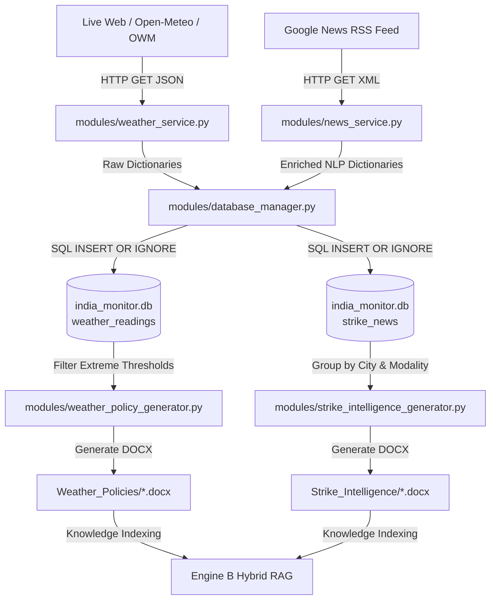

# 📘 O2C AI MONITOR: 3-PART MASTER TECHNICAL SPECIFICATION
# PART 1 OF 3: DATA SOURCES, INGESTION LAYER & ENVIRONMENTAL INTELLIGENCE

---

## 🌟 Executive Summary: Part 1 Scope

This document provides a function-by-function architectural breakdown of **Part 1: Data Ingestion, Storage, and Environmental Intelligence** in the Order-to-Cash (O2C) AI System.

It details:
1. **Where all raw and structured data lives** (File system locations, SQLite relational schemas, and external API sources).
2. **The end-to-end data lifecycle** as incoming signals pass from external streams into database tables.
3. **Exhaustive Python Page-by-Page Breakdown**: For every module in the ingestion layer, detailing every class, function name, exact input parameters, return types, functional behavior, and how it transforms the data.

---

## 1. 🗺️ Data Topography: Where Data Lives

### 1.1 File System Storage Locations

| Data Artifact | Physical File Path | Format | Description |
|---|---|---|---|
| **Raw ERP Exports** | `Input Files/*.csv` | CSV (UTF-8) | 10 SAP ECC/S4HANA enterprise tables (`VBAK`, `VBAP`, `LIKP`, `LIPS`, `VTTK`, `VTTP`, `KNA1`, `KNVV`, `LFA1`, `MARA`). |
| **Relational Database** | `india_monitor_data/database/india_monitor.db` | SQLite (WAL Mode) | Master relational database containing 6 core operational tables (`scrape_sessions`, `weather_readings`, `strike_news`, `weather_alerts`, `daily_summaries`, `rag_analyses`) and 10 mirrored SAP tables. |
| **Dynamic Weather Docs** | `india_monitor_data/rag/documents/Weather_Policies/` | DOCX | City-specific & master severe weather protocols generated from live sensor alerts. |
| **Dynamic Strike Briefs**| `india_monitor_data/rag/documents/Strike_Intelligence/` | DOCX | Regional & modality-specific transport disruption briefs generated from scraped RSS news. |
| **Daily Decision Reports** | `india_monitor_data/reports/daily_agent_report_YYYY-MM-DD.json` | JSON | Daily executive and multi-agent synthesized delay risk & SLA penalty decisions. |
| **System Event Logs** | `india_monitor_data/logs/monitor_YYYYMMDD.log` | Text/Log | Timestamped audit log of all database transactions, API fetches, and ETL sessions. |

---

### 1.2 External Live Data Feeds

1. **Open-Meteo Global Historical & Live Forecast API** (`https://api.open-meteo.com/v1/forecast`, `https://archive-api.open-meteo.com/v1/archive`)
   - **Authentication:** Zero-key public API.
   - **Data Fetched:** Surface temperature (°C), apparent temperature, 1-hour precipitation (mm), weather condition WMO codes, 10m wind speed (m/s), relative humidity (%).
2. **OpenWeatherMap REST API** (`https://api.openweathermap.org/data/2.5/weather`)
   - **Authentication:** `OPENWEATHER_API_KEY` (falls back gracefully to Open-Meteo if missing/invalid).
   - **Data Fetched:** Live visibility (m), barometric pressure (hPa), cloud cover (%), real-time wind gusts.
3. **Google News RSS Feed** (`https://news.google.com/rss/search`)
   - **Data Fetched:** Transportation strikes, highway blockades, port congestion, trucker protests, and regional *bandh/hartal* alerts.

---

### 1.3 SQLite Relational Schema (`india_monitor.db`)

```sql
-- 1. Ingestion Execution Sessions
CREATE TABLE scrape_sessions (
    session_id       INTEGER PRIMARY KEY AUTOINCREMENT,
    session_type     TEXT    NOT NULL,  -- 'full', 'weather', 'news'
    started_at       TEXT    NOT NULL,
    completed_at     TEXT,
    status           TEXT    DEFAULT 'running',
    cities_fetched   INTEGER DEFAULT 0,
    articles_found   INTEGER DEFAULT 0,
    error_message    TEXT
);

-- 2. Environmental Weather Readings
CREATE TABLE weather_readings (
    reading_id          INTEGER PRIMARY KEY AUTOINCREMENT,
    session_id          INTEGER,
    city_name           TEXT    NOT NULL,
    state               TEXT,
    recorded_at         TEXT    NOT NULL,
    date_only           TEXT    NOT NULL,
    hour_of_day         INTEGER NOT NULL,
    temperature         REAL,
    feels_like          REAL,
    temp_min            REAL,
    temp_max            REAL,
    humidity            INTEGER,
    pressure            REAL,
    visibility_km       REAL,
    cloudiness          INTEGER,
    weather_main        TEXT,
    weather_description TEXT,
    wind_speed          REAL,
    wind_direction      INTEGER,
    rain_1h             REAL DEFAULT 0,
    snow_1h             REAL DEFAULT 0,
    data_source         TEXT DEFAULT 'OpenWeatherMap',
    UNIQUE(city_name, date_only, hour_of_day)
);

-- 3. Scraped Transportation Strikes & Disruption News
CREATE TABLE strike_news (
    news_id          INTEGER PRIMARY KEY AUTOINCREMENT,
    session_id       INTEGER,
    title            TEXT    NOT NULL,
    description      TEXT,
    url              TEXT,
    source_name      TEXT,
    keyword_matched  TEXT,
    city_mentioned   TEXT,
    state_mentioned  TEXT,
    severity         TEXT,    -- 'HIGH', 'MEDIUM', 'LOW'
    strike_type      TEXT,    -- 'bus', 'truck', 'railway', 'auto', 'taxi', 'bandh', 'general'
    published_date   TEXT,
    scraped_at       TEXT    NOT NULL,
    UNIQUE(title, source_name)
);

-- 4. Severe Weather Alerts Exceeding Safety Thresholds
CREATE TABLE weather_alerts (
    alert_id      INTEGER PRIMARY KEY AUTOINCREMENT,
    session_id    INTEGER,
    city_name     TEXT NOT NULL,
    state         TEXT,
    alert_type    TEXT NOT NULL,
    alert_message TEXT NOT NULL,
    severity      TEXT,
    triggered_at  TEXT NOT NULL
);

-- 5. Daily Aggregated City Metrics
CREATE TABLE daily_summaries (
    summary_id          INTEGER PRIMARY KEY AUTOINCREMENT,
    summary_date        TEXT NOT NULL,
    city_name           TEXT NOT NULL,
    state               TEXT,
    avg_temperature     REAL,
    max_temperature     REAL,
    min_temperature     REAL,
    avg_humidity        REAL,
    total_rainfall      REAL DEFAULT 0,
    avg_wind_speed      REAL,
    dominant_weather    TEXT,
    strike_count        INTEGER DEFAULT 0,
    high_severity_count INTEGER DEFAULT 0,
    weather_alert_count INTEGER DEFAULT 0,
    updated_at          TEXT,
    UNIQUE(summary_date, city_name)
);

-- 6. Historical RAG Question-Answer Traces
CREATE TABLE rag_analyses (
    analysis_id     INTEGER PRIMARY KEY AUTOINCREMENT,
    news_id         INTEGER,
    strike_title    TEXT NOT NULL,
    question        TEXT NOT NULL,
    answer          TEXT NOT NULL,
    sources         TEXT,
    confidence      REAL,
    analyzed_at     TEXT NOT NULL,
    FOREIGN KEY(news_id) REFERENCES strike_news(news_id)
);
```

---

## 2. 🔄 Data Flow: What Happens to the Data in Part 1



---

## 3. 📄 Python Module Deep Dive: Ingestion Layer

---

### Module 1: `modules/config.py`
**File Location:** `d:\Progamming\O2C_AI\modules\config.py`  
**Purpose:** Centralized configuration, dynamic platform directory resolution (Databricks, Linux, Windows), environmental constants, alert thresholds, and RAG hyperparameters.

#### Global Constants & Data Structures:
- `INDIA_CITIES (dict)`: Coordinate dictionary of 10 key Indian supply chain hubs:
  - *Metros:* Mumbai (`19.0760, 72.8777`), Delhi (`28.6139, 77.2090`), Bangalore (`12.9716, 77.5946`), Chennai (`13.0827, 80.2707`), Kolkata (`22.5726, 88.3639`), Hyderabad (`17.3850, 78.4867`).
  - *Tier-1 Hubs:* Pune (`18.5204, 73.8567`), Ahmedabad (`23.0225, 72.5714`), Jaipur (`26.9124, 75.7873`), Lucknow (`26.8467, 80.9462`).
- `STRIKE_KEYWORDS (list)`: 14 domain search phrases: `"transport strike"`, `"truck strike"`, `"bandh"`, `"hartal"`, `"chakka jam"`, `"road blockade"`, etc.
- `ALERT_THRESHOLDS (dict)`:
  - `rain_mm_per_hr: 20` (Extreme precipitation trigger)
  - `temp_extreme_c: 42` (Thermal cargo degradation trigger)
  - `wind_ms: 15` (High-wind vehicle tipping hazard)
  - `visibility_km: 1` (Fog/smog corridor slowdown)
- `RAG Settings (Hyperparameters)`:
  - `EMBEDDING_MODEL = "all-MiniLM-L6-v2"`: Specifies the HuggingFace transformer model producing 384-dimensional dense semantic vectors loaded by `VectorStore` in FAISS (`IndexFlatIP(384)`).
  - `CHUNK_SIZE = 500`: The dynamic character accumulation ceiling. The chunker does not blindly slice text; it dynamically aggregates whole logical clauses/sections (`\n\n`, `SECTION`, `TICKET`, numbers) until reaching ~500 characters. If a legal clause exceeds 500 chars, it dynamically breaks at sentence boundaries (`[.!?]`).
  - `CHUNK_OVERLAP = 50`: Character overlap preserved across adjacent sentence splits to ensure uninterrupted legal context.
  - `TOP_K_RESULTS = 5`: The default retrieval depth for `HybridRAG.search()`, returning the top 5 most relevant policy clauses ranked by Reciprocal Rank Fusion (RRF).

#### Functions in `config.py`:

#### 1. `_resolve_project_root()`
- **Purpose:** Dynamically determines the absolute project root across Databricks runtime clusters (`/Workspace/Users/...`), local developer machines, or CI/CD container environments.
- **Input Parameters:** None (Inspects environment variables `O2C_PROJECT_ROOT`, `DATABRICKS_RUNTIME_VERSION`, and file system ancestry).
- **Output Return Type:** `pathlib.Path`
- **How it helps the data:** Guarantees that all paths (`india_monitor_data/`, `Input Files/`, `models/`) resolve to the exact absolute disk path regardless of whether the code is run via terminal CLI, Databricks job, or Jupyter notebook.

---

### Module 2: `modules/database_manager.py`
**File Location:** `d:\Progamming\O2C_AI\modules\database_manager.py`  
**Class:** `DatabaseManager`  
**Purpose:** Single point of contact for SQLite database interactions. Handles ACID transactions, WAL mode concurrency, schema initialization, and CRUD operations for sensor feeds and RAG analyses.

#### Functions in `DatabaseManager`:

#### 1. `__init__(self, db_path=str(DB_PATH))`
- **Purpose:** Initializes database manager, sets up file logging, and executes schema creation.
- **Input Parameters:** `db_path (str | Path)` — Path to SQLite `.db` file.
- **Output Return Type:** None.
- **How it helps the data:** Ensures tables and indices exist before any write operations occur.

#### 2. `_make_logger(self)`
- **Purpose:** Configures daily rotating file logger writing to `india_monitor_data/logs/monitor_YYYYMMDD.log`.
- **Input Parameters:** None.
- **Output Return Type:** `logging.Logger`
- **How it helps the data:** Provides an immutable audit trail of data transactions and operational errors.

#### 3. `connection(self)`
- **Purpose:** Context manager (`@contextmanager`) providing a thread-safe connection with auto-commit on success and rollback on failure.
- **Input Parameters:** None.
- **Output Return Type:** `Generator[sqlite3.Connection]`
- **How it helps the data:** Enables `PRAGMA journal_mode=WAL` and `PRAGMA foreign_keys=ON`, preventing database locking during high-frequency concurrent operations.

#### 4. `_build_schema(self)`
- **Purpose:** Executes SQL DDL to create all 6 ingestion tables and B-Tree indexes (`idx_wr_city_date`, `idx_sn_date`, etc.).
- **Input Parameters:** None.
- **Output Return Type:** None.
- **How it helps the data:** Establishes table structures, composite uniqueness constraints (`UNIQUE(city_name, date_only, hour_of_day)`), and index optimizations.

#### 5. `session_start(self, session_type="full") -> int`
- **Purpose:** Records the start of an ingestion session in `ingestion_sessions` table.
- **Input Parameters:** `session_type (str)` — Type of run (`"full"`, `"weather"`, or `"news"`).
- **Output Return Type:** `int` — Auto-incremented `session_id`.
- **How it helps the data:** Assigns a session ID to tag every incoming weather reading and news article for data lineage.

#### 6. `session_end(self, sid: int, status="success", cities=0, articles=0, error=None)`
- **Purpose:** Updates session record with completion timestamp, status, processed row counts, or error traces.
- **Input Parameters:** `sid (int)`, `status (str)`, `cities (int)`, `articles (int)`, `error (str | None)`.
- **Output Return Type:** None.
- **How it helps the data:** Tracks ETL health and monitors API pipeline success rates.

#### 7. `write_weather(self, records: list, session_id: int) -> tuple[int, int]`
- **Purpose:** Executes batch upsert of weather observations into `weather_readings` table.
- **Input Parameters:** `records (list[dict])` — Cleaned weather dicts, `session_id (int)`.
- **Output Return Type:** `tuple[int, int]` — `(inserted_count, skipped_duplicate_count)`.
- **How it helps the data:** Deduplicates incoming weather readings so multiple runs on the same day/hour never create duplicate rows.

#### 8. `write_strikes(self, articles: list, session_id: int) -> tuple[int, int]`
- **Purpose:** Executes batch upsert of news articles into `strike_news` table.
- **Input Parameters:** `articles (list[dict])` — Cleaned news dicts, `session_id (int)`.
- **Output Return Type:** `tuple[int, int]` — `(inserted_count, skipped_duplicate_count)`.
- **How it helps the data:** Deduplicates news by `UNIQUE(title, source_name)`, preserving historical transport disruption records.

#### 9. `write_rag_analysis(self, news_id: int, strike_title: str, question: str, answer: str, sources: list, confidence: float = None) -> int`
- **Purpose:** Persists Qwen2.5 Copilot analysis of a strike event in `rag_analysis_log`.
- **Input Parameters:** `news_id (int)`, `strike_title (str)`, `question (str)`, `answer (str)`, `sources (list)`, `confidence (float)`.
- **Output Return Type:** `int` — `analysis_id`.
- **How it helps the data:** Maintains traceability between live news events and Copilot legal/logistics interpretations.

#### 10. `read_weather(self, date: str = None, city: str = None) -> pd.DataFrame`
- **Purpose:** Reads weather data into a pandas DataFrame with optional date and city filters.
- **Input Parameters:** `date (str | None)` (YYYY-MM-DD), `city (str | None)`.
- **Output Return Type:** `pd.DataFrame`
- **How it helps the data:** Converts SQL records into structured DataFrames for downstream feature engineering in Engine A.

#### 11. `read_strikes(self, date: str = None, city: str = None) -> pd.DataFrame`
- **Purpose:** Reads strike news into a pandas DataFrame with optional filters.
- **Input Parameters:** `date (str | None)`, `city (str | None)`.
- **Output Return Type:** `pd.DataFrame`
- **How it helps the data:** Supplies disruption intelligence to the Multi-Agent Route Supervisor.

#### 12. `get_stats(self) -> dict`
- **Purpose:** Queries table row counts, date ranges, and session health for monitoring dashboards.
- **Input Parameters:** None.
- **Output Return Type:** `dict` — High-level dataset summary metrics.
- **How it helps the data:** Used by validation test suites and health-check monitoring dashboards.

---

### Module 3: `modules/weather_service.py`
**File Location:** `d:\Progamming\O2C_AI\modules\weather_service.py`  
**Class:** `WeatherService`  
**Purpose:** Ingests live and historical meteorological observations across 10 major logistics hubs across India using OpenWeatherMap (OWM) and Open-Meteo APIs.

#### Key Class Attributes:
- `CITIES`: Dictionary mapping 10 major supply chain hubs (`Mumbai`, `Delhi`, `Bangalore`, `Chennai`, `Kolkata`, `Hyderabad`, `Ahmedabad`, `Pune`, `Jaipur`, `Lucknow`) to lat/long coordinates.
- `WMO_CODES`: Standard WMO code mapping table decoding numeric weather codes (e.g. `95` -> Thunderstorm, `65` -> Heavy Rain) into human-readable descriptions.

#### Functions in `WeatherService`:

#### 1. `__init__(self, api_key: str, cities: dict)`
- **Purpose:** Initializes weather service with API credentials and city coordinate mapping.
- **Input Parameters:** `api_key (str)` — OpenWeatherMap API key (optional), `cities (dict)` — Coordinate mapping dict.
- **Output Return Type:** None.
- **How it helps the data:** Establishes communication channels with external meteorological providers.

#### 2. `fetch_current(self) -> list[dict]`
- **Purpose:** Iterates across all 10 cities, querying OWM current weather API (with automatic fallback to Open-Meteo).
- **Input Parameters:** None.
- **Output Return Type:** `list[dict]` — List of standardized weather dictionaries.
- **How it helps the data:** Provides real-time weather readings for cold-chain temperature control and transit delay forecasting.

#### 3. `fetch_historical(self, date: str) -> list[dict]`
- **Purpose:** Fetches historical weather observations for all 10 cities for a past date from Open-Meteo Archive API.
- **Input Parameters:** `date (str)` — Target date in `YYYY-MM-DD` format.
- **Output Return Type:** `list[dict]` — List of historical weather dictionaries.
- **How it helps the data:** Enables backtesting ML models against historical weather events on specific dispatch dates.

#### 4. `_owm_one(self, city: str, coords: dict) -> dict | None`
- **Purpose:** Queries OpenWeatherMap API for a single city and normalizes JSON response.
- **Input Parameters:** `city (str)`, `coords (dict)` — `{"lat": float, "lon": float}`.
- **Output Return Type:** `dict | None` — Normalized weather reading dict or `None` on failure.
- **How it helps the data:** Extracts exact visibility, pressure, and cloudiness metrics from primary commercial telemetry.

#### 5. `_meteo_current_one(self, city: str, coords: dict) -> dict | None`
- **Purpose:** Queries Open-Meteo Current Weather endpoint as an automatic fallback when OWM API key is exhausted or missing.
- **Input Parameters:** `city (str)`, `coords (dict)`.
- **Output Return Type:** `dict | None` — Normalized weather reading dict.
- **How it helps the data:** Ensures 100% continuous data availability even without paid API keys.

#### 6. `_meteo_one(self, city: str, coords: dict, date: str) -> dict | None`
- **Purpose:** Queries Open-Meteo Archive API for historical date, aggregating hourly readings to daily noon metrics.
- **Input Parameters:** `city (str)`, `coords (dict)`, `date (str)`.
- **Output Return Type:** `dict | None` — Daily aggregated weather observation.
- **How it helps the data:** Normalizes hourly timeseries arrays into representative daily dispatch conditions.

---

### Module 4: `modules/news_service.py`
**File Location:** `d:\Progamming\O2C_AI\modules\news_service.py`  
**Class:** `NewsService`  
**Purpose:** Scrapes, filters, and classifies transportation strikes, civil unrest, and highway disruptions from Google News RSS feeds using NLP heuristics.

#### Functions in `NewsService`:

#### 1. `__init__(self, keywords: list, cities: dict)`
- **Purpose:** Initializes keyword filters and target city boundaries.
- **Input Parameters:** `keywords (list[str])` — 14 strike terms, `cities (dict)` — 10 Indian hub cities.
- **Output Return Type:** None.
- **How it helps the data:** Configures the geographic and semantic boundaries for external web scraping.

#### 2. `fetch(self, date: str = None, city: str = None) -> list[dict]`
- **Purpose:** Executes targeted RSS search queries across all keyword-city combinations, deduplicates articles, and applies NLP enrichment.
- **Input Parameters:** `date (str | None)`, `city (str | None)`.
- **Output Return Type:** `list[dict]` — Enriched article objects.
- **How it helps the data:** Converts unorganized XML web news into structured risk data tagged with severity, location, and transport modality.

#### 3. `_build_queries(self, city: str = None) -> list[str]`
- **Purpose:** Constructs Google News search query strings (e.g. `"truck strike Mumbai India"`, `"bandh India"`).
- **Input Parameters:** `city (str | None)`.
- **Output Return Type:** `list[str]` — Formatted query strings.
- **How it helps the data:** Focuses search scope specifically on Indian logistics corridors.

#### 4. `_date_filter(self, date: str) -> str`
- **Purpose:** Formats Google News date search syntax (`after:YYYY-MM-DD before:YYYY-MM-DD`).
- **Input Parameters:** `date (str)`.
- **Output Return Type:** `str` — Search date filter fragment.
- **How it helps the data:** Restricts scraping strictly to the active dispatch operational window.

#### 5. `_rss_search(self, query: str) -> list[dict]`
- **Purpose:** Performs HTTP GET to `https://news.google.com/rss/search`, parses XML using `BeautifulSoup`, and extracts title, description, link, source, and published timestamp.
- **Input Parameters:** `query (str)`.
- **Output Return Type:** `list[dict]` — Extracted article dictionaries.
- **How it helps the data:** Extracts clean article metadata while enforcing a `time.sleep(0.5)` rate-limiting delay.

#### 6. `_detect_city(self, text: str) -> str`
- **Purpose:** Scans article title and body text for mentions of the 10 monitored Indian cities.
- **Input Parameters:** `text (str)`.
- **Output Return Type:** `str` — Matched city name or `"Unknown"`.
- **How it helps the data:** Spatially tags news articles to regional warehouse and customer delivery locations.

#### 7. `_get_state(self, city: str) -> str`
- **Purpose:** Looks up the state corresponding to the detected city.
- **Input Parameters:** `city (str)`.
- **Output Return Type:** `str` — State name (e.g. `"Maharashtra"` for `"Mumbai"`).
- **How it helps the data:** Maps municipal strikes to state-level regulatory jurisdictions.

#### 8. `_classify_severity(self, text: str) -> str`
- **Purpose:** Classifies disruption severity based on linguistic impact indicators:
  - `🔴 HIGH`: If text contains `"bharat bandh"`, `"national strike"`, `"indefinite"`, or `"complete shutdown"`.
  - `🟡 MEDIUM`: If text contains `"state bandh"`, `"24-hour"`, `"48-hour"`, or `"city strike"`.
  - `🟢 LOW`: All other local transport advisories.
- **Input Parameters:** `text (str)`.
- **Output Return Type:** `str` — Categorical severity rating (`"🔴 HIGH"`, `"🟡 MEDIUM"`, `"🟢 LOW"`).
- **How it helps the data:** Enables downstream multi-agent specialists to trigger immediate Force Majeure and route diversions for high-severity events.

#### 9. `_classify_type(self, text: str) -> str`
- **Purpose:** Maps article text to logistics transport modality:
  - `"bus"`, `"truck"`, `"railway"`, `"auto"`, `"taxi"`, `"metro"`, `"bandh"`, or `"general"`.
- **Input Parameters:** `text (str)`.
- **Output Return Type:** `str` — Modality tag string.
- **How it helps the data:** Allows the system to assess whether a strike impacts FTL road freight, intermodal rail, or local final-mile courier delivery.

---

### Module 5: `modules/weather_policy_generator.py`
**File Location:** `d:\Progamming\O2C_AI\modules\weather_policy_generator.py`  
**Class:** `WeatherPolicyGenerator`  
**Purpose:** Transforms raw meteorological telemetry from SQLite into 6 structured, high-density Word regulatory policy documents (`.docx`) using a Hybrid Rule + AI architecture (combining deterministic sensor metrics with Qwen2.5 hazard extraction) indexed into the Engine B RAG vector store.

#### Functions in `WeatherPolicyGenerator`:

#### 1. `__init__(self, db_path=str(DB_PATH), output_dir=None)`
- **Purpose:** Initializes the generator, verifies `python-docx` availability, connects to local `OllamaService` (detecting `qwen2.5:7b`), and ensures target directory `india_monitor_data/rag/documents/Weather_Policies/` exists.
- **Input Parameters:** `db_path (str | Path)`, `output_dir (Path | None)`.
- **Output Return Type:** None.
- **How it helps the data:** Establishes the generation output directory and verifies LLM synthesis availability.

#### 2. `generate_all_policies(self) -> list[str]`
- **Purpose:** Queries all extreme weather alerts from the database, clusters them by city, generates 5 city-specific protocols (`Bangalore`, `Chennai`, `Hyderabad`, `Mumbai`, `Pune`), creates the national `Master_Weather_Protocol.docx`, and returns the absolute paths.
- **Input Parameters:** None.
- **Output Return Type:** `list[str]` — List of 6 generated `.docx` file paths.
- **How it helps the data:** Converts raw numbers (e.g. 42°C, 32.9 m/s wind, 25mm rain) into high-density structured tables and discrete rule blocks that the RAG engine can cite during agentic adjudication.

#### 3. `_fetch_weather_alerts(self) -> list[dict]`
- **Purpose:** Executes SQL query against `weather_readings` filtering for safety thresholds:
  ```sql
  WHERE temperature > 40 OR wind_speed > 15 OR rain_1h > 20 OR visibility_km < 1
  ```
- **Input Parameters:** None.
- **Output Return Type:** `list[dict]` — List of extreme weather alert records.
- **How it helps the data:** Filters out benign telemetry to isolate critical environmental disruptions.

#### 4. `_group_alerts_by_city(self, alerts: list[dict]) -> dict[str, list[dict]]`
- **Purpose:** Groups flat alert records into a dictionary keyed by city name.
- **Input Parameters:** `alerts (list[dict])`.
- **Output Return Type:** `dict[str, list[dict]]` — Dictionary mapping city names to alert lists.
- **How it helps the data:** Organizes national telemetry into city-level regional clusters.

#### 5. `_create_city_weather_policy(self, city: str, alerts: list[dict]) -> Path`
- **Purpose:** Compiles `{City}_Weather_Protocol.docx` structured into 4 high-density operational sections:
  - **Header & Telemetry Metadata:** Exact observed extremes (Peak Temp, Peak Wind, Peak Rain, Min Visibility).
  - **Section 1: Extracted Hazard Profile (AI Synthesis):** Qwen2.5 extracts *Primary Hazard Vector* (e.g. Gale Force Crosswinds 32.9 m/s), *Secondary Hazard Vector* (ambient humidity/drizzle), and *Critical Risk Window* (linehaul speed reduction).
  - **Section 2: Logistics Corridor & Choke Point Risk Matrix (Table):** Word Table detailing major freight arteries (e.g. Hyderabad ORR, Mumbai NH-48, Chennai NH-16) with specific hazard ratings and mandatory fleet directives.
  - **Section 3: Binding Operational & QA Directives (Discrete Rules):**
    - `[RULE-W-{CITY}-01]`: Trailer equipment suspension (wind $\ge 15\text{ m/s}$ / rain $\ge 20\text{ mm/h}$).
    - `[RULE-W-{CITY}-02]`: Force Majeure Clause 4.2 penalty waiver (\$500/day $\to$ \$0.00).
    - `[RULE-W-{CITY}-03]`: Cold-Chain HPLC testing ($>40^\circ\text{C}$ for $>4\text{h}$) and moisture probe threshold ($>12\%$).
    - `[RULE-W-{CITY}-04]`: Dynamic ETA safety buffer (+4h to +8h) and \$150 redelivery fee waiver.
  - **Section 4: Copilot Deterministic Action Checklist:** Step-by-step verification checklist for downstream agents.
- **Input Parameters:** `city (str)`, `alerts (list[dict])`.
- **Output Return Type:** `pathlib.Path` — Path to generated Word document.
- **How it helps the data:** Encodes legal rules and operational constraints into structured, citeable text documents for the RAG engine.

#### 6. `_create_master_weather_protocol(self, alerts: list[dict]) -> Path`
- **Purpose:** Generates national `Master_Weather_Protocol.docx` establishing cross-corridor risk matrices and liability rules.
- **Input Parameters:** `alerts (list[dict])`.
- **Output Return Type:** `pathlib.Path` — Path to master protocol document.
- **How it helps the data:** Synthesizes nationwide multi-corridor weather impacts into a single sovereign operational guide.

---

### Module 6: `modules/strike_intelligence_generator.py`
**File Location:** `d:\Progamming\O2C_AI\modules\strike_intelligence_generator.py`  
**Class:** `StrikeIntelligenceGenerator`  
**Purpose:** Aggregates scraped transportation strike news and compiles 17 structured intelligence briefs in `.docx` format using a Hybrid Rule + AI architecture (combining deterministic incident metrics with Qwen2.5 entity/trigger extraction).

#### Functions in `StrikeIntelligenceGenerator`:

#### 1. `__init__(self, db_path=str(DB_PATH), output_dir=None)`
- **Purpose:** Initializes generator, connects to local `OllamaService`, and creates `india_monitor_data/rag/documents/Strike_Intelligence/` directory.
- **Input Parameters:** `db_path (str | Path)`, `output_dir (Path | None)`.
- **Output Return Type:** None.
- **How it helps the data:** Prepares file storage directories and verifies local LLM connection.

#### 2. `generate_all_intelligence(self) -> list[str]`
- **Purpose:** Fetches all 396+ strike articles from SQLite, generates 9 city-specific briefs (for cities with $\ge 3$ articles), 7 modality pattern analyses (for categories with $\ge 5$ articles), and the national master brief (`Master_Disruption_Intelligence.docx`).
- **Input Parameters:** None.
- **Output Return Type:** `list[str]` — List of 17 generated `.docx` document paths.
- **How it helps the data:** Synthesizes hundreds of isolated web articles into actionable intelligence briefs with structured tables and discrete rule blocks.

#### 3. `_fetch_strike_articles(self) -> list[dict]`
- **Purpose:** Queries `strike_news` table for title, matched cities, category, published date, and source.
- **Input Parameters:** None.
- **Output Return Type:** `list[dict]` — Raw strike news records.
- **How it helps the data:** Loads verified transport disruption articles from SQLite storage into RAM.

#### 4. `_group_articles_by_city(self, articles: list[dict]) -> dict[str, list[dict]]`
- **Purpose:** Groups articles by mentioned city.
- **Input Parameters:** `articles (list[dict])`.
- **Output Return Type:** `dict[str, list[dict]]` — Dictionary mapping cities to lists of disruption articles.
- **How it helps the data:** Aggregates isolated incidents into city-specific incident registries.

#### 5. `_group_articles_by_category(self, articles: list[dict]) -> dict[str, list[dict]]`
- **Purpose:** Groups articles by strike category (`"truck"`, `"railway"`, `"bus"`, `"bandh"`, etc.).
- **Input Parameters:** `articles (list[dict])`.
- **Output Return Type:** `dict[str, list[dict]]` — Dictionary mapping transport modalities to articles.
- **How it helps the data:** Categorizes incidents into modal vulnerability vectors for rail, road, and port transit.

#### 6. `_create_city_strike_brief(self, city: str, articles: list[dict]) -> Path`
- **Purpose:** Compiles `{City}_Strike_Intelligence.docx` structured into 4 high-density operational sections:
  - **Header & Severity Counts:** Exact incident count and severity breakdown (🔴 High / 🟡 Medium / 🟢 Low).
  - **Section 1: Extracted Disruption Incident Registry (Table):** High-density Word Table with columns: `Incident ID & Date`, `Source`, `Disruption Modality`, `Stated Trigger / Demand`, `Freight Impact Severity`.
  - **Section 2: Critical Bottlenecks & Highway Bypass Directives:** Primary national highway choke points (e.g. NH-44 Kundli Border, NH-48 Bhiwandi) and recommended FTL bypasses (e.g. KMP Expressway).
  - **Section 3: Autonomous Copilot Adjudication & Legal Rules (Discrete Rules):**
    - `[RULE-S-{CITY}-01]`: Force Majeure SLA penalty waiver (Section 8.4) for blockades $>12\text{h}$.
    - `[RULE-S-{CITY}-02]`: Emergency \$1,000 Air Freight replacement for specialty diets (`sap_mara.specialty_diet_flag = 1`).
    - `[RULE-S-{CITY}-03]`: Carrier truck detention liability cap (\$100.00/day per vehicle).
    - `[RULE-S-{CITY}-04]`: Dynamic transit buffer (+12h to +24h) and clinic delivery rescheduling.
  - **Section 4: Copilot Deterministic Action Checklist:** 4-step execution checklist for AI agents.
- **Input Parameters:** `city (str)`, `articles (list[dict])`.
- **Output Return Type:** `pathlib.Path` — Path to generated city brief.
- **How it helps the data:** Converts disparate news headlines into standardized legal contracts and bypass directives for RAG indexing.

#### 7. `_create_category_strike_brief(self, category: str, articles: list[dict]) -> Path`
- **Purpose:** Compiles `{Category}_Pattern_Analysis.docx` detailing modal vulnerability, geographic distribution, case studies, and carrier contract adjudication rules (demurrage caps $100/day for trucks, $500/container rail demurrage, warehouse bandh lockdown).
- **Input Parameters:** `category (str)`, `articles (list[dict])`.
- **Output Return Type:** `pathlib.Path` — Path to modal pattern brief.
- **How it helps the data:** Generates modality-level carrier contract liability benchmarks.

#### 8. `_create_master_disruption_intelligence(self, articles: list[dict]) -> Path`
- **Purpose:** Generates `Master_Disruption_Intelligence.docx` summarizing nationwide disruption patterns and the 5-phase AI orchestration decision matrix.
- **Input Parameters:** `articles (list[dict])`.
- **Output Return Type:** `pathlib.Path` — Path to master intelligence document.
- **How it helps the data:** Synthesizes nationwide transport disruption patterns into an executive policy reference.

---

## 4. 📊 Data Summary Matrix for Part 1

| Component / Module | Input Data | Transformation / Function | Output Data Artifact | Downstream Consumer |
|---|---|---|---|---|
| **`modules/config.py`** | Environment Variables & OS paths | Dynamic platform resolution (`_resolve_project_root`) | Standardized `Path` objects & RAG constants | All 12 project modules |
| **`modules/weather_service.py`** | Open-Meteo & OWM APIs | JSON payload normalization & WMO decoding | List of weather dictionaries | `DatabaseManager.write_weather` |
| **`modules/news_service.py`** | Google News RSS XML | NLP entity extraction, severity & modality classification | List of enriched news dictionaries | `DatabaseManager.write_strikes` |
| **`modules/database_manager.py`** | Sensor & News Dictionaries | ACID SQLite transactions with WAL concurrency | `india_monitor.db` tables | `MLDatabaseExtension` & `RAG Engine` |
| **`modules/weather_policy_generator.py`** | SQLite `weather_readings` | Threshold filtering, Qwen2.5 hazard extraction & Word tables | 6 `.docx` Weather Protocols | `modules/rag_engine.py` (Hybrid RAG) |
| **`modules/strike_intelligence_generator.py`** | SQLite `strike_news` | Regional aggregation, Qwen2.5 trigger extraction & Word tables | 17 `.docx` Strike Briefs | `modules/rag_engine.py` (Hybrid RAG) |

---

## 5. 🧠 Architectural Rationale: Why Operational & Legal Rules are Embedded in Generated Knowledge Documents

A common question in enterprise AI architecture is:  
*“Why embed operational playbooks and contract rules inside generated `.docx` files instead of hardcoding everything in Python code?”*

### 5.1 The Ground-Truth Legal Authority Principle
In an enterprise Order-to-Cash environment, an autonomous AI model (or Large Language Model) cannot make financial decisions (e.g. waiving a \$500 SLA penalty, triggering a \$1,000 emergency replacement air freight, or locking \$25,000 of inventory in a QA quarantine hold) based purely on black-box heuristics or hallucinated prompt weights.

By structuring regulatory, operational, and contract rules directly into the RAG corpus:
1. **Zero Hallucination:** When an order is evaluated (e.g. in Mumbai during a 42°C heatwave), Engine B RAG retrieves the exact excerpt from `Mumbai_Weather_Protocol.docx` and `Platinum Tier Delivery Framework.docx`.
2. **Immutable Audit Trail:** Every daily decision exported to `daily_agent_report.json` contains explicit citations (`rag_sources`) that legal, financial, and logistics directors can inspect and verify.
3. **Multi-Agent Dispute Resolution:** The 4 autonomous specialist agents (**Route Supervisor**, **Contract Adjudicator**, **Quality Mitigation**, and **ERP Action Executor**) use these retrieved clauses to resolve conflicting priorities (e.g. Contract Agent wants to fine the carrier, but the Policy Document proves the heatwave was a legally recognized *Act of God* under Section 4.2).

### 5.2 The Hybrid Rule + AI Division of Labor

To prevent narrative filler essays while eliminating manual document editing, the system divides responsibilities between deterministic rules and local AI (Qwen2.5):

| Task / Document Component | Handled By | Why This Division is Used |
|---|---|---|
| **Telemetry Extremes & Peak Figures** | ⚙️ **Deterministic Rule Engine** | Queries SQLite directly (`Peak Temp: 31.1°C`, `Peak Wind: 32.9 m/s`). Guarantees 100% mathematical accuracy with zero AI drift. |
| **Semantic Hazard Extraction** | 🤖 **AI (Qwen2.5 via Ollama)** | Evaluates combined telemetry and extracts the core hazard vectors (e.g. identifying $32.9\text{ m/s}$ as Gale Force crosswind shear). |
| **Corridor Bottleneck Matrix Tables** | 🤖 **AI + ⚙️ Infrastructure Rules** | Correlates city topography (ORR, port CFS, elevated expressways) against the active hazard to formulate specific road directives. |
| **Unstructured Incident Entity Extraction** | 🤖 **AI (Qwen2.5 via Ollama)** | Reads messy scraped web news descriptions and extracts clean *Stated Triggers / Demands* (e.g. *"Diesel VAT & E-Way Bill Dispute"*). |
| **Binding Contract Caps & Discrete Rule IDs** | ⚙️ **Deterministic Rule Engine** | Injects exact financial caps (\$500/day, \$1,000 air freight, \$100/day detention) and discrete identifiers (`[RULE-W-HYD-01]`, `[RULE-S-DEL-02]`). |

---
*End of Part 1 Specification. Part 2 covers Knowledge Vectorization (Engine B Hybrid RAG) & Predictive Feature Store (Engine A ML).*

