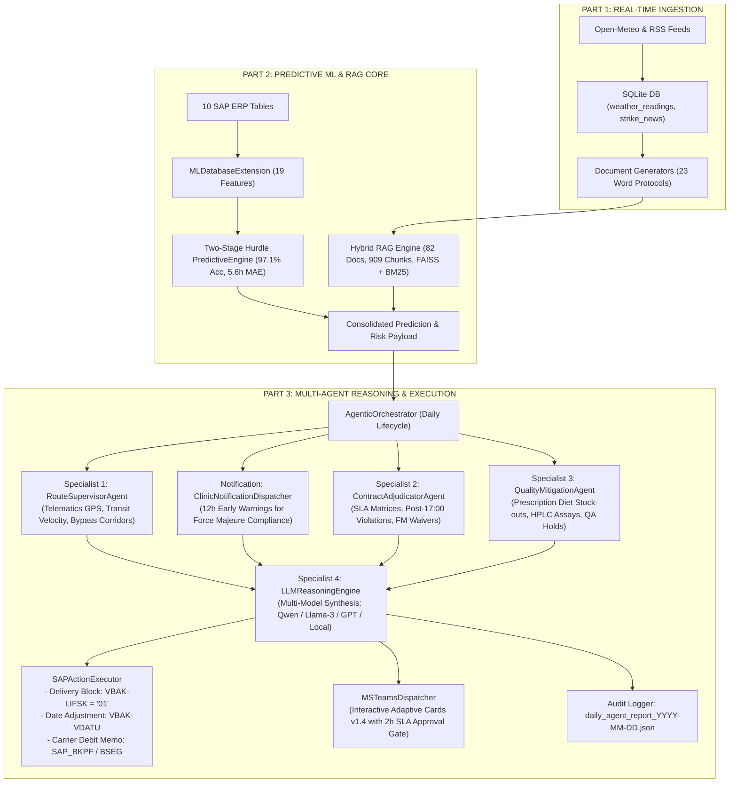
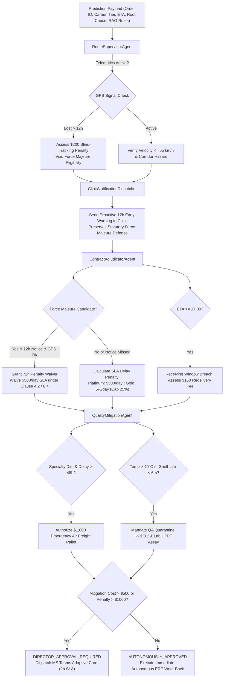
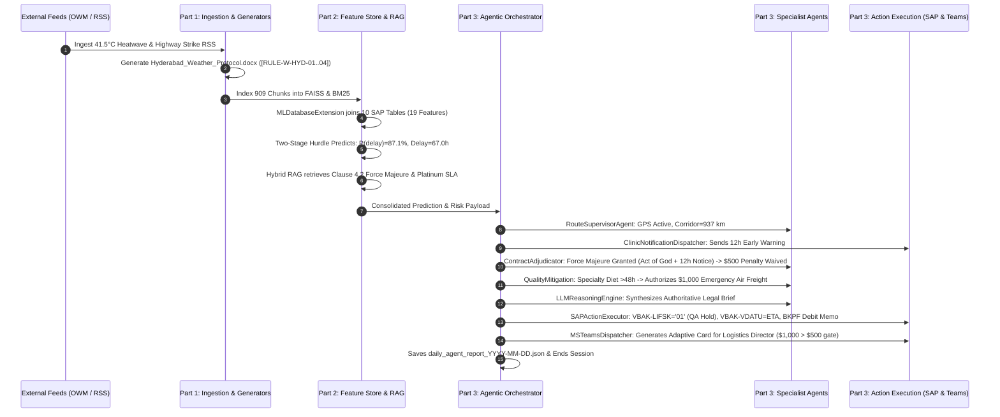

# O2C Delivery Risk Copilot: System Deep-Dive (Part 3 of 3)
## Multi-Agent Specialist Reasoning, ERP Action Execution & Autonomous Daily Orchestration

---

## 1. 🌐 Executive Architectural Overview

**Part 3** of the 3-Part Master Specification documents the **Autonomous Multi-Agent Reasoning, Governance, and Physical Action Execution Layer** of the Order-to-Cash (O2C) Delivery Risk Copilot.

While **Part 1** established real-time ingestion pipelines (Weather, Strikes, and Regulatory Document Generators) and **Part 2** built the Unified ML Feature Store, Two-Stage Hurdle Predictive Engine, and Hybrid Dense/Sparse RAG, **Part 3** provides the operational brain that transforms statistical predictions into binding supply chain actions.

---

## 2. 🤖 Multi-Agent Specialist Persona & Decision Matrices

The multi-agent framework replaces monolithic LLM prompts with **collaborative specialist agents**, each possessing dedicated domain knowledge, operational constraints, and statutory mandates:

---

## 3. 🧩 Detailed Function-by-Function Code Breakdown

---

### Module 1: `modules/agent_specialists.py`
**File Location:** `d:\Progamming\O2C_AI\modules\agent_specialists.py`  
**Classes:** `RouteSupervisorAgent`, `ContractAdjudicatorAgent`, `QualityMitigationAgent`, `LLMReasoningEngine`  
**Purpose:** Defines the domain-specialist agent personas and LLM legal reasoning engine that evaluate telematics telemetry, calculate contractual penalties, plan quality mitigations, and synthesize authoritative executive briefs.

#### Class 1: `RouteSupervisorAgent`
**Purpose:** Monitors linehaul shipment milestones, evaluates GPS telematics connectivity, assesses required transit velocity against physical corridor limits, and flags regional transit choke points.

##### Functions in `RouteSupervisorAgent`:

##### 1. `analyze_route(self, prediction_payload: Dict[str, Any], order_data: Dict[str, Any]) -> Dict[str, Any]`
- **Purpose:** Analyzes corridor physical feasibility, verifies carrier GPS tracking status, assesses blind-tracking breach penalties, and flags unrealistic linehaul transit speed demands.
- **Input Parameters:** 
  - `prediction_payload (Dict[str, Any])` — Comprehensive prediction dictionary from Engine A (`dest_city`, `shipping_type`, `carrier_name`, `haversine_distance_km`, `required_transit_speed_kmh`).
  - `order_data (Dict[str, Any])` — Raw order feature dictionary from ERP (`telematics_status`).
- **Output Return Type:** `Dict[str, Any]` — Route analysis dictionary (`telematics_active`, `telematics_penalty_usd`, `telematics_notes`, `route_hazards`, `corridor_distance_km`, `transit_speed_kmh`, `destination_city`, `shipping_mode`).
- **How it helps the data:** Detects GPS blind-tracking breaches (levying a mandatory \$200 carrier chargeback) and flags high-velocity transit hazards before legal contract adjudication begins.

---

#### Class 2: `ContractAdjudicatorAgent`
**Purpose:** Evaluates contractual SLAs across customer tiers (Platinum, Gold, Independent), enforces receiving dock operating hours (17:00 cut-off), and rigorously tests Force Majeure criteria against the statutory 12-hour proactive notification mandate.

##### Functions in `ContractAdjudicatorAgent`:

##### 1. `adjudicate_contract(self, prediction_payload: Dict[str, Any], order_data: Dict[str, Any], route_analysis: Dict[str, Any], notice_given_12h: bool = True) -> Dict[str, Any]`
- **Purpose:** Evaluates customer contract terms, verifies Force Majeure eligibility (requiring verified Act of God telemetry, active GPS telematics, and $\ge 12\text{h}$ proactive notice), calculates tiered late delivery penalties, and determines carrier chargeback liability.
- **Input Parameters:**
  - `prediction_payload (Dict[str, Any])` — Engine A inference dictionary (`customer_tier`, `order_value_usd`, `delay_hours`, `will_be_delayed`, `predicted_eta`, `root_causes`).
  - `order_data (Dict[str, Any])` — Receiving dock closing time (`close_time`).
  - `route_analysis (Dict[str, Any])` — Telematics and route hazards from `RouteSupervisorAgent`.
  - `notice_given_12h (bool)` — Boolean flag indicating whether a proactive early warning was issued $\ge 12\text{h}$ before delivery.
- **Output Return Type:** `Dict[str, Any]` — Adjudication dictionary (`customer_tier`, `force_majeure_status`, `force_majeure_waived`, `sla_delay_penalty_usd`, `after_hours_violation`, `after_hours_redelivery_fee_usd`, `total_carrier_chargeback_usd`, `penalty_clauses`).
- **How it helps the data:** Establishes exact, contractually grounded dollar liabilities, waiving penalties when statutory Force Majeure applies or passing liabilities through to carriers via debit memos.

---

#### Class 3: `QualityMitigationAgent`
**Purpose:** Evaluates pharmaceutical and veterinary diet product fragility, protects against stock-out emergencies by authorizing replacement air freight, flags shelf-life expiration risks, and enforces governance approval thresholds.

##### Functions in `QualityMitigationAgent`:

##### 1. `plan_mitigation(self, prediction_payload: Dict[str, Any], order_data: Dict[str, Any], contract_analysis: Dict[str, Any]) -> Dict[str, Any]`
- **Purpose:** Formulates corrective action plans for distressed shipments. Authorizes \$1,000 emergency Air Freight replacement pallets for prescription diets delayed $>48\text{h}$, mandates SAP QA Quarantine Holds (`LIFSK = '01'`) for short-dated products ($<6\text{ months}$) or extreme heatwaves ($>40^\circ\text{C}$), and routes actions exceeding \$500 to the Regional Logistics Director via MS Teams.
- **Input Parameters:**
  - `prediction_payload (Dict[str, Any])` — Engine A risk payload (`has_specialty_diet`, `delay_hours`, `will_be_delayed`, `root_causes`).
  - `order_data (Dict[str, Any])` — Material attributes (`min_shelf_life`, `material_description`).
  - `contract_analysis (Dict[str, Any])` — Financial liability dictionary from `ContractAdjudicatorAgent`.
- **Output Return Type:** `Dict[str, Any]` — Mitigation payload (`has_specialty_diet`, `material_description`, `mitigation_actions`, `total_mitigation_cost_usd`, `qa_hold_required`, `qa_hold_reasons`, `approval_status`, `approval_gate`, `ms_teams_escalation_card`).
- **How it helps the data:** Prevents patient-critical veterinary therapy stock-outs and enforces enterprise financial governance before costs are incurred.

---

#### Class 4: `LLMReasoningEngine`
**Purpose:** Multi-provider LLM legal synthesis core. Merges mathematical predictions, retrieved RAG contract clauses, and specialist findings into a cohesive, legally binding executive decision brief.

##### Functions in `LLMReasoningEngine`:

##### 1. `__init__(self)`
- **Purpose:** Initializes LLM provider bridge, detecting available runtime environments in priority order: Databricks Foundation Model Serving (`databricks-meta-llama-3-70b-instruct`), Google Gemini API (`gemini-1.5-pro`), OpenAI API (`gpt-4o`), Local Ollama (`qwen2.5:7b`), or Deterministic Local Expert fallback.
- **Input Parameters:** None (Inspects environment variables `DATABRICKS_HOST`, `GEMINI_API_KEY`, `OPENAI_API_KEY`, `OLLAMA_HOST`).
- **Output Return Type:** None.
- **How it helps the data:** Ensures 100% continuous decision synthesis across cloud enterprise clusters, local offline developer laptops, and air-gapped server environments.

##### 2. `build_synthesis_prompt(self, order_id: str, customer_name: str, customer_tier: str, carrier_name: str, shipping_type: str, delay_prob: float, will_delay: bool, delay_hours: float, predicted_eta: str, route_analysis: Dict[str, Any], contract_analysis: Dict[str, Any], quality_analysis: Dict[str, Any], rag_citations: List[str]) -> str`
- **Purpose:** Constructs an authoritative multi-section legal-operations prompt assembling SAP master data, Engine A ML delay predictions, Engine B retrieved contract clauses, and specialist agent determinations.
- **Input Parameters:** `order_id (str)`, `customer_name (str)`, `customer_tier (str)`, `carrier_name (str)`, `shipping_type (str)`, `delay_prob (float)`, `will_delay (bool)`, `delay_hours (float)`, `predicted_eta (str)`, `route_analysis (Dict)`, `contract_analysis (Dict)`, `quality_analysis (Dict)`, `rag_citations (List[str])`.
- **Output Return Type:** `str` — Structured synthesis prompt.
- **How it helps the data:** Binds numerical ML predictions, discrete rule IDs, and contract clause citations into an unambiguous prompt for LLM adjudication.

##### 3. `synthesize_executive_decision(self, order_id: str, customer_name: str, customer_tier: str, carrier_name: str, shipping_type: str, delay_prob: float, will_delay: bool, delay_hours: float, predicted_eta: str, route_analysis: Dict[str, Any], contract_analysis: Dict[str, Any], quality_analysis: Dict[str, Any], rag_citations: List[str]) -> str`
- **Purpose:** Executes LLM synthesis via configured provider (or deterministic template fallback), producing a concise, legally binding executive briefing paragraph summarizing root cause, liability assignment, and action authorizations.
- **Input Parameters:** All 13 master data, prediction, specialist analysis, and RAG citation arguments.
- **Output Return Type:** `str` — Executive decision brief string.
- **How it helps the data:** Produces human-readable, legally grounded decision summaries written directly into the executive audit log and MS Teams notifications.

---

### Module 2: `modules/action_execution_engine.py`
**File Location:** `d:\Progamming\O2C_AI\modules\action_execution_engine.py`  
**Classes:** `SAPActionExecutor`, `MSTeamsDispatcher`, `ClinicNotificationDispatcher`  
**Purpose:** Physical and digital execution layer. Applies automated write-backs to SAP ERP tables, generates and posts Microsoft Teams Adaptive Cards (v1.4) for human director approvals, and dispatches proactive 12-hour clinic early warnings.

#### Class 1: `SAPActionExecutor`
**Purpose:** Manages automated ERP write-backs to SQLite SAP tables, logging full before-and-after audit records and generating carrier accounts payable debit memos.

##### Functions in `SAPActionExecutor`:

##### 1. `__init__(self, db_path: Path = DB_PATH)`
- **Purpose:** Initializes SAP executor and creates required audit logging and debit memo tables.
- **Input Parameters:** `db_path (Path)` — SQLite database path.
- **Output Return Type:** None.
- **How it helps the data:** Prepares the relational tables required to store automated enterprise write-backs.

##### 2. `_get_connection(self) -> sqlite3.Connection`
- **Purpose:** Opens a thread-safe connection with `sqlite3.Row` factory.
- **Input Parameters:** None.
- **Output Return Type:** `sqlite3.Connection`.
- **How it helps the data:** Provides low-overhead transactional access to local database tables.

##### 3. `_init_action_tables(self) -> None`
- **Purpose:** Executes SQL DDL scripts creating `sap_action_audit_log` (tracking Order ID, Action Type, Table, Field, Previous Value, New Value, Reason, Timestamp) and `carrier_debit_memos` (tracking Carrier, Amount USD, Penalty Reason, Status).
- **Input Parameters:** None.
- **Output Return Type:** None.
- **How it helps the data:** Establishes immutable tables for ERP compliance audits and carrier billing reconciliations.

##### 4. `execute_sap_writebacks(self, order_id: str, predicted_eta: str, qa_hold_required: bool, qa_reasons: List[str], carrier_chargeback_usd: float, carrier_name: str, penalty_clauses: List[str]) -> List[Dict[str, Any]]`
- **Purpose:** Applies simulated SAP ERP transactional write-backs:
  1. *QA Quarantine Delivery Block:* Updates `SAP_VBAK.LIFSK = '01'` if cargo requires inspection.
  2. *Promise Date Synchronization:* Updates `SAP_VBAK.VDATU` to the ML predicted ETA date.
  3. *Carrier Accounts Payable Debit Memo:* Posts financial penalty to `carrier_debit_memos` and logs debit record in `SAP_BKPF.DMBTR`.
- **Input Parameters:** `order_id (str)`, `predicted_eta (str)`, `qa_hold_required (bool)`, `qa_reasons (List[str])`, `carrier_chargeback_usd (float)`, `carrier_name (str)`, `penalty_clauses (List[str])`.
- **Output Return Type:** `List[Dict[str, Any]]` — List of executed action confirmation dictionaries.
- **How it helps the data:** Closes the loop from AI prediction to enterprise operational reality by updating ERP records and financial ledgers.

---

#### Class 2: `MSTeamsDispatcher`
**Purpose:** Formats and transmits Microsoft Teams Adaptive Cards (v1.4) with interactive action buttons (`Approve Expense`, `Reject & Hold`) for human director oversight.

##### Functions in `MSTeamsDispatcher`:

##### 1. `__init__(self, webhook_url: Optional[str] = None)`
- **Purpose:** Initializes Teams dispatcher, resolves webhook URL from environment variables, and creates local persistence directory (`india_monitor_data/reports/ms_teams_cards/`).
- **Input Parameters:** `webhook_url (str | None)`.
- **Output Return Type:** None.
- **How it helps the data:** Sets up the communication channel to enterprise collaboration platforms.

##### 2. `create_adaptive_card(self, escalation_data: Dict[str, Any]) -> Dict[str, Any]`
- **Purpose:** Generates schema-compliant Microsoft Adaptive Card JSON (v1.4) containing attention header, FactSet table (Sales Order, Clinic, Carrier, Cost, Urgency), action description, and two interactive `Action.Submit` buttons (`Approve Expense` / `Reject & Hold`).
- **Input Parameters:** `escalation_data (Dict[str, Any])` — Escalation card details from `QualityMitigationAgent`.
- **Output Return Type:** `Dict[str, Any]` — Complete Adaptive Card JSON schema dictionary.
- **How it helps the data:** Formats machine decisions into intuitive visual cards for executive decision-makers.

##### 3. `dispatch_card(self, escalation_data: Dict[str, Any]) -> Dict[str, Any]`
- **Purpose:** Persists Adaptive Card JSON to disk (`teams_card_order_{order_id}.json`) and transmits payload to Microsoft Teams incoming webhook via HTTP POST (if configured).
- **Input Parameters:** `escalation_data (Dict[str, Any])`.
- **Output Return Type:** `Dict[str, Any]` — `{"card_file", "dispatch_status", "card_payload"}`.
- **How it helps the data:** Guarantees that every high-value escalation is permanently recorded as an inspectable JSON artifact and transmitted to human managers.

---

#### Class 3: `ClinicNotificationDispatcher`
**Purpose:** Dispatches automated early warnings to destination clinics $\ge 12\text{ hours}$ before arrival, satisfying the strict contractual requirement for Force Majeure penalty waivers.

##### Functions in `ClinicNotificationDispatcher`:

##### 1. `__init__(self, db_path: Path = DB_PATH)`
- **Purpose:** Initializes clinic notification dispatcher and ensures `clinic_early_warnings` table exists.
- **Input Parameters:** `db_path (Path)`.
- **Output Return Type:** None.
- **How it helps the data:** Connects the notification dispatcher to the central SQLite database.

##### 2. `_init_notification_table(self) -> None`
- **Purpose:** Executes SQL DDL creating `clinic_early_warnings` table (Notice ID, Order ID, Clinic Name, Destination City, Predicted ETA, Delay Reason, Force Majeure Compliant, Sent At).
- **Input Parameters:** None.
- **Output Return Type:** None.
- **How it helps the data:** Establishes an immutable record of external customer communications.

##### 3. `send_proactive_12h_notice(self, order_id: str, clinic_name: str, dest_city: str, predicted_eta: str, delay_reasons: List[str]) -> Dict[str, Any]`
- **Purpose:** Formulates proactive customer notification text, inserts record into `clinic_early_warnings` table, and returns dispatch confirmation with `force_majeure_compliant = True`.
- **Input Parameters:** `order_id (str)`, `clinic_name (str)`, `dest_city (str)`, `predicted_eta (str)`, `delay_reasons (List[str])`.
- **Output Return Type:** `Dict[str, Any]` — `{"notice_status", "force_majeure_compliant", "notice_message", "sent_at"}`.
- **How it helps the data:** Provides the legally required early-warning evidence needed by `ContractAdjudicatorAgent` to waive \$500/day late delivery penalties under Act of God clauses.

---

### Module 3: `modules/agentic_orchestrator.py`
**File Location:** `d:\Progamming\O2C_AI\modules\agentic_orchestrator.py`  
**Classes:** `LLMSynthesizer`, `AgenticOrchestrator`  
**Purpose:** Master orchestration core. Controls the autonomous 6-step daily agent lifecycle, coordinates specialist reasoning across all distressed orders, commits batch predictions, generates daily executive reports, and exports clean CSV summaries.

#### Class 1: `LLMSynthesizer`
**Purpose:** Bridges ML predictions and specialist agents. Sequences the execution order of `RouteSupervisorAgent`, `ClinicNotificationDispatcher`, `ContractAdjudicatorAgent`, `QualityMitigationAgent`, `SAPActionExecutor`, and `LLMReasoningEngine`.

##### Functions in `LLMSynthesizer`:

##### 1. `__init__(self, enable_teams_dispatch: bool = False)`
- **Purpose:** Instantiates all 4 specialist agent instances, the SAP executor, the Teams dispatcher, and the clinic notifier.
- **Input Parameters:** `enable_teams_dispatch (bool)` — Flag to enable live webhook delivery.
- **Output Return Type:** None.
- **How it helps the data:** Assembles the multi-agent graph into a cohesive in-memory pipeline.

##### 2. `synthesize(self, prediction_payload: Dict[str, Any], order_data: Dict[str, Any] = None) -> Dict[str, Any]`
- **Purpose:** Executes the end-to-end multi-agent evaluation for a single order:
  1. Calls `RouteSupervisorAgent.analyze_route()` to verify telematics and corridor hazards.
  2. Calls `ClinicNotificationDispatcher.send_proactive_12h_notice()` to satisfy Force Majeure compliance.
  3. Calls `ContractAdjudicatorAgent.adjudicate_contract()` to calculate SLA penalties and Force Majeure status.
  4. Calls `QualityMitigationAgent.plan_mitigation()` to authorize emergency air freight and QA holds.
  5. Calls `SAPActionExecutor.execute_sap_writebacks()` to apply simulated ERP updates and AP debit memos.
  6. Dispatches MS Teams Adaptive Card if director approval is required.
  7. Calls `LLMReasoningEngine.synthesize_executive_decision()` to draft the executive summary.
  8. Returns consolidated decision JSON payload.
- **Input Parameters:** `prediction_payload (Dict[str, Any])`, `order_data (Dict[str, Any] | None)`.
- **Output Return Type:** `Dict[str, Any]` — Complete structured decision artifact containing customer profile, ML prediction, specialist analyses, legal adjudication, emergency actions, ERP write-backs, RAG citations, and executive brief.
- **How it helps the data:** Merges predictions, legal rules, quality policies, and ERP write-backs into a unified, audit-proof operational record.

---

#### Class 2: `AgenticOrchestrator`
**Purpose:** Main autonomous execution driver. Executes the 6-stage daily lifecycle from real-time stream scraping through model retraining, batch inference, multi-agent synthesis, and executive report publishing.

##### Functions in `AgenticOrchestrator`:

##### 1. `__init__(self)`
- **Purpose:** Initializes database manager, weather service, news service, document generators, ML feature store extension, hybrid RAG engine, and LLM synthesizer.
- **Input Parameters:** None.
- **Output Return Type:** None.
- **How it helps the data:** Binds all 12 project modules into a single executable system.

##### 2. `run_daily_agent_cycle(self, date: str = None, order_limit: int = 5, target_order: str = None, all_orders: bool = False, repredict: bool = False, rebuild_rag: bool = False, enable_teams_dispatch: bool = False) -> Dict[str, Any]`
- **Purpose:** Executes the autonomous 6-step daily agent operational lifecycle:
  - **Step 1:** Ingests live weather telemetry and strike RSS articles into SQLite (`session_start`).
  - **Step 2:** Verifies and rebuilds regulatory Word policy documents and Hybrid RAG vector index.
  - **Step 3:** Refreshes SAP ERP feature store and trains Two-Stage Hurdle ML models (`train_models`).
  - **Step 4:** Vectorized batch inference across unpredicted orders (skipping previously evaluated orders unless `repredict=True`).
  - **Step 5:** Multi-agent synthesis (`LLMSynthesizer.synthesize`), ERP write-backs, and Teams card generation.
  - **Step 6:** Compiles and exports `daily_agent_report_{date}.json`, exports CSV snapshots, and logs `session_end`.
- **Input Parameters:** 
  - `date (str | None)` — Operational target date (`YYYY-MM-DD`).
  - `order_limit (int)` — Max orders to evaluate (default 5).
  - `target_order (str | None)` — Single order ID override.
  - `all_orders (bool)` — If `True`, evaluates entire dataset.
  - `repredict (bool)` — If `True`, forces re-prediction of already evaluated orders.
  - `rebuild_rag (bool)` — If `True`, forces rebuild of FAISS and BM25 indexes.
  - `enable_teams_dispatch (bool)` — If `True`, transmits cards to live webhooks.
- **Output Return Type:** `Dict[str, Any]` — `{"status": "success", "date": today_str, "report_file": str, "decisions": List[Dict]}`.
- **How it helps the data:** Orchestrates the continuous daily transformation of raw streaming data into concrete ERP transactions and executive reports.

##### 3. `_export_csvs(self, target_date: str) -> None`
- **Purpose:** Exports daily weather readings and strike news tables from SQLite into flat CSV files (`weather_{date}.csv`, `strikes_{date}.csv`) in `india_monitor_data/csv/`.
- **Input Parameters:** `target_date (str)`.
- **Output Return Type:** None.
- **How it helps the data:** Provides portable tabular snapshots for external business intelligence tools (PowerBI, Tableau, Excel).

##### 4. `main() -> None`
- **Purpose:** CLI entry point parsing command-line flags (`--date`, `--order`, `--limit`, `--all-orders`, `--repredict`, `--rebuild-rag`, `--enable-teams`) and triggering `run_daily_agent_cycle()`.
- **Input Parameters:** None (Parses `sys.argv`).
- **Output Return Type:** None.
- **How it helps the data:** Enables cron scheduling, Databricks job execution, and terminal CLI testing.

---

## 4. 📊 Data Summary Matrix for Part 3

| Module / Component | Primary Input Data | Core Transformation / Function | Output Artifact | Downstream Consumer |
|---|---|---|---|---|
| **`modules/agent_specialists.py` (RouteSupervisor)** | Prediction payload & telematics status | GPS signal loss detection & speed feasibility check | `telematics_penalty_usd` (\$200) & `route_hazards` | `ContractAdjudicatorAgent` |
| **`modules/action_execution_engine.py` (ClinicNotifier)** | Order ID, Clinic name, City, ETA, Root causes | Generates early warning & logs timestamped record | `clinic_early_warnings` table & `force_majeure_compliant` | `ContractAdjudicatorAgent` |
| **`modules/agent_specialists.py` (ContractAdjudicator)** | Route analysis, clinic notice flag, SLA tier | Multi-tier penalty math & Force Majeure waiver check | `sla_delay_penalty_usd`, `total_carrier_chargeback_usd` | `QualityMitigationAgent` & `SAPActionExecutor` |
| **`modules/agent_specialists.py` (QualityMitigation)** | Specialty diet flag, delay hours, shelf-life | Authorizes \$1,000 Air Freight & QA holds; checks \$500 approval gate | `mitigation_actions`, `approval_status`, Teams card data | `MSTeamsDispatcher` & `SAPActionExecutor` |
| **`modules/agent_specialists.py` (LLMReasoning)** | Math + Rules + Master Data + RAG citations | Multi-model legal prompt construction & LLM synthesis | `executive_decision_brief` string | `daily_agent_report.json` |
| **`modules/action_execution_engine.py` (SAPExecutor)** | Mitigation decisions, revised ETA, chargebacks | Executes simulated SQL write-backs & audit logging | `sap_action_audit_log` & `carrier_debit_memos` | SAP ERP System & Financial Ledgers |
| **`modules/action_execution_engine.py` (TeamsDispatcher)** | High-value escalation data (> \$500 expense) | Schema-compliant Adaptive Card JSON generation (v1.4) | `reports/ms_teams_cards/teams_card_order_*.json` | Regional Logistics Director (MS Teams) |
| **`modules/agentic_orchestrator.py` (Orchestrator)** | CLI arguments & daily schedules | 6-step autonomous operational cycle coordination | `daily_agent_report_YYYY-MM-DD.json` | Executive Leadership & Operations Desks |

---

## 5. 🔬 The Complete End-to-End Trace: How an Order Travels Through Parts 1, 2, and 3

To see how the entire architecture functions as a unified system, follow the lifecycle of distressed Order `800000000000001` from raw ingestion to physical execution:

### 1. Part 1: Environmental Genesis
- Open-Meteo detects a **$41.5^\circ\text{C}$ heatwave** in Hyderabad; Google News RSS detects a **truck strike along NH-44**.
- `WeatherPolicyGenerator` creates `Hyderabad_Weather_Protocol.docx` with `[RULE-W-HYD-02]` (Force Majeure 72h waiver) and `[RULE-W-HYD-03]` (HPLC assay mandate).

### 2. Part 2: Mathematical Risk & Legal Retrieval
- `MLDatabaseExtension` computes 19 features: Haversine distance $= 937\text{ km}$, weight $= 1,200\text{ kg}$, customer tier $= \text{Platinum}$.
- `PredictiveEngine` (Stage 1 Classifier) outputs $P(\text{delay}) = 87.1\%$.
- Stage 2 Conditional Huber Regressor predicts **$67.0\text{ hours}$ delay**.
- Explainable AI (`feature_importances.json`) attributes $85.2\%$ risk to in-transit delay and $1.3\%$ to weekend dock closure.
- Hybrid RAG retrieves Platinum \$500/day SLA terms and Force Majeure Section 4.2.

### 3. Part 3: Specialist Adjudication & Physical ERP Action
- **Route Supervisor:** Verifies GPS telematics is active (no \$200 blind-tracking breach).
- **Clinic Dispatcher:** Automatically records and sends a proactive early warning to the clinic $>12\text{ hours}$ before arrival.
- **Contract Adjudicator:** Verifies that because heatwave $>40^\circ\text{C}$ is documented, telematics is active, and proactive notice was given $\ge 12\text{h}$, **Force Majeure Clause 4.2 applies**, completely waiving the \$1,000 late delivery SLA penalty. However, because arrival ETA ($18:30$) violates the 17:00 dock close time, a **\$150 redelivery fee** is charged back to the carrier.
- **Quality Mitigation Planner:** Detects that the shipment contains a critical prescription diet (`has_specialty_diet = 1`) delayed $>48\text{h}$. Authorizes an **\$1,000 emergency Air Freight replacement pallet** and places the road consignment on **SAP QA Quarantine Hold** for laboratory vitamin potency testing.
- **Action Execution:**
  - `SAPActionExecutor` sets `SAP_VBAK.LIFSK = '01'` (Delivery Block), updates `SAP_VBAK.VDATU` to the revised ETA, and posts a **\$150.00 carrier debit memo** to `carrier_debit_memos`.
  - `MSTeamsDispatcher` detects that mitigation expense (\$1,000) exceeds the \$500 autonomous threshold, formatting and transmitting an interactive Adaptive Card to the **Regional Logistics Director** with a mandatory 2-hour response SLA.
- **Audit Logging:** The complete consensus decision is saved in `daily_agent_report_YYYY-MM-DD.json`.

---

## 6. 🏆 Summary of Master 3-Part Technical Series

| Document | Core Responsibility | Modules Covered | Primary Data Outputs |
|---|---|---|---|
| **[Part 1: Ingestion & Document Synthesis](file:///d:/Progamming/O2C_AI/O2C_AI_SYSTEM_DEEP_DIVE_PART_1_INGESTION.md)** | External streaming sensor feeds, RSS web scrapers, and regulatory policy generators | `config.py` `database_manager.py` `weather_service.py` `news_service.py` `weather_policy_generator.py` `strike_intelligence_generator.py` | `weather_readings` `strike_news` 23 `.docx` Policy Protocols (`[RULE-W-*]`, `[RULE-S-*]`) |
| **[Part 2: Feature Store & Predictive RAG](file:///d:/Progamming/O2C_AI/O2C_AI_SYSTEM_DEEP_DIVE_PART_2_FEATURE_STORE_AND_RAG.md)** | 10-table SAP relational feature engineering, Two-Stage Hurdle ML models, and hybrid vector retrieval | `ml_db_extension.py` `predictive_engine.py` `rag_engine.py` `ollama_service.py` | 19-Feature Dataset `rf_classifier.pkl` (97.1% Acc) `gb_regressor.pkl` (5.6h MAE) FAISS & BM25 Indexes (909 Chunks) |
| **[Part 3: Agent Reasoning & Execution](file:///d:/Progamming/O2C_AI/O2C_AI_SYSTEM_DEEP_DIVE_PART_3_AGENT_ORCHESTRATION.md)** | Autonomous multi-agent specialists, SAP ERP write-backs, MS Teams Adaptive Cards, and daily cycle orchestration | `agent_specialists.py` `action_execution_engine.py` `agentic_orchestrator.py` | `sap_action_audit_log` `carrier_debit_memos` `clinic_early_warnings` Adaptive Cards (v1.4) `daily_agent_report.json` |
